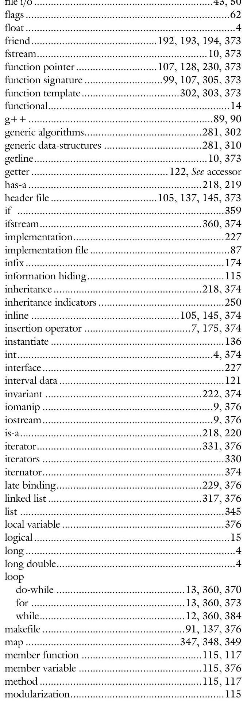

# Appendix-D-Index

# D. Index 

\#define ..... 365
\#ifdef ..... 365
\#ifndef ..... 365
\#include ..... 87
:: See scope resolution operator
-> ..... 77
abstract class ..... 269, 365
abstracting ..... 225
access modifier ..... $117,136,365$
accessor ..... 144
address-of operator ..... 365
aggregate data-type ..... 71
aggregation ..... 219
argc ..... 362
argv ..... 362
array ..... $17,360,366$
arrow operator ..... 366
assert ..... $55,359,366$
association ..... 219
base class ..... 237, 366
binding ..... $229,258,366$
bitwise operator ..... 366
bool ..... 4,366
Boolean operators ..... 366
callback ..... 289, 290, 367
callee ..... 290, 367
caller ..... 290, 367
cast ..... 5
casting ..... 367
catch ..... 65
catch-all ..... 65
cctype ..... 22
char ..... 4, 367
child class ..... 237
chmod ..... 90
cin ..... 10, 359
cin.clear() ..... 54
cin.fail() ..... 53
cin.ignore() ..... 54
class ..... $115,135,367$
class template ..... 310,368
client ..... 98,368
cohesion ..... $72,86,115,367$
functions ..... 14
coincidental ..... 15
comments ..... $355,356,367$
communicational ..... 14
composition ..... $218,219,368$
conditional expression ..... $7,362,367$
const ..... 4,146
const_cast ..... 5
constructor ..... $151,152,241,368$
copy ..... 154
default ..... 152
non-default ..... 153
container ..... 341,368
continuous data ..... 121
coupling ..... $86,115,367$
cout ..... $9,359,368$
cstdlib ..... 22
cstring ..... 22
data ..... 120
data abstraction ..... 115
default parameters ..... 103, 368
delete ..... $7,362,370$
dependency ..... 219
dereference operator ..... 370
derivation ..... 218,370
derived class ..... 237, 370
design document ..... 370
Design Document
Algorithms ..... 33,40
Data Structure ..... 42
Data Structures ..... 33
Design Overview ..... 33, 36
Error Handling ..... $33,44,48$
File Format ..... 33, 43
Interface Design ..... 33, 37
Problem Description ..... 33, 35
Structure Chart ..... 33, 38
destructor ..... $151,156,370$
discrete data ..... 121
double ..... 4,370
downcasting ..... 261, 371
dynamic_cast ..... 5
early binding ..... 229, 371
EID ..... 63, 371
encapsulation ..... 114
eof ..... 371
error flags ..... 371
error handling ..... 371
escape sequences ..... 371
expression ..... 371
extraction operator ..... $7,176,373$

modulus ..... 8,376
multi-dimensional arrays ..... $17,362,377$
mutator ..... 144,377
new ..... $7,362,371,377$
node ..... 317,377
null ..... 377
NULL ..... 377
object ..... 115,377
object file ..... 90,377
ofstream ..... 360,378
operator ..... $99,173,201,378$
-- decrement ..... $181,182,186,188,196,202,212$
- negative ..... 183, 186, 188, 196, 202
- subtraction ..... $177,186,188,196,202,212$
! not ..... 183, 186, 188, 196, 202
!= not equals ..... 184, 186, 188, 196, 202, 212
$\%$ modulus ..... $177,186,188,196,202$
&& and ..... 207, 213
() function call ..... 206, 212
* multiplication ..... $177,186,188,196,202$
* = multiply by ..... $179,186,188,196,202$
/ division ..... $177,186,188,196,202$
/= divide by ..... $179,186,188,196,202$
[] square bracket ..... 205,213
|| or ..... 207, 213
+ addition ..... 177, 186, 188, 196, 202, 208- 212
+ + increment.... 181--188, 196, 202, 209, 211-212
$+=$ add onto ..... 179, 186-196, 202, 208, 211-213
$<$ less than ..... 184, 186, 188, 196, 202, 212
$<<$ insertion..... 175, 186-196, 202, 212, 243, 253
$<=$ less than or equal........ 184-188, 196, 202, 212
= assignment ..... 204, 212, 213
$-=$ subtract from ..... $179,186,188,196,202,212$
$==$ equivalence ..... 184-196, 202, 209, 212
$>$ greater than ..... 184, 186, 188, 196, 202, 212
$>=$ greater than or equal ... 184-188, 196, 202, 212
$>>$ extraction.... 176-188, 196, 202, 212, 243, 253
parent class ..... 237
pass-by-pointer. ..... 378
pass-by-reference ..... 16,378
pass-by-value ..... 16,378
pointer ..... 378
arithmetic ..... 20
declare ..... 20
polymorphism ..... 378
private ..... $117,136,378$
procedural ..... 14
properties ..... 120
protected ..... 248,380
prototype ..... 103,380
pseudocode ..... 40,380
public ..... $117,136,380$
pure virtual function ..... 269,270
random access ..... 318

redefining ..... 242
reinterpret_cast ..... 5
scope ..... 380
scope resolution operator ..... 138,380
separate compilation ..... 380
sequential ..... 14
$\operatorname{setf}($ ) ..... 359
setter ..... 122, See mutator
$\operatorname{setw}()$ ..... 9
short ..... 4
sizeof() ..... 7,380
slicing problem ..... 261, 262, 381
source file ..... 87,137
standard template library ..... 341
static ..... $164,165,381$
static_cast ..... 5
STL ..... 381, See standard template library
strings ..... $23,360,381$
c-strings ..... 368
struct ..... 74
structure ..... 381
structure chart ..... 38,381
structure tag ..... 381
styleChecker ..... 383
switch ..... 362
tabs ..... 383
TAR ..... 92, 383
template ..... 281
template prefix ..... 303, 311
temporal ..... 14
this ..... 140,383
throw ..... 64,383
throw list ..... 383
try ..... 64,383
type parameter ..... 303, 311
UML ..... 384
UML class diagram ..... 225, 384
unsigned ..... 4
upcasting ..... 262, 384
variable ..... 384
variant ..... 222, 384
vector ..... $23,342,343,344$
virtual function ..... 258, 384
void pointer ..... $289,295,384$
v-table ..... $127,129,230,384$