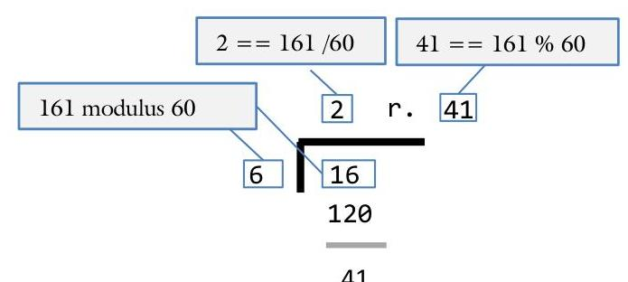
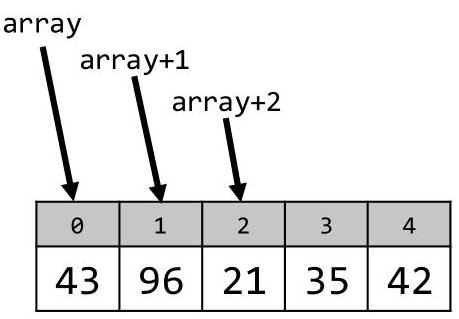
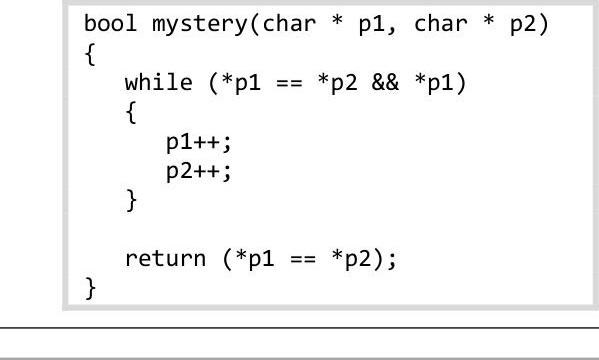

# 0-Review {.background}

---

# Review

Procedural programming is a method of programming where the fundamental unit is a function (or procedure). Topics such as variables, loops, and functions are central to procedural programming. Object-oriented programming, on the other hand, is a methodology where the fundamental unit is an object which is built from procedural tools. It is therefore necessary to have a firm grasp of procedural programming before object-oriented programming can be learned.

This section is a brief review of procedural programming. Please use this section as a gauge indicating whether you need to review some procedural topics before continuing with this book.

## Variables and data types

The first generation of computers could only work with integers. A few decades later, scientists figured out how to store decimal numbers in a computer. Today, most computers natively handle many data types. The built-in data types supported by the `C++` language are:

<div class="steel-blue-sidebar-table" style="display:none"></div>

| Data type | Use | Size | Range of values |
| :-- | :-- | :-- | :-- |
| `bool` | Logic | $1$ | $true$, $false$ |
| `char` | Letters and symbols | $1$ | $-128$ to $127$ or `'a'`, `'b'`, etc. |
| `short` | Small numbers, Unicode characters | $2$ | $-32,768$ to $32,767$ |
| `int` | Counting | $4$ | $-2,147,483,648$ to $2,147,483,647$ |
| `long` (long int) | Larger Numbers | $8$ | $\pm 9,223,372,036,854,775,808$ |
| `float` | Numbers with decimals | $4$ | $\approx 10^{-38}$ to $10^{38}$, accurate to 7 digits |
| `double` | Larger numbers with decimals | $8$ | $\approx 10^{-308}$ to $10^{308}$, accurate to 15 digits |
| `long double` | Huge Numbers | $16$ | $\approx 10^{-4932}$ to $10^{4932}$, accurate to 19 digits |

## Variable declarations

To use one of these data types, it is necessary to declare a variable. The syntax for declaring a variable is:
<DataType> <variableName>;
Observe how the variable name is camelcase: multiple words are commonly used in variable names with the first letter of each word Capitalized except for the first word.

The range of values for an integer is -2 billion to positive 2 billion for a total of 4 billion values. You can declare an integer to be positive by using the unsigned modifier. Note that this only works for integral data types; floating point numbers do not accept the unsigned modifier.

<div class="steel-blue-sidebar-table" style="display:none"></div>

| Data type | Use | Size | Range of values |
| :-- | :-- | :-- | :-- |
| `unsigned char` | Small numbers | 1 | $0$ to $255$ |
| `unsigned short` | Small numbers | 2 | $0$ to $65,535$ |
| `unsigned int` | Counting | 4 | $0$ to $4,294,967,295$ |
| `unsigned long int` | Larger Numbers | 8 | $0$ to $18,446,744,073,709,551,615$ |

You can also make a variable constant, thereby making it impossible to change the value. This can be achieved with the const modifier:

```cpp
const float PI = 3.14159;
```

Observe how we make constant variables ALL_CAPS with an underscore separating the words. This is done for all constant variables except for function parameters.

# Data conversion

When converting a value from one data type to another, the compiler inserts code into your program to make the conversion. When converting from a relatively small data type like a char into a larger one like an int, there is no data loss from the conversion. The entire range for a char fits within that of an int.

```cpp
{
   char character = 100;   // fits within the range of -128 to 127
   int integer;            // range is -2 billion to +2 billion

   integer = character;    // since 100 is within the int range,
}                           // this does not present a problem
```

However, when converting from a large data type like a long double into a smaller one like a float, it is possible that data will be lost.

```cpp
{
   long double bigNum = 3.141592653589793238;  // 19 digits for a long double
   float smallNum;                             // 7 digits for a float
   smallNum = bigNum;                          // we lose 12 digits here!
}
```

Data conversion happens automatically whenever a value from one data type is assigned to that of another. The programmer can also explicitly perform a data conversion through casting:

```cpp
{
   float value = 3.14159;
   cout << value << endl;        // display "3.14159"
   cout << (int)value << endl;   // display "3"
}
```

Observe that the (int) cast signals to the compiler to convert the floating point value into an integer. C++ adds four special types of casts:

<div class="steel-blue-sidebar-table" style="display:none"></div>

| Cast | Use |
| :-- | :-- |
| `static_cast<Type>(expression)` | Same as the simple cast described above |
| `const_cast<Type>(expression)` | Useful for making a const value no-longer const. |
| `dynamic_cast<Type>(expression)` | Useful for downcasting. See chapter 3.2 for details. |
| `reinterpret_cast<Type>(expression)` | Allows conversion between pointer types. |

Of these four, the most common is the `static_cast`. You can use it interchangeably with the simple casting we used in previous semesters:

```cpp
{
   float value = 3.14159;
   cout <<                  value   << endl; // display "3.14159"
   cout << static_cast<int>(value)  << endl; // display "3"
   cout <<            (int) value   << endl; // display "3"
}
```

> [!tldr] Sam's Corner
> {width=50 align=right}
> Though `static_cast<int>(value)`{.tldr} is more of a C++ way of doing a cast than the C way of doing things `(int)value`{.tldr}, they do the same thing. In this text and in all the examples, we will use the C casting convention simply because it requires less typing.

# Expressions

An expression is an equation that is evaluated to a single value. This equation can be in the form of a mathematical expression, the result of a function call, or any combination thereof. Evaluation of these expressions occurs in the following order:

1. Variables are replaced with the values they contain
2. The order of operations are evaluated: parentheses first and assignment last
3. When there is an int being compared/computed with a float, convert it to a float just before evaluation

The order of operations is:

<div
   class="steel-blue-sidebar-table row-border-3 row-border-12 row-border-15 row-border-17 row-border-19 row-border-20 row-border-21 row-border-22 row-border-23 row-border-24"
   style="display:none">
</div>

| | Name | Operator | Example |
| --- | :-- | :-- | :-- |
| 1 | Array indexing | `[]` | `array[4]` |
|  | Function call | `()` | `function()` |
|  | Postfix increment and decrement | `++` `--` | `count++` `count--` |
| 2 | Prefix increment and decrement | `++` `--` | `++count` `--count` |
|  | Not | `!` | `!married` |
|  | Negative | `-` | `-4` |
|  | Dereference | `*` | `*pValue` |
|  | Address-of | `&` | `&value` |
|  | Allocate with new | `new` | `new int` |
|  | Free with delete | `delete` | `delete pValue` |
|  | Casting | `()` | `(int)4.2` |
|  | Get size of | `sizeof` | `sizeof(int)` |
| 3 | Multiplication | `*` | `3 * 4` |
|  | Division | `/` | `3 / 4` |
|  | Modulus | `%` | `3 % 4` |
| 4 | Addition | `+` | `3 + 4` |
|  | Subtraction | `-` | `3 - 4` |
| 5 | Insertion | `<<` | `cout << value` |
|  | Extraction | `>>` | `cin >> value` |
| 6 | Greater than, etc. | `>=` `<=` `>` `<` | `3 >= 4` |
| 7 | Equal to, not equal to | `==` `!` | `3 != 4` |
| 8 | Logical And | `&&` | `passed && juniorStatus` |
| 9 | Logical OR | `||` | `passed || juniorStatus` |
| 10 | Assignment, etc. | `=` `+=` `*=` `-=` `/=` ` %=` | `value += 4` |
| 11 | Conditional expression (ternary operator) | `?` `:` | `passed ? "happy" : "sad"` |

# Arithmetic operators

Most of the arithmetic operators such as addition and multiplication work the same in `C++` as they do in algebra. There are a few exceptions: integer division, modulus, and the increment operator.

## Division `/`

Floating point division (`/`) behaves the way it does in mathematics. Integer division, on the other hand, does not. The evaluation of integer division is always an integer. In each case, the remainder is thrown away. To illustrate this, consider the following:

```cpp
{
   int answer = 19 / 10;
   cout << answer;
}
```
In this case, the output is _not_ 1.9. The variable `answer` cannot store a floating point value. When 19 is divided by 10, the result is 1 with a remainder of 9. Therefore, `answer` will get the value 1 and the remainder is discarded.

## Modulus `%`

Recall that integer division drops the remainder of the division problem. What if you want to know the remainder? This is the purpose of the modulus operator (`%`). Consider the following code:

```cpp
{
   int remainder = 19 % 10;
   cout << remainder;
}
```

In this case, when you divide 19 by 10, the remainder is 9. Therefore, the value of `remainder` will be 9 in this case. For example, consider the following problem:

```cpp
{
   int totalMinutes = 161;             // The movie "Out of Africa" is 161 minutes
   int numHours = totalMinutes / 60;   // The movie is 2 hours long ...
   int numMinutes = totalMinutes % 60; // ... plus 41 minutes
}
```



# Increment `++`

There are two flavors of the increment (and decrement of course) operators: increment before the expression is evaluated and increment after. To illustrate, consider the following example:

```cpp
{
   int age = 10;
   cout << age++ << endl;  // display the value of 10 because the expression
}                          //     is evaluated before age is incremented
```

In this example, we increment the value of age _after_ the expression is evaluated (as indicated by the `age++` rather than `++age` where we would evaluate _before_). Therefore, the output would be 10 although the value of age would be 11 at the end of execution. This would not be true with:

```cpp
{
   int age = 10;
   cout << ++age << endl;  // display the value of 11 because the expression
}                          // is evaluated after age is incremented
```

## Streams

The standard tools to perform text input and output with `C++` is with the standard stream libraries. This includes writing text to the screen and accepting text from the keyboard as well as interacting with files.

## Output

Text output on the screen is performed with the `cout` object. You can setup your program to write text to the screen by including the `iostream` library and using the standard namespace.

```cpp
#include <iostream>  // where cout and cin live
using namespace std; // cout and cin are part of the standard namespace
```

Simple text and number output can be performed with `cout` and the insertion operator `<<`.

```cpp
{
   int variable = 10;

   cout << "text"
      << 42          // c-string literals can be displayed
      << variable    // numeric literals can be displayed
      << 4 + 6       // variables can be evaluated
      << endl;       // expressions can be evaluated
}
```

You can left-align text with the tab '`\t`' character, you can right-align text with the `setw()` function:

```cpp
{
   cout << "\tFirst line aligns with\n"
   << "\tSecond line\n"
   << setw(20) << "right\n"
   << setw(20) << "align this text\n";
}
```

Note that `setw()` needs the `iomanip` library:

```cpp
#include <iomanip>
```

# Input

Input is primarily accomplished through the `cin` object and the extraction `>>` operator.

```cpp
{
   int number;
   char text[256];

   cin >> number >> text;  // first fetch a number, then a string
}
```

It is also possible to fetch an entire line of text:

```cpp
{
   char text[256];
   cin.getline(text, 256); // fetch an entire line of text up to the \n
}
```

Finally, it is possible to fetch only a single character from the input stream, including a white space:

```cpp
{
   char character;
   character = cin.get();  // fetch a single character. This could be a
}                          //    letter, digit, symbol, or even a space
```

## File

To read or write from a file, it is necessary to use the `fstream` library:

```cpp
#include <fstream>
```

To read data from a file, it is necessary to open the file, fetch the text, and close the file:

```cpp
int getNumber(const char * filename)
{
   ifstream fin(filename); // the fin object will point to the file in filename
   if (fin.fail())         // always check to see if the file correctly opened
      return 0;            // if we failed, do not continue on

   // fetch the data
   int data;
   fin >> data;            // reading from a file is the same as accepting
                           // input from the keyboard
   // close the file
   fin.close();            // do not forget to close the file when finished
   return data;
}
```

Writing to a file follows the same pattern except we create an `ofstream` object:

```cpp
void writeNumber(const char * filename, int data)
{
   ofstream fout(filename);   // just like with fin, we need to open the file
   if (fout.fail())           // always check the error state
      return;
   // write the data
   fout << data << endl;      // write to a file exactly the same as you would
                              // output data to the screen
   // close the file
   fout.close(); // do not forget to close the file!
}
```

# Loops

Loops are mechanisms to allow a program to execute the same section of code more than once. There are three types of loops in C++: WHILE, DO-WHILE, and FOR:

<div class="steel-blue-sidebar-table" style="display:none"></div>

|  |  while  | do-while  | for  |
| --- | :-- | :- | :-- |
| | | | |
|  | A WHILE loop is good for repeating through a given block of code multiple times. $$ \begin{array}{l} \texttt{while (x > 0)} \\ \texttt{\{ } \\ \texttt{\ \ \ x--;} \\ \texttt{\ \ \ cout << x << endl;} \\ \texttt{\}} \end{array} $$ | Same as WHILE except we always execute the body of the loop at least once. $$ \begin{array}{l} \texttt{do} \\ \texttt{\{ } \\ \texttt{\ \ \ x--;} \\ \texttt{\ \ \ cout << x << endl;} \\ \texttt{\} while (x > 0);} \end{array} $$ | Designed for counting, usually meaning we know where we start, where we end and what changes. $$ \begin{array}{l} \texttt{for (x = 10; x > 0; x--)} \\ \texttt{\{ } \\ \texttt{\ \ \ cout << x << endl;} \\ \texttt{\}} \end{array} $$ |

## While

The simplest loop is the WHILE statement. The WHILE loop will continue executing the body of the loop until the controlling Boolean expression evaluates to `false`. The syntax is:

```cpp
while (<Boolean expression>)
   <body statement>;
```

An example of the WHILE loop in action is to verify that the user input is a valid letter grade:

```cpp
char getGrade()
{
   char grade; // the value we will be returning

   // initial prompt
   cout << "Please enter your letter grade: ";
   cin >> grade;

   // validate the value
   while (grade != 'A' && grade != 'B' && grade != 'C' &&
          grade != 'D' && grade != 'F')
   {
      cout << "Invalid grade. Please enter a letter grade {A,B,C,D,F} ";
      cin >> grade;
   }

   // return when done
   return grade;
}
```

# Do-while

The DO-WHILE loop is the same as the WHILE loop except the controlling Boolean expression is checked after the body of the loop is executed. The syntax is:

```cpp
do
   <body statement>;
while (<Boolean expression>);
```

An example of the DO-WHILE loop in action is to verify that the user's age is greater than zero:

```cpp
{
   int age;
   do                               // the "do" keyword on its own line
   {                                // use {}s when there is more than one
      cout << "What is your age? "; //      statement in the body of the loop
      cin  >> age;
   }                                // keep the {}s on their own line
   while (age < 0);                 // continue until this evaluates to false
}
```

> [!Danger] Sue's Tips
> {width=50 align=right}
> We commonly use WHILE and DO-WHILE loops in event-controlled loops, a loop that continues until a given event occurs. With these loops, the number of repetitions is typically not known before the program starts.

## For

The final loop is designed for counting. The syntax is:
```cpp
for (<initialization statement>; <Boolean expression>; <increment statement>)
   <body statement>;
```

> [!note] FOR Loop Syntax Complexity
> The FOR loop syntax is more complex than WHILE and DO-WHILE loops, as it combines initialization, condition, and increment in a single statement.

> <div class="monospace quote-style" style="padding: 1em">
>
>  for (`int count = 0;`{.initialization .info} `count < 5`{.boolean-expression .warning}; `count++`{.increment .success})\
>  &nbsp;&nbsp;&nbsp;cout << count << endl;
>
> </div>

<table style="min-width: 8.5in">
<tbody>
<tr valign="top">
<td width="33%">

> [!info] Initialization:
> The first statement to be executed in a loop.
> - Can be any statement.
> - You can declare and initialize a variable inside the loop:\
>   `for (int i = 0; ... )`{.initialization .info}
> - You can initialize more than one variable:\
>   `for (j = 0, k = 0; ... )`{.initialization .info}
> - You can also leave it empty:\
>   `for (; i < 10; i++)`{.initialization .info}

</td>
<td width="33%">

> [!warning] Boolean Expression:
> Is executed immediately before the body of the loop.
> - Can be any expression.
> - As long as the expression evaluates to true, the loop continues.
> - If it is left empty, the expression evaluates to true. This means it will loop forever:\
>   `for (i = 0; ; i++)`{.boolean-expression .warning}

</td>
<td width="33%">

> [!success] Increment:
> Is executed immediately after the body of the loop.
> - Can be any statement.
> - Usually, we put a `++` or `--` here.
> - You can put more than one statement here:\
>   `for (... ; ... ; i++, j--)`{.increment .success}
> - Can be left empty:\
>   `for (; i < 10; )`{.increment .success}

</td>
</tr>
</tbody>
</table>

While the syntax of the FOR loop may look quite complex, it has the three things any counting problem needs: where to start (initialization), where to end (Boolean expression), and how much to count by (the increment statement). For example, a FOR loop to give a countdown from 10 to zero would be:

```cpp
   // a countdown, just like what Cape Kennedy uses
   for (int countDown = 10; countDown >= 0; countDown--)
      cout << countDown << endl;
```

> [!Danger] Sue's Tips
> {width=50 align=right}
> We commonly use FOR loops in counter-controlled loops, which execute a fixed number of times. Counter-controlled loops are identified by a single variable moving through a range of values. Note that the increment may be by 1, 10, or even powers of 3.
>
> When designing counter-controlled loops, answer these four questions:
> - How does the loop start?
> - How does the loop end?
> - What do you count by?
> - What happens each iteration?

## Functions

A function is a small part of a larger program. In fact, it is the fundamental unit of organization for a procedural program (the subject of CS 124). When designing writing a program with functions, three things need to be taken into account: modularization, the syntax of a function, and parameter passing.

### Modularization

Modularization is the process of splitting a large program into smaller chunks. There are, of course, good ways of doing this and bad one. We have two metrics by which we can measure the quality of modularization in a given program: cohesion and coupling.
Cohesion is the quality of a function performing one and only one task. The seven levels of Cohesion (from highest to lowest) are:

<div class="steel-blue-sidebar-table" style="display:none"></div>

| Cohesion Name | Description |
| :--: | :-- |
| Functional | Every item in a function or module is related to a single task. |
| Sequential | Operations in a module must occur in a certain order. Here operations depend on results generated from preceding operations. |
| Communicational | All elements work on the same piece of data. |
| Procedural | All related items must be performed in a certain order. |
| Temporal | Items are grouped in a module because the items need to occur at nearly the same time. What they do or how they do it is not important. |
| Logical | Items are grouped in a module because they do the same kinds of things. What they operate on, however, is totally different. |
| Coincidental | Items are in a module simply because they happen to fall together. There is no relationship. |

Coupling is the quality of the information interchange between functions. Loose coupling, represented by simple data being passed between functions, is desirable over tight. The four levels of Coupling are:

<div class="steel-blue-sidebar-table" style="display:none"></div>

| Coupling Name | Description |
| :--: | :-- |
| Data | Occurs when the data passed between functions is very simple. This occurs when a single <br> atomic data-item is passed, or when highly cohesive data-items are passed. |
| Stamp | Occurs when complex data or a collection of unrelated data-items are passed between <br> modules. |
| Control | Occurs when one module passes data to another that is interpreted as a command. |
| External | Occurs when two modules communicate through a global variable or another external <br> communication avenue. |

### Function syntax

> [!quote] Function syntax
> The syntax for declaring a function is: {style="margin-bottom: 0"}
> <table width="100%" style="margin: 0; border-bottom: 1px solid gray">
> <tbody>
> <tr valign="bottom">
> <td width="33%" height="100px">
>
> > [!error] Return type
> > Output type of the function.
>
> </td>
> <td width="33%" height="100px">
>
> > [!info] Function name
> > Every function needs a name by which it will be called.
>
> </td>
> <td width="33%" height="100px">
>
> > [!example] Parameter list
> > How data enters the function.
>
> </td>
> </tr>
> </tbody>
> </table>
>
> <div class="monospace">
>
> `<return type>`{.error} `<function name>`{.info}(`<parameter list>`{.example})\
> {\
> &nbsp;&nbsp;&nbsp;`<statement list>`{.success}\
> &nbsp;&nbsp;&nbsp;return `<return value>`{.warning};\
> }
>
> </div>
>
> <table width="100%" style="margin: 0; border-top: 1px solid gray">
> <tbody>
> <tr valign="top">
> <td width="33%" height="100px">
>
> > [!success] Success
> > The code to be executed when the function is called.
>
> </td>
> <td width="33%" height="100px">
>
> > [!warning] Warning
> > The answer to be returned to the caller indicating the results of the function.
>
> </td>
> </tr>
> </tbody>
> </table>

An example function for converting feet to meters is:

```cpp
/******************************************************
* CONVERT FEET TO METERS
* Convert imperial feet to metric meters
*****************************************************/
double convertFeetToMeters(double feet)
{
   double meters = feet * 0.3048;
   return meters;
}
```

Calling a function occurs by naming the function and providing the required parameters. To call the `convertFeetToMeters()` function above, see the following example:

```cpp
{
   double heightFeet = 5.9;
   double heightMeters = convertFeetToMeters(heightFeet);
}
```


## Parameters

Parameter passing is the process of sending data between functions. The programmer is able to specify the parameters needed in a function with a comma-separated list. For example, consider the scenario where the programmer is sending a row and column coordinate to a display function. The display function will need to accept two parameters.

```cpp
/******************************************************
 * DISPLAY COORDINATES
 * Display the row and column coordinates on the screen
 ******************************************************/
void displayCoordinates(int row, int column) // two parameters are expected
{
   cout << "("    << row      // the row parameter is the first passed
        << ", "   << column   // the column parameter is the second
        << ")\n";
   return;
}
```

For this function to be called, two values need to be provided.

```cpp
   displayCoordinates(5, 10);
```

Parameter matchup occurs by order, not by name.

There are two ways to send data between functions: pass-by-value and pass-by-reference. Pass-by-reference" is the process of indicating to the compiler that a given parameter variable is shared between the caller and the callee. We use the ampersand `&` to indicate the parameter is pass-by-reference.

<table>
<thead>
<tr style="
  background: #4f81bddd;
  color: white;">
<th style="text-align:center"></th>
<th style="text-align:center">Pass By Value</th>
<th style="text-align:center">Pass By Reference</th>
</tr>
</thead>
<tbody>
<tr>
<td style="text-align:left"></td>
<td style="text-align:left">

Pass-by-value makes a copy so two independent variables are created.

Any change to the variable by the function will not affect the caller.

> [!Fail]
> ```cpp
> /****************************************
>  * Pass-by-value
>  *     No change to the caller
>  ****************************************/
> void notChange(int number)
> {
>    number++;
> }
> ```

</td>
<td style="text-align:left">

Pass-by-reference uses the same variable in the caller and the callee.

Any change to the variable by the function will affect the caller.

> [!Success]
> ```cpp{style="background: transparent"}
> /****************************************
>  * Pass-by-reference
>  *     Will change the caller
>  ****************************************/
> void change(int &number)
> {
>    number++;
> }
> ```

</td>
</tr>
</tbody>
</table>

We use pass-by-reference to enable a callee to send more than one piece of data
back to the caller.
An example of this would be:

```cpp
void getCoordinates(int & row, int & column)
{
   cout << "Please specify the coordinates x y: ";
   cin  >> row >> column;
   return;                    // no data is sent using return
}
```

## Arrays

In the simplest form, an array is a "bucket of variables." Rather than having many variables to represent the values in a collection, we can have a single variable representing the bucket. There are two main tasks we do with arrays: create lists of data, and looking up values from a table. In call cases, it is necessary to know how to declare an array, reference individual items, and to pass arrays as parameters.

### Declare

A normal variable declaration asks the compiler to reserve the necessary amount of memory and allows the user to reference the memory by the variable name. Arrays are slightly different. The amount of memory reserved is computed by the size of each member in the list multiplied by the number of items in the list.

<div class="monospace">

{\
&nbsp;&nbsp;&nbsp;`int`{.tip-style} `grades`{.info-style}[`10`{.error-style}];\
}

</div>

<table data-line="0" class="code-line" dir="auto">
<tbody data-line="0" class="code-line" dir="auto">
<tr data-line="0" class="code-line" dir="auto">
<tr style="text-align:left" valign="top" data-line="0" class="code-line" dir="auto">
<td>

> [!tip] Base-type:
>
> The Base-type is the common data type for all elements in the array. This can be any data type.

</td>
<td>

> [!info] Name:
>
> The name of the bucket of variables. Note that it refers to the collection rather than to any individual item.

</td>
<td>

> [!error] Size:
>
> Specified at declaration time.
> * Determines the amount of space the array will use.
> * Once the size is specified, it cannot be changed.
> * The size cannot be a variable! It must be a literal (a number like 5) or a constant.

</td>
</tr>
</tbody>
</table>

It is also possible to initialize an array at declaration time:

<table>
<thead class="steel-blue-header-table" dir="auto">
<tr class="code-line" dir="auto">
<th style="min-width: 190px; text-align:center" class="code-line" dir="auto">

Declaration

</th>
<th style="text-align:center" class="code-line" dir="auto">

In memory

</th>
<th style="text-align:center" class="code-line" dir="auto">

Description

</th>
</tr>
</thead>
<tbody class="code-line" dir="auto">
<tr class="code-line" dir="auto">
<td style="text-align:left" class="code-line" dir="auto">

```cpp
int array[6];
```

</td>
<td style="text-align:left" class="code-line" dir="auto">

| ---
| ? | ? | ? | ? | ? | ? {.array}

</td>
<td style="text-align:left" class="code-line" dir="auto">

Though six slots were set aside, they remain uninitialized. All slots are filled with unknown values.

</td>
</tr>
<tr class="code-line" dir="auto">
<td style="text-align:left" class="code-line" dir="auto">

```cpp
int array[6] =
{
   3, 6, 2, 9, 1, 8
};
```

</td>
<td style="text-align:left" class="code-line" dir="auto">

| ---
| 3   | 6   | 2   | 9   | 1   | 8 {.array} |

</td>
<td style="text-align:left" class="code-line" dir="auto">

The initialized size is the same as the declared size so every slot has a known value.

</td>
</tr>
<tr class="code-line" dir="auto">
<td style="text-align:left" class="code-line" dir="auto">

```cpp
int array[6] =
{
   3, 6
};
```

</td>
<td style="text-align:left" class="code-line" dir="auto">

| ---
| 3   | 6   | 0   | 0   | 0   | 0 {.array} |

</td>
<td style="text-align:left" class="code-line" dir="auto">

The first 2 slots are initialized, the balance are filled with 0. This is a partially filled array.

</td>
</tr>
<tr class="code-line" dir="auto">
<td style="text-align:left" class="code-line" dir="auto">

```cpp
int array[] =
{
   3, 6, 2, 9, 1, 8
};
```

</td>
<td style="text-align:left" class="code-line" dir="auto">

| ---
| 0 | 0 | 0 | 0 | 0 | 0 {.array}

</td>
<td style="text-align:left" class="code-line" dir="auto">

Declared to exactly the size necessary to fit the list of numbers. The compiler will count the number of slots

</td>
</tr>
<tr class="code-line" dir="auto">
<td style="text-align:left" class="code-line" dir="auto">

```cpp
int array[6] = {};
```

</td>
<td style="text-align:left" class="code-line" dir="auto">

| ---
| 0 | 0 | 0 | 0 | 0 | 0 {.array}

</td>
<td style="text-align:left" class="code-line" dir="auto">

This is the easiest way to initialize an array with zeros in all the slots

</td>
</tr>
</tbody>
</table>

It is also possible to declare a multi-dimensional array. This is an array with more than one index:

```cpp
<base-type> <variable>[<number of rows>][<number of columns>];
```

A grid of integers that is $3 \times 4$ can be declared as:

```cpp
int grid[4][3];
```

### Referencing an array

We access individual items in an array with the square-bracket operator [].

```cpp
out << list[3] << endl; // Access the fourth item in the list
```

One important difference between arrays and mathematical sequences is that the indexing of arrays starts at zero. In other words, the first item is list[0] and the second is list[1]. Since indexing for arrays starts at zero, the valid indices for an array of 10 items is $0 \ldots 9$. This brings us to our standard FOR loop for arrays:

```cpp
for (int i = 0; i < num; i++)
   cout << list[i];
```

From this loop we notice several things. First, the array index variable is commonly the letter i or some version of it (such as ilist). This is one of the few times we can get away with a one letter variable name.

When referencing a multi-dimensional array, it is important to specify each of the dimensions. Again, we use the vertical dimension first so we use (Row, Column) variables rather than  $\mathrm{(X, Y)}$ . Back to our $3 \times 4$ grid example:

```cpp
{
   int grid[4][3] =
   {// col 0 1 2
      {    8,  12,  -5 },  // row 0
      {  421,   4, 153 },  // row 1
      {  -15,  20,  91 },  // row 2
      {    4, -15, 182 },  // row 3
   };

   // two indices for 2d arrays
   int row;                                     // vertical dimension
   int col;                                     // horizontal dimension

   // fetch the coordinates
   cout << "Specify the coordinates (X, Y) ";   // people think in terms of X,Y
   cin >> col >> row;

   // paranoia!
   assert(row >= 0 && row < 4);                 // a loop would be a better tool here
   assert(col >= 0 && col < 3);                 // always check before indexing into
                                                // an array
   // actually display the contents
   cout << grid[row][col] << endl;
}
```

Observe how we add an assert immediately before we reference the items in the grid. Though we will learn more about asserts in Chapter 1.1, the important thing to note here is that there is nothing in the C++ language to prevent the programmer from accessing memory outside the valid range of the array. It is up to the programmer to provide those checks!

# Passing an array as a parameter

Passing arrays as parameters is quite different than passing other data types. The reason for this is a bit subtle. When passing an integer, a copy of the value is sent to the callee. When passing an array, however, the data itself does not move. Instead, only the address of the data is sent. This means, in effect, that passing arrays is always pass-by-reference.

```cpp
/*******************************************
   * DISPLAY NAME
   * Display a user's name on the screen
   **********************************************/
void displayName(char lastName[], bool isMale) // no number inside the brackets!
{
   if (isMale)
      cout << "Brother ";
   else
      cout << "Sister ";
   cout << lastName; // treated like any other string
   return;
}
```

Passing multi-dimensional arrays as parameters works much the same for their single-dimensional brethren with one exception: it is necessary to specify the size of all the dimensions except the left-most dimension. Back to our $3 \times 4$ example, a prototype might be:
```cpp
void displayGrid(int array[][3]); // column size must be present
```
Note that c-strings are arrays. Therefore, if you would like to create an array of c-strings, multi-dimensional arrays are necessary. Consider the following example:

```cpp
void promptNames(char names[][256])          // the column dimension must be the
{                                            //    buffer size
   // prompt for name (first, middle, last)
   cout << "What is your first name? ";
   cin >> names[0];                          // passing one instance of the array
   cout << "What is your middle name? ";     //    of names to the function CIN
   cin >> names[1];                          // Note that the data type is
   cout << "What is your last name? ";       //    a pointer to a character,
   cin >> names[2];                          //    what CIN expects
}

int main()
{
   char names[3][256];                       // arrays of strings are multi-
                                             //    dimensional arrays of chars
   // fill the array
   promptNames(names);                       // pass the entire array

   // first name:
   cout << names[0] << endl;                 // again, an array of characters

   // middle initial:
   cout << names[1][0] << endl;              // first letter of second string

   // loop through the 3 names for full name output
   for (int i = 0; i < 3; i++)
      cout << names[i] << endl;

   return 0;
}
```

# Pointers

A pointer is a variable that does not hold data, but rather an address. All pointers have a data type, namely "a pointer to an integer" or "a pointer to a character." Arrays and c-strings are pointer variables in `C++`.

## Pointer syntax

When declaring a normal data variable, it is necessary to specify the data type.

```cpp
<DataType> * <pointerVariable>;
```

The following is an example of a pointer to a float:
float * pGPA;

The first part of the declaration is the data type we are pointing to (float). This is important because, after we dereference the pointer, the compiler needs to know what type of data we are working with.

The address of any variable can be ascertained with the address-of operator:

```cpp
{
   int variable = 42;
   cout << &variable; // this will display a value such as 0x7fff9d235d74, the
} // address of "variable" rather than the value which is 42
```

We can always retrieve the data from a given address using the dereference operator (*).

```cpp
{
   int speed = 65;
   int * pSpeed;
   pSpeed = &speed;
   cout << *pSpeed << endl;
}
```

```cpp
   // the location in memory we will be pointing to
   // currently uninitialized. Don't dereference it!
   // now it is initialized to the address of speed
   // need to use the * to get the data
}
```


## Pointer arithmetic

An array is a pointer to a block of memory. Consider the following code:

```cpp
{
   int array[5] =
   {
      43, 96, 21, 35, 42
   };
}
```

This corresponds to:


It is possible to iterate through all the elements in an array by incrementing a pointer:

```cpp
{
   int array[5] =
   {
      43, 96, 21, 35, 42 // initialize the array
   };
   int * p = array; // both p and array point to 43
   for (int i = 0; i < 5; i++) // go through the loop five times
   {
      cout << *p << endl; // display whatever p is pointing to
      p++; // advance p to point to the next item in array
   }
}
```

We can do something similar when iterating through a c-string, except we end the loop when we encounter the null-character.

```cpp
{
   char text[] = "Pointer arithmetic"; // initialize a c-string
   for (char * p = text; *p; p++) // standard FOR loop for iterating
      cout << *p << endl; // through a c-string
}
```


# Allocating memory

It is possible to determine the size of a buffer at run-time using dynamic memory allocation with new and delete. When doing this, it is important to check for errors by catching the bad_alloc exception:

```cpp
{
   // buffer size determined at run-time
   int bufferSize;
   cout << "Please specify the buffer size: ";
   cin >> bufferSize;
   // attempt to allocate the memory
   try
   {
      double * array = new double[bufferSize]; // allocation done here
      for (int i = 0; i < bufferSize; i++) // treat the array as you would
         cin >> array[i]; // any other at this point
      delete [] array; // do not forget to free your memory
   }
   catch (bad_alloc) // new throws the bad_alloc
   {
      cout << "We failed to allocated "
         << bufferSize * sizeof(double)
         << " bytes of memory\n";
   }
}
```

# Tools

A collection of tools, called libraries, are written to help us with the programming task. Some of these include the c-c-type library, the c-string library, the math library, the standard library, the string class, and the Standard Template Library (STL) vector container.

## C-c-type

The c-c-type library allows the programmer to test the properties of characters. Examples include:

```cpp
bool isalpha(char); // is the character an alpha ('a' - 'b' or 'A' - 'Z')?
bool isdigit(char); // is the character a number ('0' - '9')?
bool isspace(char); // is the character a space (' ' or '\t' or '\n')?
bool ispunct(char); // is the character a symbol ( %#$!-_*@.,? )?
bool isupper(char); // is the character uppercase ('A' - 'Z')?
bool islower(char); // is the character lowercase ('a' - 'b')?
```

The c-c-type library also offers the ability to change a character. Two examples are:

```cpp
int toupper(char); // convert lowercase character to uppercase. Rest unchanged
int tolower(char); // convert uppercase character to lowercase. Rest unchanged
```

In order to use any of these functions, it is necessary to include the cc-type library:

```cpp
#include <cctype>
```


## C-string

The c-string library allows the programmer to perform common operations with c-strings, including:

```cpp
int strlen(const char *); // find the length of a c-string
int strcmp(const char *, const char *); // 0 if the two strings are the same
char *strcpy(char *<dest>, const char *<src>); // copies src onto dest
```

In order to use any of these functions, it is necessary to include the c-string library:

```cpp
#include <cstring>
```


## C-standard-library

The c-standard-library is a virtual grab-bag of helpful functions. Some of the most common are:

```cpp
double atof(const char *); // parses input for a floating point number and returns it
int atoi(const char *); // parses input for an integer number and returns it
int rand(); // generate a random number between 0 and RAND_MAX
void srand(unsigned int ); // initialize the random number generator rand()
int system(const char *); // execute a system command as if typed on command prompt
int abs(int); // returns the absolute value of a number
```

In order to use any of these functions, it is necessary to include the c-standard-library:

[^0]
[^0]:    \#include <cstdlib>

# String class

The string class is a data type designed to make text manipulation easier. An example using the string class is the following code:

```cpp
#include <string> // don't forget the string library
int main()
{
   string lastName; // the data type is "string," no []s
   cout << "What is your last name? "; // as were needed with c-strings
   cin >> lastName; // cin works the way you expect
   string fullName = "Mr. " + lastName; // the + operator appends
   cout << "Hello " << fullName << endl; // cout works the way you expect
   return 0;
}
```


## STL containers

There are a set of tools collectively called the Standard Template Library which facilitate storing groups or lists of items. Perhaps the most useful of these is the vector class. The vector class behaves the same as an array in many ways with one important difference: a vector object can change its size. Consider the following example:

```cpp
#include <vector> // you need to include the vector library first
int main()
{
   vector <int> items; // it is necessary to specify the base-type in
                                 // the <>s, but not the number of items
   // fill the list
   for (int i = 0; i < 10; i++)
   {
      int number;
      cout << "Enter a number: ":
      cin >> number;
      items.push_back(number); // the push_back() method allows us to add an
   }
   // display the results
   for (int i = 0;
      i < items.size(); // the size() method retrieves the number of
      i++)
      cout << items[i] << endl;
   // the [] operator works as you expect: fetching
// the ith item from the list
```

The vector class will grow to accommodate as many items as is added to it through the push_back() mechanism.

# Problem 1 - 6

For each of the following, indicate where the parentheses go to disambiguate the order of operations.

1. a && b || c && d
2. c ++ < ! $4+2$
3. a || b && c + d * e
4. a += * b ++ * 7 || ! c + 5 > 2
5. 1 < x < 10

Please see page 6 for a bint.

## Problem 6

If the tab stops are set to 8 spaces, what will be the output of the following code?

```cpp
{
   cout << "\taa\n";
   cout << "aa\taa\n";
}
```

Please see page 8 for a bint.

## Problem 7

How much space in memory does each variable take?

- bool value;
- char value[256]; $\qquad$
- char value; $\qquad$
- long double value; $\qquad$

Please see page 4 for a bint.

## Problem 8

What is the value of a at the end of execution?

$$
\text { float } a=1.0+2 * 3 / 4
$$

## Problem 9

What is the value of $b$ at the end of execution?

$$
\text { int } b=(\text { float }) 1 / 4 * 10
$$

Please see page 5 for a bint.

What are the values of the following variables?
\{

```cpp
bool a = false && true || false && true;
```

10.

bool b = false || true && false || true;
11.
bool c = true && true && true && false;
12.
bool d = false || false || false || true;
13.
bool e = 100 > 90 > 80;
14.
bool f = 90 < 80 || 70;
15.
bool g = 10 + 2 - false;
16.
\}
Please see page 6 for a hint.

# Problem 17

What is the output?

```cpp
char value = 'a';
int main()
{
   char value = 'b';
   if (true)
   {
      char value = 'c';
   }
   cout << value << endl;
   return 0;
}
```

What is the output?

```cpp
{
   bool failedClass = false;
   int grade = 95;
   // pass or fail?
   if (grade < 60);
      failedClass = true;
   // output grade
   cout << grade << "%\n";
   // output status
   if (failedClass)
      cout << "You need to take "
         << "the class again\n";
}
```


# Problem 19

What is the output when the user inputs the number 5?

```cpp
{
   int number;
   // prompt for number
   cout << "number? ";
   cin >> number;
   // crazy math
   if (number = 0)
      number += 2;
   // output
   cout << number << endl;
}
```


## Problem 20

What is the output?

```cpp
void weird(int a, int & b)
{
   a = 1;
   b = 2;
}
int main()
{
   int a = 3;
   int b = 4;
   weird(a, b);
   cout << a * b << endl;
   return 0;
}
```

What is the output?

```cpp
int setZero()
{
   int value = 0;
   return value;
}
int main()
{
   int value = 10;
   setZero();
   cout << value << endl;
   return 0;
}
```

Please see page 13 for a bint.

# Problem 22-26

Write the function prototype to:
22. Update the bill to include the $15 \%$ tip
23. Display the price of a used car
24. Convert meters to feet
25. Prompt the user for his name
26. Display the contents of a Sudoku board

Please see page 14 for a bint.

## Problem 27

What is the output:

```cpp
{
   int a[] = {2, 4, 6, 8, 10};
   int b = 0;
   for (int c = 1; c < 4; c++)
      b += a[c];
   cout << b << endl;
}
```

Please see page 15 for a bint.

What is the output of the following code fragment?

```cpp
{
   int array[2][2] =
      { {3, 4}, {1, 2} };
   cout << array[1][0];
}
```

Please see page 15 for a bint.

# Problem 29

Given the following code:

```cpp
{
   int array[] = {7, 14, 21, 28};
}
```

How can you output the $3^{\text {rd }}$ item in the list without using the square bracket operator []?
Please see page 18 for a bint.

## Problem 30-33

Describe what each of the following functions do:

```cpp
void mystery(char * p)
{
   while (*p)
      cout << *(p++);
}
void mystery(char * p1, char * p2)
{
   while (*(p1++) = *(p2++))
      ;
}
int mystery(char * p1)
{
   char * p2 = p1;
   while (*(p2++))
      ;
   return p2 - p1 - 1;
}
```



# Problem 34

Write the code to find the sum of all the items in the following array of integers:

```cpp
{
   int array[10] = {5, 4, 7, 3, 5, 9, 8, 1, 3, 2};
   int sum = 0;
}
```

Please see page 7 for a bint.

## Problem 35

Write the code to display the contents of a string, one character on each line:

```cpp
void display(const char * text)
{
}
```

Please see page 7 for a bint.

## Problem 36

Match the declaration with the type of data:

| int & a; | Pointer to an integer |
| :-- | :-- |
| int a; | Error |
| int @ a; | Pointer to a pointer to an integer |
| int * a; | A reference to an integer |
| int ** a; | An integer variable |

Please see page 18, 101 for a bint.

# Problem 37

Match the description of the statement with the code:

| int * p = new int; |
| :-- |
| int * p = new int *; |
| int * p = new int(7); |
| int * p = new int(int); |
| int * p = new int[7][7]; |
| int * p = new int[7] |

Allocate a pointer to a function
Allocate an array of 7 integers
Allocate an integer and leave the memory un-initialized
Error
Allocate an integer and initialize the memory to 7
Allocate a 2-dimensional array: $7 \times 7$
Please see page 19 for a hint.

## Problem 38

Fibonacci is a sequence of numbers where each number is the sum of the previous two:

$$
F(n):= \begin{cases}0 & \text { if } n=0 \\ 1 & \text { if } n=1 \\ F(n-1)+F(n-2) & \text { if } n>1\end{cases}
$$

Write the code to generate the first 100 numbers in the Fibonacci sequence