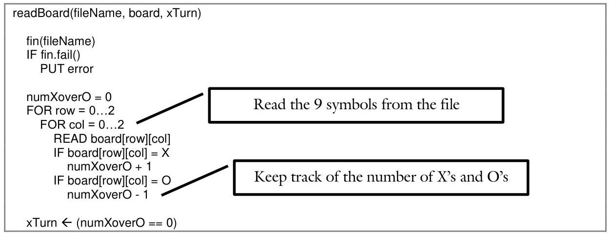

# 1.0-Using-Objects {.unit-background}

| ---
| [1.0 Design Documents](1.0-Using-Objects.ai)
| [1.1 Defensive Programming](../Chapter-1.1/1.1-Defensive-Programming.ai.md)
| [1.2 Exception Handling](../Chapter-1.2/1.2-Exception-Handling.ai.md)
| [1.3 Structures](../Chapter-1.3/1.3-Structures.ai.md)
| [1.4 Separate Compilation](../Chapter-1.4/1.4-Separate-Compilation.ai.md)
| [1.5 Function: Advanced Topics](../Chapter-1.5/1.5-Function-Advanced-Topics.ai.md)

<div style="page-break-after: always;"></div>

# 1.0-Using-Objects {.unit-background style="clip-path: inset(0.5in 0 0 0)"}

# 1.0 Design Documents

Sam is anxious to begin work on a new programming project. Though the project is large and complex (the game of Tic-Tac-Toe), Sam knows how to do some of the easier things and wants to get them out of the way. As he feverously starts typing, Sue enters the lab. Sue also wants to begin her project early and is surprised by Sam's progress. "How are you going to solve the file-format problem" Sue asks him. "Umm, I haven't figured that out yet." "How are you going to handle user input" she asks. Again, Sam has no answer. Finally, truly bewildered, she asks Sam how he can type any code without knowing how to solve the key problems of the project. With this, Sam replies "Well, you have to begin somewhere." Sue chews on this for a few minutes. How do you begin a large project such as this?

## Objectives

By the end of this chapter, you will be able to:

- See the benefit of designing a program before writing the code
- List and define the components of a design document
- Understand how the components of a design document work together to help the programmer solve key problems


## Prerequisites

Before reading this chapter, please make sure you are able to:

- Write the pseudocode for a given algorithm
(Procedural Programming in C++, Chapter 2.2)
- Create a structure chart describing the dataflow and modularization of a program
(Procedural Programming in C++, Chapter 2.0)
If you are unsure of any of these prerequisites, please take a moment to review them before proceeding.


## What is a design document and why you should care

Computer languages such as $\mathrm{C}++$ force programmers to focus on a myriad of little details when writing code. This makes it difficult to see the big picture, to design with broad strokes and to make big decisions. It is like building an airplane and people keep asking you what kind of screw you want to use. What kind of screw!? You don't even know how many engines will be needed!

The **design document** is meant to free you from these details so you can identify and solve the key problems. Once these big decisions are made, then we can address the details required when writing code. Perhaps more importantly, the design document helps us identify which path we do _not_ want to pursue before we get too committed to a given solution. The danger of getting bogged down in details is that large parts of the problem remain unknown. Often the value of a decision is not realized until long after the decision is made. By drafting out a solution to the entire problem, however, we can see how all our design decisions interact with each other early in the design process. In other words, the design document gives the programmer the ability to see and address the big issues of a project before committing to any one solution.

It is perhaps best to think of the design document as a suite of tools, each designed to address a specific aspect of a programming project. Though each of these tools has a purpose, it is not uncommon to encounter a problem where some of the tools are not needed. The parts of a design document are:

| Part | Purpose {.steel-blue-header-table style="border-top: 2px solid black; border-bottom: 2px solid black"}
| :--: | :--
| Problem Description | Clearly state what problem is being solved so everyone involved is on the same page
| Design Overview | Summarize to the reader of how the problem will be solved. Highlight the big design <br> decisions so the reader will know what to focus on
| Structure Chart | Make sure the I/O functionality of the program is understood early in the design process
| Algorithms | Make an inventory of the functions of the program
| Data-structures | Identify and draft the algorithms of the key functions
| File Format | Describe how data will be stored in the program while it is running
| Error Handling | Describe how data will be read from and written to a file {style="border-bottom: 2px solid black"}

If the programmer solves all of these problems before a line of code is written, then the actual process of writing code will be relatively straight forward.

One final note: there is no such thing as a standard template for a design document. All programmers do this a little differently according to the needs of their project and their personal taste. For the purpose of this class, we will use the above format so you can be familiar with the tools that are commonly used in a design document. After you have mastered these tools, you can decide for yourself the composition of your design documents.

> [!Danger] Sue's Tips
> {.sue}
> Generally, the more detailed the design document, the smaller the chance for unforeseen problems to derail the project. It is not uncommon in industry to spend a day on design for every two days writing code.
>
> At the beginning of every project, the programmer is asked to make an estimate of how long a given feature will take to implement. This is very difficult: if the programmer over-estimates the time to complete the project then he will be perceived as being less valuable. If the programmer underestimates then he will need to work extra hours to meet his ambitious timeline. The design document helps the programmer deliver an accurate estimate because it helps the programmer to better understand the solution.

## 1. Problem description

The first part of the design document is the program description. In an academic setting, this is the easiest part of the design document. The only thing required is to summarize the assignment in a sentence or two. That is it! In the workplace, however, this is much more complex.

Often the most difficult part of a project is just identifying what the project is all about. Perhaps this is best explained by example. Consider a young programmer who decides to make a new mobile calendar application. Being a diligent software engineer, he starts with the program description. Suddenly he is confronted with such questions as:

- What is the point of this project?
- Who is going to use it, and why?
- What makes it different/better than the hundreds of similar programs out there currently?

The whole point of the program description is to get clarity, so there is no question as to what problem the program is meant to solve.

**What:** The design overview is a brief description of the problem the program is designed to solve. If you cannot describe it in a couple of sentences, then you probably don't understand it yourself.

**How:** Try to tell a classmate or friend what the project is all about. If you can do it in a single sentence, then write that sentence down in the program description. If not, keep working on it!

**Example:** Consider the classic game of Tic-Tac-Toe. A program description might be:

| ---
| This program will allow the two users to play Tic-Tac-Toe. The game will be saved in a file and the users will be able to interact with their game using a text-based interface. {.gray-box}|

> [!tldr] Sam's Corner
> {.sam}
> The program description should be concise and largely technology free. Read and re-read the problem description from the assignment and summarize it in a single sentence. If you are spending more than a minute on it, you are over-thinking it!

## 2. Design overview

The design overview serves the same purpose as the introduction to an essay: it gives the reader a fighting chance of understanding what is to follow. In other words, the design document consists of a variety of tools designed to describe various parts of the solution. Because these tools describe different aspects of the solution, it is not easy to connect the dots. One part of the solution may be described in the structure chart, in algorithms, and in the file I/O section. The design overview describes the entire approach to solve the problem holistically so the reader knows what to look for when the other tools are described.

The single biggest mistake students make when writing a design document (aside from not allocating enough time to accomplish the task) is to confuse the design overview with the problem description. The problem description describes what problem you are solving. The design overview describes how the problem is to be solved. Thus the design overview does not address the behavior of the program (that is for the problem description). It will address what strategy the programmer should follow to write the code.

> [!Quote]
> *The problem description describes _what_ problem you are solving.*
>
> *The design overview describes _how_ the problem is to be solved.*

**What**: The design overview should briefly describe the elements of your program. This includes how you will go about solving the problem described in the problem definition. Often this includes the main modules, the data-structures that will be used, and the algorithms that will be needed. The detail here will be sufficient for the reader to understand how the problem will be solved, but not necessarily detailed enough to actually build it.

**How**: Describe the highlights of how the code will be written, focusing on the major decisions you made in the other parts of the design document. For most assignments in college, the design overview will be one or two short paragraphs. In the workplace, the design overview can be a full page.

**Example**: Back to our Tic-Tac-Toe program, a design overview might be:

| ---
| The game will be stored in a $3 \times 3$ array of characters. All user interactions will be directed towards modifying this array. The board will also be stored in a file in a 3 row, 3 column grid. {.gray-box}

> [!Danger] Sue’s Tips
> {.sue}
> Though the design overview is near the beginning of the design document, it is the last part written. You often don’t have a fully developed idea of how you will solve the problem until the design document is complete.
>
> One way to think of this is: if you were to describe to a friend how you are going to solve this program in one minute, how would you do that? What are the big decisions you made? What is the gist of your basic approach?

## 3. Interface design

The interface design describes everything the user will encounter with the program. This is the most tedious but the easiest part of the design document. It is tedious because you need to discover and describe every single output the program could generate and every input the user could enter.

In industry, the interface design can be obtained from the spec (short for "specification"). The spec is a document describing how a given feature or product is to work and is provided to the programmer by some designer. If the spec is written correctly, the programmer needs only to search the depths of the spec for the interface design and paste it into his design document. If the spec is not done correctly, then the programmer will need to ask the designer to provide those interface details. In either case, the programmer simply cannot begin the project without a clear understanding of what the interface will be like.

In academia, the interface design is usually provided by the teacher. Either it is part of the program description, it is implied with a working program that the student needs to explore, or the interface is up to the student to describe. In either case, the student cannot begin the project without a clear understanding of the interface.

**What**: A detailed description of the input the user may enter, the output the program needs to produce, and all the error messages the program may generate.

**How**: Three tables are usually required:

- Output: If the program uses text input and output, provide the actual text the program will generate. If the program uses graphical output, provide a screen shot.
- Input: Create a table with two columns. The first describes the input and the second describes how the program will respond to it.
- Errors: Create a table with two columns. The first describes the text of the error message and the second describes when the error message will be presented to the user.


### Example

With our Tic-Tac-Toe program, a sample from the Output section is:

<table>
<thead class="gray-box steel-blue-header-table"><tr><th>Output screen-shot</th><th>What it is used for</th></tr></thead>
<tbody>
<tr class="gray-box" valign="top">
<td>

```
   A   B   C
1  O |   | X
  ---+---+---
2  X | X | O
  ---+---+---
3  O | X |
```

</td>
<td> Displaying the board after every turn </td>
</tr>
</tbody>
</table>

A small sample of the Input section is:
| Input value {.steel-blue-header-table .gray-box} | How the program responds
| :-- | :--
| s {.steel-blue-header-table .gray-box} | Save the current board to a file
| e {.steel-blue-header-table .gray-box} | Edit a square on the board
| q {.steel-blue-header-table .gray-box} | Quit the game

One example error is:
| `Error message` {.steel-blue-header-table .gray-box} | When the message appears
| :-- | :--
| `Unable to open file file.txt for reading.` {.gray-box} | File is missing or otherwise unavailable for reading


## 4. Structure chart

Any reasonably complex design consists of myriad of parts, all working together as a single whole. The purpose of the structure chart is to identify these parts and describe how they interact. Note that the function of the parts themselves is not described (thereby underscoring why self-descriptive function names are so important). For programming problems, the tool of choice for designing at this level is the structure chart.

**What**: A structure chart is a graphical representation of the modules in a program and how information passes between them. A structure chart is the primary design tool for procedural designs.

**How**: The structure chart is a graph containing three components:

- Functions: the functions of the program with a circle drawn around them.
- Lines: lines connecting functions that call each other.
- Parameters: labels on the lines connecting functions if data flows between them.

**Example**: Back to our Tic-Tac-Toe program, the Structure Chart would be the following:


:::mermaid
---
title: Board Program Flowchart
layout: hierarchical
flowchart:
   htmlLabels: false
---
flowchart TB
   subgraph subGraph1["Main"]
      direction LR

      main["main"]
   end

   subgraph subGraph2["Handle Program"]
      direction RL

      clearBoard["clearBoard"]
      interact["interact"]
   end

   subgraph subGraph3["Utility Functions"]
      direction LR

      displayOptions["displayOptions"]
      displayBoard["displayBoard"]
      editSquare["editSquare"]
      getText["getText"]
   end

   subgraph subGraph4["I/O"]
      direction LR

      convertSymbol["convertSymbol"]
      readBoard["readBoard"]
      writeBoard["writeBoard"]
      getCoordinates["getCoordinates"]
   end

   main -->|board, xTurn| interact

   clearBoard --> main

   displayOptions --> interact
   interact -->|board| displayBoard
   readBoard --> interact
   interact -->|board, xTurn, fileName| writeBoard
   interact -->|board, xTurn, fileName| editSquare
   getText -->|fileName| interact

   convertSymbol -->|symbol| displayBoard
   getCoordinates -->|row, col| editSquare

   subGraph1 --> subGraph2 --> subGraph3 --> subGraph4
:::

.jpeg>)

> [!Danger] Sue's Tips
> {.sue}
> Though it is possible to draw a structure chart electronically, \
> this can be a time-consuming and frustrating experience. \
> It is best to leave a half page blank in your design document and draw it by hand. \
> Before you do this, however, take a moment and draw a few drafts on scratch paper. \
> Make sure that `main()` is on top and functions get called top-to-bottom like the above example.
>
> When you are finished with your structure chart, make sure it is neat and readable. Sloppy work in a structure chart often is a reflection of sloppy thinking.

## 5. Algorithms

While the structure chart describes how the functions of the program interact with each other but do not describe what occurs within a function, the algorithms section has the opposite purpose. Here we look at individual functions and briefly forget about the rest of the program. Note that you must have a structure chart before you can do this; otherwise you won't know what algorithms will need to be written!

**What**: The algorithms section describes the critical algorithms of the program. Trivial functions, such as getFileName(), have no place in the design document. Instead, focus on the handful of hard functions. If you can't just sit down and write the code for a function, then draft it out in the algorithms section. This is perhaps the most common mistake programmers make in their design documents.

**How**: Pseudocode is the tool of choice for algorithms. Remember to make it detailed enough that we have actual variable names and equations, but not so detailed that the language of $\mathrm{C}++$ comes through.

**Example**: One non-trivial function from the Tic-Tac-Toe game is readBoard(). The tricky part is determining whose turn it is. If there are an equal number of X's and O's, it must be X's turn; otherwise it is O's turn to go next.


<div class="monospace">

> [!Quote] Pseudocode
> readBoard(fileName, board, xTurn)\
> \
> fin(fileName)\
> IF fin.fail()
> > PUT error
>
> numXoverO = 0
> > FOR row = 0...2
> > > FOR col = 0...2 <span style="border: 2px solid black; padding: 0.4em">Read the 9 symbols from the file</span>
> > > > READ board[row][col]\
> > > > IF board[row][col] = X
> > > > > numXoverO + 1
>
> > > > IF board[row][col] = O
> > > > > numXoverO - 1 <span style="border: 2px solid black; padding: 0.4em">Keep track of the number of X's and O's</span>
>
> xTurn ← (numXoverO == 0)

</div>

The next non-trivial function is editSquare(), how the user is allowed to put an X or O on the board. Again the function needs to keep track of whose turn it is.

<div class="monospace">

> [!Quote] Pseudocode
> editSquare(board, xTurn)
> > getCoordinates(row, col)\
> > IF board[row][col] ≠'.'
> > > RETURN
>
> >  IF xTurn
> > >    board[row][col] = X
> > >    xTurn = FALSE
>
> >  ELSE
> > >    board[row][col] = O
> > >    xTurn = TRUE

</div>


> [!danger] Sue's Tips
> {.sue}
> In practice, any algorithm that could be the source of bugs or prove difficult to implement should be specified in pseudocode so difficulties could be worked out before the code is written. The sooner the bugs are found, the easier they will be to fix

## 6. Data structure

Most data-structure decisions in a program are trivial: use an integer for counting, a Boolean for logical data, and a string for text. It is often the case when there is no obvious built-in data-structure that can solve a given problem. Consider, for example, a program designed to play a MadLib ${ }^{\circledR}$ game from Project 3 of last semester. Should the story be stored as a single string? As an array of lines? As an array of words? Each of these possibilities has different ramifications for the rest of the program. In many ways, the choice of datastructure is the most critical design decision for a MadLib ${ }^{\circledR}$ program.

**What**: The data-structures addresses how the data in the program will be stored. Don't bother with trivial items such as file names or indexes. Instead, focus on the data that drives the program. If you have an array, structure (Chapter 1.3), class (Chapter 2.0), or any other type of data-structure, it should be described here.

**How**: For procedural programs, describe how the user's data will be stored in the program. Later in the semester we will use UML class diagrams to describe Object-Oriented constructs.

**Example**: There are two non-trivial data-structures in our Tic-Tac-Toe game: a coordinate and a board.

- Coordinate: a structure with two member variables: row and column.

<div class="center">

| Coordinate {.steel-blue-header-table .center}
| :--
| row
| col

</div>

- Board: a $3 \times 3$ array of characters were the possible tokens are:

<div class="center">

| Token {.steel-blue-header-table .center} | Meaning
| :--
| `X` | Space occupied by $X$
| `O` | Space occupied by $O$
| `.` | Unoccupied space

</div>

> [!tldr] Sam's Corner
{.sam}
> When defining a data-structure for a given problem, it is important to consider how much memory the data-structure will take. This is an important consideration when we have many instances of that data-structure in a program. A pixel consisting of three chars, for example, is much more compact than one consisting of three integers. This is especially true when there are millions of pixels in a given image.

## 7. File format

Whereas the data-structures section of the design document is concerned with how to store the user's data while the program is executing, the file format section is concerned with how to persist that data between executions of the program.

**What**: Describe the format of data in the file as well as how that data is converted into a run-time datastructure at file-read and file-write time.

**How**: Give an example of the file format. Describe any translation that needs to happen to convert this file format into a data-structure. Typically this includes a diagram as well as an English description.

**Example**: An example file for our Tic-Tac-Toe game is the following:

```
XO.
...
.X.
```

The '$X$' and '$O$' token map directly to the corresponding token in the file format. The '$.$' token maps to a space.

> [!Danger] Sue's Tips
> {.sue}
> There are two overriding concerns when defining a file format: the amount of space required to store the user's data, and how easy it is to perform the read/write operations.
>
> When faced with a fixed file format, namely a file format that the programmer does not get to specify, then the programmer often must choose a data-structure that facilitates the read/write process. Also, it is important that the programmer fully understands the associated standards and requirements for the file format before attempting to write the code.
>
> A more common scenario occurs when the programmer is given the freedom to define an appropriate way to store the data in a file. In these scenarios, pay special attention to space and translation issues.

## 8. Error handling

In the ideal world users never make mistakes, files always have data in the expected format, and programmers never make mistakes. Of course we do not live in the perfect world. Our programs need to be designed to withstand errors from any source and still function properly. The best way to accomplish this is to think about error handling early in the design process.

What: The error handling section will represent your best guess as to the types of errors that your program will need to handle. This is always incomplete; some errors are difficult to predict until you write the program or test the software. However, every error you catch early in the process will save a great deal of time further down the road.

How: Enumerate the three types of errors that a program is likely to handle:

- User Errors: unexpected input coming from the user. This could be anywhere from an incorrect filename to an invalid coordinate. User errors are typically handled with an IF statement and an error message.
- File Errors: data in a file is in a different order or a different format than is expected. This could be caused by a bug in the file creation code or by the file itself being changed by the user. File errors are usually handled with an IF statement and an error message.
- Internal Errors: errors caused by bugs within a program. These are all detected with asserts (Chapter 1.1) or other types of debug code.

Example: The user errors that the Tic-Tac-Toe program will have to handle include:

| Error | Condition | Handling {.steel-blue-header-table}
| :-- | :-- | :--
| Invalid option | User input something other than $r, s$, or $q$ | Re-prompt and error message
| Invalid coordinate | Coordinate specification that is not $[a . c][1 . .3]$ | Re-prompt
| Invalid filename | Unable to open file with specified filename | Re-prompt and error message

The file errors in the Tic-Tac-Toe program include:

| Error | Condition | Handling {.steel-blue-header-table}
| :-- | :-- | :--
| Unexpected token | Token in file that is not $x, 0$, or . | Error message and stop loading file
| Too few tokens | Reach EOF before 9 tokens are read | Error message and stop loading file
| Impossible game | There should be the same number of $x$ s and $O s$ <br> or one more $x$ than 0 | Error message and stop loading file

The final type of errors is internal:

| Error | Condition | Handling {.steel-blue-header-table}
| :-- | :-- | :--
| Malformed coordinate | coord. $x>2$ or coord. $x<\theta$ or <br> coord. $y>2$ or coord. $y<\theta$ | Assert
| Malformed board | Any value in the board that is not $x, 0$, or . | Assert

> [!Danger] Sue's Tips
> {.sue}
> The condition of every error, be that user, file, or internal, should be readily convertible into a Boolean expression. If it is not, you don't understand the error well enough yet.

<table class="Example">
<thead>
<tr>
<th colspan="3">

## Example 1.0 - Tic-Tac-Toe Design Document {.example-title}

</th>
</tr>
</thead>
<tbody>
<tr>
<th>

Demo

</th>
<td>

This demo is meant to illustrate a complete design document for a program approaching the complexity of what one would expect to see in CS 124.

</td>
<th></th>
</tr>
<tr>
<th>

Solution

</th>
<td>

Write a design document for a simple game to play Tic-Tac-Toe. The game should be able to allow two users to play the game and the program should persist a game in a file.

</td>
<th></th>
</tr>
<tr>
<th>

Challenge

</th>
<td>

The important components of the design document are presented in the preceding section. It is important to observe how each section addresses a different aspect of the overall design.

</td>
<th></th>
</tr>
<tr>
<th>

See Also

</th>
<td>

As a challenge, see if you can complete a design document for a project you have worked on in a previous semester. Pay special attention to the new sections (Design Overview, Interface Design, Data-structures, File Format, and Error Handling).

</td>
<th></th>
</tr>
</tbody>
</table>

# Problem 1

What typically goes at the top of a structure chart?
Answer:

Please see page 35 for a hint.

## Problem 2

List and define the three components of the Interface Design section of the Design Document

- $\qquad$
- $\qquad$
- $\qquad$

Please see page 34 for a hint.

## Problem 3

List and define all the components of the Design Document.

- $\qquad$
- $\qquad$
- $\qquad$
- $\qquad$
- $\qquad$
- $\qquad$
- $\qquad$
- $\qquad$
- $\qquad$

Please see page 31 for a hint.

# Problem 4

Define each of the following Design Document tools:

- Structure Chart: $\qquad$
- UML $\qquad$
- Pseudocode $\qquad$
Please see page 35, 36, and 37 for a bint.


## Challenge 5

Create a complete design document from the Calendar project (Project 2) from CS 124. This will obviously take more space than is provided here in the textbook...

Please see page 40 for a bint.