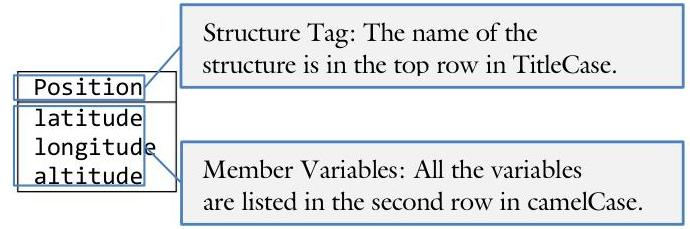

# Unit 1: Using Objects {.unit-1-background}

> **In this Chapter:**
> [[toc]]

<div style="page-break-after: always;"></div>

### 1.3 Structures

Sue is working on a program to play Sudoku and is getting tired of passing row and column parameters to almost every function. In her mind the two variables should be one because they represent a single concept. However, there is no "Coordinate" data type in C++. Surely there must be a better way!

**Objectives**

By the end of this chapter, you will be able to:

- List and define the following terms: structure, member variable, and member value.
- Create a structure to represent a given concept.
- Declare, initialize, pass as a parameter, and dereference a structure variable.
- See the value in using structures to simplify a wide range of programming problems.


**Prerequisites**

Before reading this chapter, please make sure you are able to:

- Choose the most appropriate data type for a given programming problem (Procedural Programming in C++, Chapter 1.2)
- Pass a variable to a function by-value, by-reference, and by-pointer (Procedural Programming in C++, Chapter 1.4, 3.3)
- Define cohesion and use it to better define functions (Procedural Programming in C++, Chapter 2.0)
- Declare, initialize, pass as a parameter, and dereference an array variable (Procedural Programming in C++, Chapter 3.0)


## What is a structure and why you should care

A structure is a mechanism to create a custom data type specifically tailored for the needs of a given program. In other words, we do not have to be limited to the built-in data types provided by the `C++` language (such as int, float, char, bool, double, etc.).

There are several reasons why structures are an invaluable tool in your programming toolbox. First, there are a collection of problems that can only be addressed with structures. Thus the topic of structures completes your training in procedural programming techniques. Second, a big part of programming, especially using the Object-Oriented design methodology, is to create custom data types designed especially for a given application. Our first baby-step into this space is structures. Every single program we write for the remainder of the semester will build off of this chapter.

> [!Danger] Sue's Tips
> {.sue}
> The structure is the second aggregate data type. This means that it consists of more than one primitive (or built-in) data types. Our first aggregate data type was an array, consisting of a collection of items with the same base type and where each instance is accessed with an index. Structures are similar to arrays in many ways but with two important exceptions: elements in a structure can be of different data types where arrays must be the same, and elements in a structure are referenced by name whereas arrays are referenced by index.

# Designing with structures 

Perhaps the easiest way to think of structures is as a "bucket of variables." There are two parts to this model: the variables in the bucket and the name of the bucket itself. When designing a structure, we use a simple two-row table where the first row corresponds to the name of the structure and the second consists of the list of variables that are to be contained:


We call this simple design tool UML, an acronym meaning "Unified Markup Language." UML is actually a suite of five tools, of which this the class diagram presented here is only one. (Booch, 1994) (Rumbaugh, Blaha, Premerlani, Eddy, & Lorensen, 1991)
The first part of the design process is to answer the question "What is this structure for?" Just as when we design functions, the concept of cohesion comes into play. If we can answer this question well, if the member variables together describe a single cohesive concept, and if a simple name completely encapsulates the concept the member variables represent, then we will have an easy time designing and using our new structure.
The second part of the design process is to identify the member variables necessary to characterize the concept represented with the structure tag. Again, the concept of cohesion plays an important role. All the member variables should work together to describe one concept. Resist the temptation to throw in extra or unnecessary variables. These will just make the code more difficult to maintain and use.

The following are examples of structures you may want to create:

| Account | Complex | Name | Address |
| :-- | :-- | :-- | :-- |
| centsBalance | real | first | street |
| centsMinimumBalance | imaginary | middleInitial | city |
| interestRate |  | last | state |
| accountNumber |  | title | zip |

An example of a bad structure definition exhibiting weak cohesion might be:

| Stuff |
| :-- |
| counter |
| buffer |
| fileName |

> [!Danger] Sue's Tips
> {.sue}
> UML is an easy tool to quickly visualize and design structures. It is also the primary tool we use in the Data-structures section of the design document. Take a moment and sketch out the structures that may come in handy for the Chess project presented at the end of this unit.

# Defining a structure 

The first step in working with a structure is to define it. A structure definition is a template for a variable; it is not a variable itself. The integer date-type int, for example, is not a variable. Only when you declare a variable with int count; then the data type gets realized as a variable.

The structure definition has several parts: the "struct" keyword indicating we are defining a structure, the name of the structure ("Position" in this case), the curly braces $\}$, and a list of variable declarations comprising the member variables of the structure. Consider the following UML class diagram for a Position structure:

| Position |
| :-- |
| latitude |
| longitude |
| altitude |

The definition for Position is:

| struct Position | // corresponds to the structure tag |
| :-- | :-- |
| \{ | // corresponds to the member variable latitude |
| float latitude; | // note member variables can be of different data types |
| float longitude; | // do not forget the semi-colon! |
| int altitude; |  |

With the UML description of a structure, it should be a very straight-forward process to create the structure definition. The only thing that is needed is to provide the data types and remember the syntax. Keep in mind that this only defines the structure. It is a blue-print telling the compiler what a Position variable will look like. You can use this definition to create as many Position variables as you like, each of which will have its own copy of the data.

Note that it is possible to create one structure out of another. This is called a nested structure. If, for example, I wished to create a structure capturing the notion of the leg of a journey, I would want to use my newly created Position structure. The UML for the Trip structure would be:

| Trip |
| :-- |
| source |
| destination |
| cost |

> [!Danger] Sue's Tips
> {.sue}
> You can also specify data types in your UML if you feel it adds clarity to your design. Our Trip structure above could also be represented as:

| Trip |
| :-- |
| source : Position |
| destination : Position |
| cost : float |

Based on this UML, the definition for Leg is:

| struct Trip | // the structure tag should be TitleCased |
| :-- | :-- |
| { | // we don't have to use built-in data types for |
| Position source; | // member variables; we can use structures! |
| Position destination; | // it is possible to mix built-in data types |
| float cost; | // with structures |

# Declaring a structure 

To turn the template of a data type into a variable, you need to declare the variable. This is true with a builtin data type as it is with a structure. Therefore, the syntax of declaring a variable of type Position is as one would expect:

```cpp
{
    Position positionRexburg; // a variable of type Position. Make sure that
} // Position is defined before here
```

It is possible to initialize a variable at declaration time (int count $=0 ;$ ). It is similarly possible to initialize a structure variable at declaration time. The main difference is that three member variables need to be initialized at once:

```cpp
{
    Position positionRexburg = // define Position before this line of code
    { // use curly braces to surround the values
        43.82937, // latitude member variable
        -111.7828, // longitude
        4865 // altitude
    }; // don't forget the semi-colon!
}
```

You can copy the contents of one structure onto another with the assignment operator =: Remember, every time you declare a structure, you are creating a brand new copy or instance. This means you can change the values of one instance without affecting the others.

```cpp
{
    Position rexburg = {43.8231, -111.7828, 4865};
    Position disney = {33.8121, -117.9190, 141};
    Position copyRexburg;
    copyRexburg = rexburg; // this is legal! You can copy the contents of one
                                    // one struct into another any time you want.
    cout << "Difference in altitude between Rexburg and Disney: "
        << copyRexburg.altitude - disney.altitude
        << endl;
}
```

Notice how the assignment operator copies all the data from the curly braces into the new structure variable. It turns out that you can perform a structure copy any time you want.

> [!tldr] Sam's Corner
> {.sam}
> While it is legal to copy one structure onto another, it is also expensive. If the structure has any member variables, a large amount of data may be copied. This means a seemingly innocent assignment operator may be the source of many assembly instructions taking a lot of CPU time. In other words, use this construct sparingly.

It is easy and convenient to copy structures with the assignment operator. Remember that we cannot do the same thing quite as easily with an array:

```cpp
{
    int array1[] = {4, 6, 8, 1};
    int array2[4];
    array1 = array2;
} // ERROR: this does not work! You need to use a
// loop to copy the contents of an array
```


# Referencing member variables 

With an array, it is possible to access individual elements with the square bracket operator []. The $4^{\text {th }}$ item in an array, for example, can be accessed with array[3]. Structures do not access member variables by index but rather by name. This is accomplished with the dot operator (also known as the member access operator). Back to our positionRexburg variable declared previously, we can declare the Position variable and initialize the member variables separately:

```cpp
{
    Position positionRexburg; // declared but not initialized
    positionRexburg.altitude = 4865; // use the dot operator to access the
    cout << positionRexburg.altitude; // member variables directly
}
```

This also works if a member variable is a structure itself. Recall our Trip structure that had a source member variable of type Position.

| Trip |
| :-- |
| Source |
| destination |
| cost |

This can be initialized in much the same way:

```cpp
{
    Trip romeToVenice;
    romeToVenice.cost = 25.32; // the cost member variable is a float
    romeToVenice.source.latitude = 41.9000; // source is a Position which has three
    romeToVenice.source.longitude = 12.5000; // member variables. Each of these
    romeToVenice.source.altitude = 456; // can be accessed by name with the
} // dot operator .
```


> [!tldr] Sam's Corner
> {.sam}
> With arrays, it is easy to write a FOR loop to iterate through all the elements in the collection. This is impossible with a structure! Because member variables are referenced by name rather than by index, the only way to access all the member variables is to laboriously enumerate them individually in the code.

A structure is called an "early-binding" mechanism. The compiler has all the information necessary to verify that the referencing of a member variable is done correctly. You cannot iterate off the end of the buffer in a structure as you can with an array!

As with any data type, we can also make arrays of structures:

```cpp
{
    Position manyPositions[10]; // an array of 10 positions
    // initialize the 5th item
    manyPositions[4].latitude = 43.8293; // access the member variables after
    manyPositions[4].longitude = -111.7928; // the [] with the dot operator
    manyPositions[4].altitude = 4865;
    // copy the 5th into the 1st
    manyPositions[0] = manyPositions[4]; // copy all the data
}
```


# Pointers and structures 

It is possible to create a pointer to a structure in much the same way we can create a pointer to any other data type. Unfortunately the syntax of accessing member variables gets a bit complex. We need to first dereference the structure pointer with the * operator before we can access the member variables with the dot operator. The problem arrises from the fact that the dot operator comes before the dereference operator in the order of operations. To make our intentions clear, we need to use parentheses. Consider the following example with the Position structure:

```cpp
{
    Position pos; // pos is a variable of type Position
    Position * pPos = &pos; // pPos is a pointer to a Position
    pos.altitude = 4865; // access the altitude member variable with the dot
    (*pPos).altitude = 5260; // we need the () operator to override the order of
} // operations. This is ugly
```

To avoid this nasty syntax involving the dot, parentheses, and dereference operator, a more convenient syntax was developed: the arrow operator $->$. It allows us to access member variables from a pointer to a structure without the unpleasant syntax.

```cpp
{
    Position pos;
    Position * pPos = &pos;
    pos.altitude = 4865; // dot operator for a structure variable
    pPos->altitude = 5260; // arrow operator for a pointer to a structure variable
}
```

Why do you suppose they developed a special syntax for a pointer to a structure? How common could it be? The answer is: very common.

Structures can be large, taking many bytes of memory. Therefore, it is expensive to copy them. Just like with arrays, programmers go through great lengths to ensure that there is only one copy of a structure in memory. Imagine how slow a computer would be if all the data was copied every time an array or structure got passed to a function. To prevent this inefficiency, it is quite common to pass structures as pointers between functions. This way, the callee will have access to the member variables without the callee having to make a copy of the structure. As you can see, if we are commonly passing pointers to structures between functions, the arrow operator would come in handy to access the member variables.

# Passing a structure to a function 

As previously discussed, making copies of structures can be an expensive practice. How then do we pass structures to functions as parameters? The answer is: the same as any other data type with one exception. We almost never pass a structure by-value.

```cpp
void function(Position byValue, // avoid passing a structure by-value
    Position & byReference, // very common way to pass a structure
    Position * byPointer) // less common but still very useful
{
    byValue.altitude = 5260; // use the dot operator here
    byReference.altitude = 5260; // also use the dot operator
    byPointer->altitude = 5260; // pointer necessitates the use of the arrow
}
```

When passing a structure variable to a parameter and the function is not to change the variable, then pass the structure by-reference as a constant:

```cpp
void display(const Position & pos) // pass a constant struct by reference
{
    cout.setf(ios::fixed | ios::showpoint);
    cout.precision(4);
    cout << "(" << pos.latitude // reference each member variable with the
        << ", " << pos.longitude // dot operator. Since the variable is
        << ", " << pos.altitude // a const, there is no chance of
        << ")"; // accidentally changing the value of pos
}
```

When passing a structure variable and the intention is to change the variable, then pass the structure byreference:

```cpp
void prompt(Position & pos) // pass a struct by reference
{
    cout << "Please enter the position as latitude longitude altitude: ";
    cin >> pos.latitude
        >> pos.longitude
        >> pos.altitude;
}
```


# Sam's Corner 

The `C++` language was derived from C which had many of the same constructs. One important difference is that there was no pass-by-reference in the C language. If you wanted the caller to change the variable, you had to use pass-by-pointer. This means that an entire generation of programmers were trained to pass structures by pointer instead of by reference. The above function prototypes would thus be:

```cpp
void display(const Position * pPos);
void prompt(Position * pPos);
```

Of course the body of the functions would access the member variables with the arrow operator.

## Example 1.5 - Position 

This program will demonstrate how to define a structure, declare a variable, reference the member variables, and pass a structure as a parameter.

Create a structure representing a position on the globe:

| Position |
| :-- |
| latitude |
| longitude |
| altitude |

Some functions to test this structure are:

```cpp
int main()
{
    // First we will declare a simple Position variable
    Position pos1;
    // Next we will fill it with the prompt function
    prompt(pos1);
    // Now to display the results
    cout << "Original value of pos1: ";
    display(pos1);
    // We will initialize a position as we declare it this time
    Position pos2 =
    {
                        // use curly braces to surround the values
            43.82937, // latitude member variable
            -111.7828, // longitude
            4865 // altitude
    };
    // we can perform a structure-copy with the assignment operator
    pos1 = pos2;
    // display the results to verify
    cout << "New value of pos1: ";
    display(pos1);
    // one final prompt
    promptPointer(&pos1);
    return 0;
}
```

The complete solution is available at 1-3-position.html or:
/home/cs165/examples/1-3-position.cpp

## Example 1.3 - Address 

This program will demonstrate how to define a structure, declare a variable, reference the member variables, and pass a structure as a parameter.

Write a program to prompt a user for his address and display it back to him.

| Address |
| :-- |
| street |
| city |
| state |
| zip |

The declaration of the structure is:

| struct Address | // structure tag is TitleCased |
| :-- | :-- |
| \{ | // the street can be long, use the string class |
| string street; | // same is true with the city |
| string city; | // states use a two-letter abbreviation, plus \0 |
| char state[3]; | // the zip is five digit integer |
| int zip; |  |

To initialize the structure, we need a prompt function:

| void prompt(Address & input) | // we are changing the input so it is |
| :-- | :-- |
| \{ | // pass-by-reference |
| cout << "What is your street address? "; |  |
| getline(cin, input.street); | // use the dot operator to access the |
| cout << "What is your city? "; | // member variables here |
| getline(cin, input.city); |  |
| cout << "What is your state and zip? "; |  |
| cin >> input.state >> input.zip; |  |

Finally, we display the Address by passing it as a constant by reference.

| void display(const Address & output) | // we are not changing the output |
| :-- | :-- |
| \{ | // so the parameter is a const |
| cout << output.street << endl | // we access the member variables |
| << output.city << ", " | // with the dot operator. Because |
| << output.state << " " | // the variable is a const, we |
| << output.zip << endl; | // cannot change the values |

The complete solution is available at 1-3-address.html or:
/home/cs165/examples/1-3-address.cpp

## Example 1.8 - Tic-Tac-Toe 

This program will demonstrate how to integrate structures into a large project. In this case, the project is Tic-Tac-Toe.

Integrate two structures into our Tic-Tac-Toe example from the previous chapters.

| Game | Coordinate |
| :-- | :-- |
| board | row |
| xTurn | col |

The declaration of the Game structure is:

```cpp
struct Game
{
    char board[][3];
    // the same 3x3 array as before
    bool xTurn;
};
```

With this change, main() is greatly streamlined:

```cpp
int main()
{
    // set up the board
    Game game; // only one variable needed, not 2
    clearBoard(game); // it is also much easier to
    // let the users play the game // pass as a paraemter
    interact(game);
    return 0;
}
```

Though many functions will change with this instruction of the Game structure, most will follow the pattern of the clearBoard() function.

```cpp
void clearBoard(Game & game) // pass the structure by reference
{
    // remove all the markings off the board
    for (int row = 0; row < 3; row++)
            for (int col = 0; col < 3; col++)
                game.board[row][col] = '.';
            // set the turn to X's
    game.xTurn = true;
}
```

The complete solution is available at 1-3-ticTacToe.html or:
/home/cs165/examples/1-3-ticTacToe.cpp

Given the following code:

```cpp
{
    struct Position
    {
        double latitude;
        double longitude;
        double altitude;
    };
    Position myHouse;
    myHouse.latitude = 43.83388;
    myHouse.longitude = -111.80500;
    myHouse.altitude = 5260.00;
}
```

List all the member variables.

> ## Problem 2 
> 
> Write the code for a structure definition matching the following UML:
> 
> | Name |
> | :-- |
> | firstName |
> | lastName |
> 
> ## Problem 3
> 
> Given the following structure definition:
> 
> ```cpp
> struct Position
> {
>     double latitude;
>     double longitude;
>     int altitude;
> };
> ```
> 
> How would you declare a variable of type Position?
>   <input style="min-height: 200px">
> 
> Given the following code:
> 
> ```cpp
> struct Position
> {
>     double latitude;
>     double longitude;
>     int altitude;
> };
> Position myHouse;
> ```
> 
> How do you initialize the member variable altitude?
>   <input style="min-height: 200px">
> 
> ## Problem 5 
> 
> What is the output?
> 
> ```cpp
> {
>     struct Person
>     {
>         int age;
>         char name[100];
>         float height;
>     };
>     Person jack;
>     cout << sizeof(jack) << endl;
> }
> ```
>   <input style="min-height: 200px">
> 
> ## Problem 6 
> 
> Given the following structure definition and variable declarations:
> 
> ```cpp
> struct Name
> {
>     char first[256];
>     char middleInitial;
> };
> struct Family
> {
>     char last[256];
>     Name father;
>     Name mother;
> };
> int main()
> {
>     Family smithFamily;
>     Name bob;
>     <your code goes here>
> }
> ```
> 
> Write the code to display the contents of all the member variables. For example:
> ```
> cout << bob.first;
> ```
>   <input style="min-height: 200px">
> 
> *Please see page 69 for a hint.*
> 
> ## Problem 7
> 
> Consider the following UML:
> 
> | Complex |
> | :-- |
> | real |
> | imaginary |
> 
> Please do the following:
> 
> 1. Create a structure matching the UML
>   <input style="min-height: 200px">
> 2. Create a variable of type complex. Name it $x$ and fill it with $5.2+36.1 i$
>   <input style="min-height: 200px">
> 3. Create another variable. Name it $y$ and copy $x$ into $y$
>   <input style="min-height: 200px">
> 4. Write an IF statement comparing the value of $x$ with the value of $y$
>   <input style="min-height: 200px">
