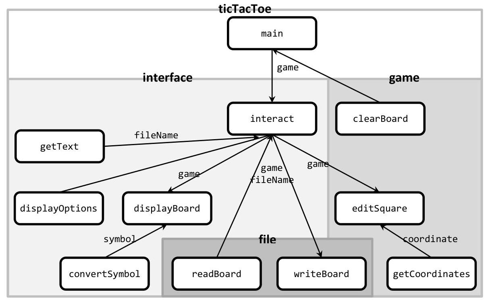
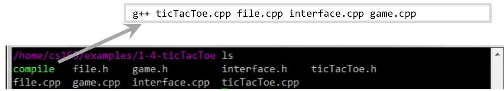
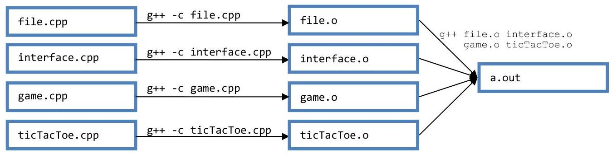
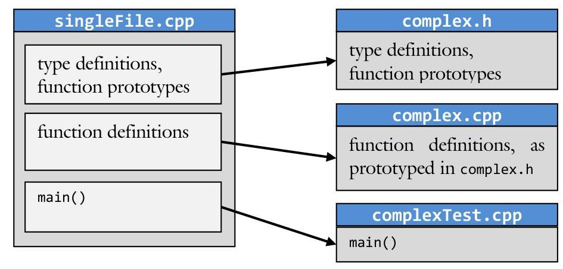
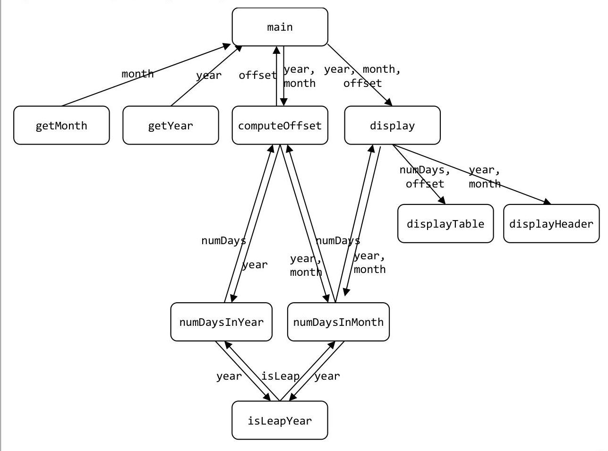

---
ai_generated: true
conversion: "Converted from PDF using Mistral OCR"
original_file: "1.4-Separate-Compilation.pdf"
generated: "2025-08-03 16:27:26"
---

# 1.4-Separate-Compilation

# Unit 1: Using Objects 

### 1.4 Separate Compilation

Sam and Sue are working on a large project with several other programmers. Immediately it is apparent to them that this will be very difficult to coordinate. With so many people editing the same file, how will they ever keep the project compiling? How will they ever keep people from editing the file at the same time? To mitigate these issues, they decide to break the project up into several smaller files.

## Objectives

By the end of this chapter, you will be able to:

- Name and define the terminology of separate compilation: header files, implementation or source files, makefile, linking, and assembly.
- Break a large program in a single file into many smaller and more manageable files.
- Design a project with separate compilation in mind.
- See the value of using separate compilation to reduce the complexity of a project.


## Prerequisites

Before reading this chapter, please make sure you are able to:

- Write a function prototype so functions can appear in any order in a file (Procedural Programming in C++, Chapter 1.4)


## What is separate compilation and why you should care

Separate compilation is the process of designing a program with multiple files each of which is a manageable size. Virtually every commercial software you run, be it on your phone, on your laptop, or on the web, consists of many source files. It is such a common practice in industry that most professional programmers cannot fathom working with just a single source code file.
There are many reasons why even beginner programmers should start thinking in terms of separate compilation. The first is that it drastically reduces the complexity of a program. When all the functions pertaining to a given aspect of a program are located in a single file, it becomes much easier to find the function you are looking for and easier to localize bugs.
Another benefit to separate compilation is that it facilitates code re-use. If you perfect a function that is general-purpose (such as the getIndex() function from Chapter 1.1), it is easy to put the function in its own file. Then, when you wish to incorporate that function in another program, it is only necessary to include the file in the project rather than copy-paste the code. In other words, large chunks of code can be reused into a new project with just a single statement. In this way, you can start building your own personal libraries that are as useful as iostream and string that you have been using since the beginning of the semester.
The final benefit of separate compilation is that is makes it much easier to work on large projects with other programmers. When a programmer is given a part of a project to work on independently, he can implement and often test his code independently from modules being developed by team members.

# Modularizing files 

The first step in working with multiple files is to determine the best way to break thet project into manageable components. If this sounds similar to the problem of breaking a large function into a collection of smaller ones, it should. In both cases, the principles of cohesion and coupling come to play.

## File cohesion

Cohesion, as you recall, is the quality of all the parts of a given component being directed towards a single purpose. This is true with files as it is with functions. Each file should only contain code designed to accomplish one task. Similarly, all the code for the task should be present in the single file. Consider, for example, our Tic-Tac-Toe program from previous chapters. A cohesive design would be to have one file containing all the functions working with the user interface, one file working with file I/O, and another with working with the rules of the game. This way only the user interface file needs to be changed if a different user interface is to be used.

## Component coupling

Coupling is a measure of information interchange. With functions, coupling is primarily concerned with the parameters passed to and from functions. With files, coupling is primarily concerned with how easy it would be for someone to use the functionality contained within the file. In other words, the less complicated the interface of the functions, the easier it will be to use these functions. As a general rule, we try to shield the client from the complexity of our algorithms by minimizing how much he need to know.

Back to our Tic-Tac-Toe example, we might be tempted to sub-divide the program into the following parts:


Thus the file I/O is in one component, being the only thing that needs to know about the file format. The game logic is in another component, the only file that understands the rules of Tic-Tac-Toe. Finally the user interface is in the interface component. The complete program listing is available at 1-4-ticTacToe.html or:
/home/cs165/examples/1-4-ticTacToe
Note that this is a directory with several files.

# Source files and headers 

Up to this point in time, all the code necessary to compile a given program has existed in a single file. We call this file a source file (a.k.a. implementation file) because the file contains the source code of the program. For a $\mathrm{C}++$ program, source files end with the .cpp suffix.

One factor complicating compilation of a source file is that, at compile time, all references need to be known. In other words, before you can call a function, the function needs to be defined or prototyped. How can this happen when the function might be defined in another file? Header files are designed to address this issue.

## Header files

A header file is in many ways like a cargo ship's manifest. It contains a list of all the contents so clients know what they can expect to find inside. This is important in the context of separate compilation because a given source file needs to know what tools (such as functions) are defined in other files.

In $\mathrm{C}++$, header files end with the .h suffix. With few exceptions, header files do not contain code. Instead, they contain the necessary information for source files to use code existing in other files. Header files consist of:

- Function prototypes: Prototypes of the functions intended to be used by the client.
- Type definitions: Structure definitions intended to be used by the client.

Typically every component source file has its own header file by the same name. For example, file.cpp will have file.h as a companion. In order to use the functions in the source file, the header file will need to be included.

## Including header files

In order to include the code from a header file into a source file, it is necessary to use the \#include preprocessor directive. This directive tells the pre-processor to copy-paste the code from the specified file directly into the source file. Consider the following line of code:
\#include <iostream>
This instructs the pre-processor to include a standard template library (iostream in this case) into the program we are writing.

We can also include files from our own directory using a similar syntax:
\#include "file.h"
There is no mystery what this line of code does. The above line of code is exactly the same as the programmer physically copying the code from file.h and pasting it into the program at that point.
Notice that there is a slight difference between including the iostream library and the file.h header. In the former case, there are chevrons <> around the file name. This tells the pre-processor to look in the standard library directory for the file. In the latter case, there are double quotes "" around the file name. This tells the pre-processor to look in the current directory for the file.

# Sue's Tips 

It is a good habit to design header files in such a way that it is as easy and convenient as possible for the client to use your code. One part of that is to avoid the following statement:
using namespace std;
By using that statement, you are forcing your client to use the standard namespace. use the long version of the common data types in your function prototypes:
std::string getText(); // instead of "string getText();"

## Ensuring only one copy is used

There is one level of complexity that needs to be addressed in order to fully understand header files. Consider a header file that contains a structure representing a Tic-Tac-Toe board combined with whose turn it currently is:

```cpp
struct Game
{
    char board[3][3];
    bool xTurn;
};
```

Because this structure will be needed by almost every function in the program, we decide to put it in its own header file called ticTacToe.h. So far, everything works great. Now let's say that I wish to use this structure as a parameter in the interact() function whose prototype exists in interface.h. This means that part of interface. $h$ will appear as follows:

```cpp
#include "ticTacToe.h" // need Game structure for interact()
// the main interaction loop
void interact(Game & game);
```

I will also need the Game structure in the file I/O functions as well. Thus part of file. $h$ will appear as:

```cpp
#include "ticTacToe.h" // need Game for both read and write
#include <string> // need the string class
// read the board from a file
void readBoard(const std::string & fileName, Game & game);
// write the board to a file
void writeBoard(const std::string & fileName, const Game & game);
```

Now I wish to use both interact() and writeBoard() in the same file. This will necessitate including both interface.h and file.h:

```cpp
#include "file.h"
#include "interface.h"
int main()
{
    Game game;
    readBoard(string("game.txt"), game);
    interact(game);
    return 0;
}
```

This will generate a very unusual compile error: apparently we are attempting to define the Game structure twice! At first this may seem unusual. We only have one copy of Game and that copy is in ticTacToe.h. However, since interface.h does a \#include "ticTacToe.h" as does file.h, that means that two copies of the structure definition are included. How can this be avoided?

The answer is to put a special \#ifndef around each header file:

```cpp
#ifndef TIC_TAC_TOE_H
#define TIC_TAC_TOE_H
/*****************************************
    * GAME
    * A game is a combination of the 3x3
    * board and whose turn it currently is
    ******************************************/
struct Game
{
    char board[][3];
    bool xTurn;
};
#endif // TIC_TAC_TOE_H
```

The first time this file is included, TIC_TAC_TOE_H is not defined in the code so it gets included. The second time, however, TIC_TAC_TOE_H is defined so the entire body of the header file is skipped. This mechanism ensures only one copy of a header file is ever included in the compilation of a source file. In other words, it enables programmers to include header files without worrying about including the same file twice

# Compiling 

Possibly the easiest way to compile a project consisting of multiple file is to list all the source files on the compiler's command line:
g++ ticTacToe.cpp file.cpp interface.cpp game.cpp
When doing this, it is important that there is exactly one main() in the source files. If there is more or less, the compiler will be unsure from which function to start the program. It is therefore a common practice to name the file containing main() with the name of the resulting program. In this case, the program is called ticTacToe so the file containing main() is ticTacToe.cpp.

Observe how there are no header files specified on the command line. The reason for this is that the header files are included with the \#include mechanism.

# Compilation script 

As the number of files in a project get larger and larger, it becomes more and more tedious to type this long command when compiling the project. A simple way to avoid this is to create a small program called a script to compile the project for you.

To create a compile script (traditionally called compile), simply edit a file called compile:


In this file, type the command that you need to execute to compile your project. This means that as you add new files to your project, you will need to edit your compile file to include the new file.

The final step of creating a compile script is to tell the operating system that the newly-created file is executable. You do this by adding "execute" permissions to the file. Again, from the command line, type the following command:

```cpp
chmod +x compile
```

Observe how, in the above screen-shot, the "compile" file is green while the rest of the files are grey. This is the operating system's way of indicating that the compile file is executable. We can simply type the command "compile" on the command prompt and our project will be compiled. All examples on the course site using separate compilation will have a compile script.

## Object files

One advantage of using multiple source files is that compilation can become much quicker. This may not seem like a big deal now; small programs take only a moment to compile. As programs get larger, compilation times matter. For truly large projects, it may take several hours for the program to compile. The key to speeding up the compilation process is to break it into multiple phases. The first phases involves the generation of object files. An object file is a partially compiled file, assembly code rather than the machine language required by the CPU. The second phase involves linking together all the object files into a single executable.

You can generate an object file with the following command:

```cpp
g++ -c file.cpp
```

Notice the -c compiler switch. This indicates to the compiler that the target will be an object file (file.o in this case) and that we are not trying to create an executable such as a.out.

After all the object files are generated, there are .o files for every .cpp file:

| chmod /c file | /example | file.o | game.o | interface.o |  |
| :--: | :--: | :--: | :--: | :--: | :--: |
| compile | file.cpp | game.cpp | interface.cpp | ticTacToe.cpp |  |
| file.h |  | game.h | interface.h | ticTacToe.h |  |

The last step of the compilation process is to link together all the object files into a single executable. To do this, the object files are sent to the compiler the same way the source files are sent:

```cpp
g++ file.o game.o interface.o ticTacToe.o
```

Page 84 | 1.4 Separate Compilation | Unit 1: Using Objects | C++ Object Oriented Programming

The following illustration graphically illustrates what occurred in the two stages.


# Makefile 

A makefile is another mechanism to compile multiple source files. It accomplishes this by selectively compiling the object files of a project according to what has changed since the last compilation. The essence of makefile is this selection process.

A makefile is a file that contains the dependencies for a given project. In the makefile, the programmer indicates how to tell if a given file needs to be rebuilt, and how. Each dependency, called a rule, has three components:

- Target: the name of the file that might need to be rebuilt.
- Dependency List: the list of dependencies used to determine if target needs to be rebuilt.
- Recipe: instructions how to build the target.

The syntax for a recipe is:

```cpp
<target> : <Dependency List>
    <Recipe>
```

Note that there must be a tab (not spaces) before recipe.
For example, we will need to re-build the file "interface.0" if the source-file has changed (interface.cpp), if the header file has changed (interface.h), or if the file containing the board definition has changed (ticTacToe.h). If any of these has changed, then we will need to rebuild the interface.o.

```cpp
interface.o : interface.cpp interface.h ticTacToe.h
    g++ -c interface.cpp
```

One final thing to know about the makefile is that line comments start with the \# rather than //. The complete makefile for the Tic-Tac-Toe game is:

```cpp
a.out: file.o interface.o game.o ticTacToe.o
    g++ file.o interface.o game.o ticTacToe.o
file.o : file.cpp file.h ticTacToe.h
    g++ -c file.cpp
interface.o : interface.cpp interface.h ticTacToe.h
    g++ -c interface.cpp
game.o : game.cpp game.h ticTacToe.h
    g++ -c game.cpp
ticTacToe.o : ticTacToe.cpp ticTacToe.h
    g++ -c ticTacToe.cpp
```

This rule has only one command but it is possible to have many commands to the rule. The next question is "how do we know when to build interface.o?" The prerequisite list will answer this question. If any of the files listed (interface.cpp, interface.h, ticTacToe.h) are newer than the target file (interface.o), then the rule gets executed. The entire project can get compiled with the following command:
make
Thus makefile is the name of the file containing the build instructions, and make is the name of the tool that reads the makefile configuration file. make will open makefile in the current working directory and execute the rules from top to bottom. If all the rules are properly formed, then the end result will be an update to all the targets listed in the makefile.

The following sections of the GNU reference for the makefile are worth the read:

- 2. An Introduction to Makefiles
- 2.1 What a Rule Looks Like
- 2.2 A Simple Makefile
- 2.3 How make Processes a Makefile


# Submission tools 

In our classes, we turn in assignments using the submit program. This program, unfortunately, only accepts one file and changes the filename. The combination of these two things requires us to use an extra tool in order to turn in assignment consisting of multiple files. This tool is called TAR.
TAR (Tape ARchiving utility, originally designed for creating an archive on the old-style reel-to-reel tape storage devices), is a program conceptually similar to ZIP: it combines multiple files into one and compresses them. We will use TAR to combine our separate source files for the purpose of submission.

## Creating a TAR file

We only submit those files necessary to compile a program. This means we do not turn in compiled files (ex: a.out), object files (ex: date.o), or backup files (ex: date.cpp ). For the purposes of CS 165, we will only submit source files (*.cpp), header files (*.h) and the makefile itself (makefile). To create a TAR file, we use the tar command, the -cf switch, the name of the target file, and the name of the files to be included. For example, if I were to create a file called homework1.tar, then I would use the following command:
tar -cf homework1.tar *.h *.cpp makefile

## Running test-bed on a TAR file

Test-bed is aware of the TAR file format. There are two assumptions that test-bed makes on your file:

- All the files, including the source files, header files, and the makefile, must not exist in a directory. This means we should not TAR a folder, but rather the files themselves as illustrated above.
- The output file should be called a.out. After test-bed runs your makefile to compile your project, it looks for an executable called a.out.

When test-bed runs, it performs the following steps:

1. Creates a folder from the current directory called [username]. dir.
2. Copies the TAR file to [username]. dir.
3. Extracts the files from the TAR file with:
tar -xf [username].tar
4. Compiles the files according to the makefile instructions
make a.out
5. Compares the test result of a.out with those in the test-bed specification for the assignment.
6. Removes [username].dir.

If test-bed malfunctions, you can debug the process by running through the steps manually.

# Turning in a TAR file 

For a standard C++ file, submit reads the program header to decide where the program is to go. Unfortunately, submit cannot read a TAR file. Thus, when we turn in a program containing multiple files, we can expect submit to prompt us for the instructor name, the class number, and the assignment name. Note that this does not excuse us from putting a well-formed comment block at the head of each of our files!

## Best practices

When working with large, multi-file projects, things can get complicated without taking a few elementary steps. The following best practices are designed to make life easier for programmers:

## 1. Divide files carefully

Time spent thoughtfully dividing a large project into files, or specifying files for a new project, is well spent. Good modularization practices can pay large dividends throughout the life of the project through easier collaboration, simplified debugging, reduced development time, and easier code re-use.

## 2. Build driver programs

Create a driver program for the file every time a file is created. For example, a source file called file.cpp should have a header called file. $h$ and also a driver program called fileTest. cpp. The driver program contains a main() and should make it easy to exercise the interfaces in the source file. This will facilitate finding bugs and give you some idea as to how easy the interfaces are to work with.

## 3. Negotiate interfaces with your collaborators

When collaborating with other programmers, you can save a lot of time and frustration by carefully defining your interfaces. Since collaboration typically occurs at the file level, changes affecting header files are much more painful than those affecting only source files. Periodic meetings with your collaborators can be best spent reviewing and negotiating interfaces. These interfaces often serve as contracts between different aspects of the program.

# Example 1.4 - Complex Number 

This example will demonstrate how to break a single large file to several, more manageable chunks. The single large file is in singleFile.cpp.


The header file is:

```cpp
#ifndef COMPLEX_H
#define COMPLEX_H
struct Complex
{
    double real;
    double imaginary;
};
void prompt(Complex & complex);
void display(const Complex & complex);
void addTo(Complex & lhs, const Complex & rhs);
bool isZero(const Complex & num);
#endif // COMPLEX_H
```

The compile script is:
g++ complex.cpp complexTest.cpp
The makefile is:

```cpp
### the main rule
a.out: complexTest.o complex.o
    g++ -o a.out complexTest.o complex.o
    tar -cf example14.tar *.h *.cpp makefile
```

```cpp
### for the object files
complexTest.o: complexTest.cpp complex.h
    g++ -c complexTest.cpp
complex.o: complex.cpp complex.h
    g++ -c complex.cpp
```

The complete solution is available at 1-4-complexNumbers.html or:
/home/cs165/examples/1-4-complexNumbers/

# Review 1 

Given the following structure definition and variable declaration, enumerate all possible ways to access the member variables:

```cpp
struct A1
{
    int a;
    int b;
};
struct A2
{
    int c;
    A1 d;
};
struct A3
{
    A2 e;
    A1 f;
    int g;
};
```

```cpp
{
    A1 x;
    A2 y;
    A3 z;
}
```

Please see page 69 for a hint.

## Problem 2

Consider the following structure chart for the Calendar program from CS 124. What would be the best way to break the project up into separate files?


Please see page 80 for a hint.

# Problem 3 

Write the header files from Problem 2
Filename: $\qquad$
Filename: $\qquad$
Filename: $\qquad$

## Problem 4

Write the makefile for Problem 2

Given the following makefile:

```cpp
a.out : sukoku.o game.o interface.o file.o
    g++ sukoku.o game.o interface.o file.o
gameTest : gameTest.o game.o
    g++ -o gameTest.o game.o
sudoku.o : sudoku.cpp sudoku.h
    g++ -c sudoku.cpp
game.o : game.h game.cpp sudoku.h
    g++ -c game.cpp
interface.o : interface.cpp interface.h sudoku.h
    g++ -c interface.cpp
file.o : file.h file.cpp sudoku.h
    g++ -c file.cpp
```

5. List all the executables that will be built from the above makefile.
6. List all the object files that will be built from the above makefile.
7. List, in order, what would be built if interface. $h$ were changed.
8. List, in order, what would be built if sudoku. $h$ were changed.