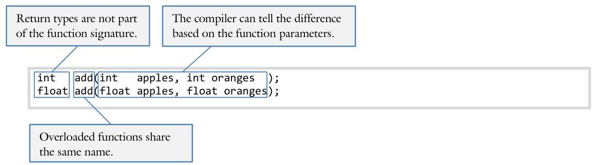

# Unit 1: Using Objects 

> **In this Chapter:**
> [[toc]]

<div style="page-break-after: always;"></div>

### 1.5 Function: Advanced Topics

Sam is working on a project with Sue and is getting a bit exasperated. So many of the functions he needs to write are nearly identical! He was just about to give up when Sue shows him a few tricks to make his job much easier.

**Objectives**

By the end of this chapter, you will be able to:

- Define and use a collection of overloaded functions
- Create a function with default parameters
- Make a function inline and articulate when it would be useful to do so
- Create a pointer to a function


**Prerequisites**

Before reading this chapter, please make sure you are able to:

- Write a user-defined function to perform a task (Procedural Programming in C++, Chapter 1.4)
- Pass parameters to a function by-value, by-reference, and by-pointer (Procedural Programming in C++, Chapter 1.4, 3.3)
- Create a pointer variable, initialize it, dereference it, and pass it to a function (Procedural Programming in C++, Chapter 3.3)


## The advanced topics of functions and why you should care

As we learned from CS 124, functions are a great tool to simplify the job of writing programs. They allow us to break large and complex projects into more manageable chunks and they facilitate code re-use. While these are all true, they are a very procedural way of approaching a project. In the object-oriented world, it is often useful to think in terms of the client, some programming collaborator who will use the code you produce. As we begin to think in terms of producing code that others consume, it becomes apparent that we need to find ways to make using our code more convenient for the client.

There are four topics concerning functions that, from a procedural perspective, may not seem to have much value. As we learn about object-oriented constructs in the coming units, the hope is that the value of these topics will become apparent. These topics are overloading, default parameters, inline, and pointers to functions.

# Overloading 

Overloading is the process of having more than one function with the same name. The only differences between the functions are the parameters they take. Perhaps this is best explained by example:
int addIntegers(int value1, int value2);
float addFloats( float value1, float value2);
Both of these functions perform essentially the same task though with different parameters. Overloading allows us to simplify the names of these functions:


We specify which version of add() we want through the data type of the parameter we pass. Thus calling $\operatorname{add}(4,5)$ will access the integer version of the function while calling add $(4.0,5.0)$ will access the float version. This matching occurs by comparing the function signatures of the overloaded functions.

## Function signature

A function signature is the combination of the name of the function with the data type of the parameters it takes. Thus the function signature of "int add(int value1, int value2)" is "add-int-int". Two functions can be said to be overloaded when they have the same name but different signatures. Note that the notion of a function signature does not include the return type. Thus the following is in error:

```cpp
string prompt(); // ERROR: we cannot overload prompt() this way because the
int prompt(); // function signatures are identical.
```

The compiler is able to handle overloading in the following way. When a file or program is compiled, a table is created with all the function names and the location in memory where the code for the function is to reside. The function name the compiler uses, however, is a special one. It contains the complete function signature. For example, if we were to create the following function:

```cpp
int add(int value1, int value2);
```

The compiler would name this function "add@int@int." Thus an add() function taking floats as parameters (add@float@float) would clearly have a different name to the compiler.

# When to use overloading 

Overloading should be used whenever a collection of functions has the same semantic meaning but operate on different parameters. Common examples include mathematical operations:

```cpp
void setZero(float & value);
void setZero(Complex & value);
void setZero(Coordinate & value);
```

Another example might be an operator that works with a variety of data types:

```cpp
void sort(int array[], int size);
void sort(float array[], int size);
void sort(string array[], int size);
```

In general, whenever the same action is to be applied to many things, overloading is a good choice.

## When to not use overloading

Consider the case when there are three overloaded versions of the setZero() function from the above example. How does the compiler choose which to call? The answer, of course, depends on the parameters that are passed to the function. If a float is passed to setZero(), then the float version will be called.
We cannot overload functions where the only difference in the function signature is a constant modifier or a by-reference modifier. To illustrate this point, consider the following code:

```cpp
void overload(int x)
{
    cout << "Integer\n";
}
void overload(const int x)
{
    cout << "Constant integer\n";
}
void overload(int & x)
{
    cout << "By-reference integer\n";
}
int main()
{
    int value;
    overload(x);
    return;
}
```

// overload() with an integer parameter
// overload() with a constant integer parameter
// overload() with an integer by-reference
// overload() with an integer by-reference

In the above example, the compiler will generate the following errors:

```cpp
1-5-overload.cpp: In function "void overload(int)":
1-5-overload.cpp:22: error: redefinition of "void overload(int)"
1-5-overload.cpp:18: error: "void overload(int)" previously defined here
1-5-overload.cpp: In function "void overload(int)":
1-5-overload.cpp:57: error: redefinition of "void
overload(int)"
1-5-overload.cpp:18: error: "void overload(int)" previously defined here
```

## Example 1.5 - Overloading 

This example will demonstrate several ways to overload a function. In each case, the function is called "overload()" though different parameters will be used.

There are three versions of the function overload():

```cpp
void overload(int value)
{
    cout << "The integer version of the overload() function\n";
}
void overload(int value1, int value2)
{
    cout << "The multi-integer version of the overload() function\n";
}
void overload(const char * value)
{
    cout << "The text version of the overload() function\n";
}
```

Now we will call these functions:

```cpp
int main()
{
    cout << "overload(7): ";
    overload(7);
    cout << "overload(7, 7): ";
    overload(7, 7);
    cout << "overload(\"seven\"): ";
    overload("seven");
    return 0;
}
```

The output of the above program is:

| overload(7): | The integer version of the overload() function |
| :-- | :-- |
| overload(7, 7): | The multi-integer version of the overload() function |
| overload("seven"): | The text version of the overload() function |

As a challenge, see if you can add to this example by adding another overloaded function:
void overload(int * pointer);
Notice how the pointer modifier is part of the function signature.
The complete solution is available at 1-5-overload.html or:
/home/cs165/examples/1-5-overload.cpp

## Example 1.5 - Swap 

This example will demonstrate several ways to overload a function taking two parameters. In each case, the name of the function will remain the same but the parameters will be different.

Write three versions of a function called swap(): one that swaps two integers, one that swap two strings, and one that swaps two doubles.

There are three versions of the function swap():

```cpp
void swap(int & value1, int & value2)
{
    int tmp = value1;
    value1 = value2;
    value2 = tmp;
}
void swap(string & s1, string & s2)
{
    string tmp = s1;
    s1 = s2;
    s2 = tmp;
}
void swap(double & value1, double & value2)
{
    double tmp = value1;
    value1 = value2;
    value2 = tmp;
}
```

Now we will call these functions:

```cpp
int main()
{
    string last = "Thomas";
    // oh no! I got the first name and
    string first = "Ricks";
    // the last name mixed up
    swap(last, first); // calls the "string &" version
    cout << first << ' ' << last << endl; // all is better now!
    return 0;
}
```

As a challenge, can you think of other versions of swap() that may be useful? Implement them and write a driver program to test them.

The complete solution is available at 1-5-swap.html or:
/home/cs165/examples/1-5-swap.cpp

# Default parameters 

Often we write a function with multiple parameters but when we call the function we pass exactly the same values again and again. Wouldn't it be great if we could tell the compiler "If I don't pass anything, just use the default value." Default parameters give us that capability. It is exactly the same thing as overloading a function with different numbers of parameters. For example, consider the getline() function to fetch a line of text from the keyboard. The prototype could be:
void getline(char * text, int bufferSize);
Note that we use a buffer size of 256 the vast majority of the time. It might behoove us to then provide the following code to make it more convenient for the user of our code:

```cpp
void getline(char * text)
{
    getline(text, 256);
}
```

Observe how the client can now either call the two parameter version of the function or the one parameter version. If they call the one parameter version, then 256 is supplied for the buffer size. C++ provides a mechanism to make this process much easier:

```cpp
void getline(char * text, // required parameter
    int bufferSize = 256); // default or optional parameter
```


## Order of the parameters

When designing a function with default parameters, it is important to carefully order the parameters. If, for example, there is one required parameter and one default parameter, the required parameter must be the leftmost of the two. Similarly, if there are three default parameters and the user specifies one, it is the left-most parameter that is matched with the user value.

```cpp
void function(int value1 = 0, int value2 = 0);
function(43)
```


## Prototypes

One final quirk of default parameters: if you are using a function prototype, the default parameter specification goes in the function prototype rather than in the function declaration. For example:

```cpp
// prototype
int getIndex(int max, // required parameter
    int min = 0); // default parameter specified here
// declaration
int getIndex(int max, int min) // the default value is not indicated
{
    int input;
    do
    {
        cout << "Enter a value between "
            << min << " and " << max << ": "; // notice how we use the variable min
            cin >> input; // exactly the same regardless
        }
        while (input > max || input < min); // of whether the default value
        return input; // is used or a user-specified
    }
```

## Example 1.5 - Default Parameter 

This example will demonstrate the use of default parameters. Note how we will have one function declaration but it will be called four different ways.

The prototype for our default parameter function is:
void defaultParam(int one $=0$, int two $=0$, int three $=0$ );
The declaration does not include the default parameter specification:

```cpp
void defaultParam(int one, int two, int three)
{
    cout << "defaultParam(" << one << ", " << two << ", " << three << ")\n";
}
```

Now to test the function, we will call it four different ways:

```cpp
int main()
{
    // zero parameters
    cout << "defaultParam() : ";
    defaultParam(); // one == 0, two == 0, three == 0
    // one parameter
    cout << "defaultParam(1) : ";
    defaultParam(1); // one == 1, two == 0, three == 0
    // two parameters
    cout << "defaultParam(1, 2) : ";
    defaultParam(1, 2); // one == 1, two == 2, three == 0
    // three parameters
    cout << "defaultParam(1, 2, 3) : ";
    defaultParam(1, 2, 3); // one == 1, two == 2, three == 3
    return 0;
}
```

The output for this program is:

```cpp
defaultParam() : defaultParam(0, 0, 0)
defaultParam(1) : defaultParam(1, 0, 0)
defaultParam(1, 2) : defaultParam(1, 2, 0)
defaultParam(1, 2, 3) : defaultParam(1, 2, 3)
```

As a challenge, add a fourth default parameter to this function. Make it a c-string. There are several key issues that will need to be addressed: what should the default value be, and how will you handle the NULL pointer case in the program.

The complete solution is available at 1-5-defaultParam.html or:
/home/cs165/examples/1-5-defaultParam.cpp

# Inline 

Often we wish to write a trivial function with just one or two lines of code. Unfortunately, with standard functions, this trivial function incurs a small performance penalty. Function calls take about a dozen clock cycles or more, depending on the number of parameters and local variables. This may seem insignificant, but they will pile up when performed over and over again.

Inline functions are designed to alleviate this performance penalty. When a function is called, instead of leaving the current function and jumping to the called function, the compiler simply pastes the code from the inline function directly into the caller. In other words, there is exactly one copy of each standard function in a compiled program. With inline functions, there are many copies because the compiler makes duplicate copies of your code.

Inline functions represent a net performance win because the overhead of calling a function is avoided. However, it could actually involve a memory penalty if the amount of code duplicated is large. For this reason, we only use inline functions when there are just a few lines of code in the function body.

To make a function inline, simple add the inline keyword to the beginning of the function:
The inline keyword tells the compiler that it would be more efficient to copy-paste the code of the function rather than use a traditional function call.

```cpp
inline int skates()
{
    return 42;
}
```


## Header files

There is one quirk of inline functions: they must be specified in the header file rather than in the source file. The reason for this is that, at compile time, the complete body of the function must be available when the source file is compiled. This means that if we wish to make the convertSymbol() function from our Tic-TacToe program inline, we would need to modify interface.h:

```cpp
#ifndef _INTERFACE_H
#define _INTERFACE_H
#include "ticTacToe.h" // need Game structure for interact()
// the main interaction loop
void interact(Game & game);
/*********************************************
    * CONVERT SYMBOL
    * Convert symbol for the space '.' into
    * the display representation ' '
    **********************************************/
inline char convertSymbol(char letter)
{
    assert(letter == '.' || letter == '0' || letter == 'X');
    return (letter == '.') ? ' ' : letter;
}
#endif // _INTERFACE_H

## Example 1.0 - Inline 

This example will demonstrate the user of inline functions. Note how they behave exactly the same as non-inline functions. The only difference is performance.

The inline function (multiply in this case) is:

```cpp
inline int multiplyInline(int value1, int value2)
{
    return value1 * value2;
}
```

The standard or non-inline version of the same function is:

```cpp
int multiplyStandard(int value1, int value2)
{
    return value1 * value2;
}
```

We will call these two functions the same way:

```cpp
int main()
{
    // the inline version
    cout << "multiplyInline(6, 7) = "
        << multiplyInline(6, 7)
        << endl;
    // the standard version
    cout << "multiplyStandard(6, 7) = "
        << multiplyStandard(6, 7)
        << endl;
    return 0;
}
```

We also expect these two functions to behave the same way:

```cpp
multiplyInline(6, 7) = 42
multiplyStandard(6, 7) = 42
```

As a challenge, go back to an old project from CS 124 or from earlier this semester and see how many of your trivial functions should be inline. Remember, functions that are more than a few lines should not be made inline.

The complete solution is available at 1-5-inline.html or:
/home/cs165/examples/1-5-inline.cpp

# Pointers to functions 

A pointer, as you recall, is the address of data rather than the data itself. For example, a URL is not the web page but rather the address of the web page somewhere on the internet. Similarly, we can create a new variable holding data with:
int data;
Or we can create a new variable to hold the address of data with:
int * pointer;
All variables reside in memory. We can retrieve the address of a variable with the address-of operator:

| \{ |  |
| :-- | :-- |
| int data; | // "data" resides in memory |
| cout << &data << endl; | // "&data" will return the address of "data" |
| \} |  |

It turns out that functions also reside in memory. We can retrieve the address of a function, store the address of a function, and de-reference the address of a function in much the same way we do other pointers.

## Getting the address of a function

When your program gets loaded by the operating system in memory, it is given an address. Therefore, the addresses of all the functions in the program are known at program execution time. We can, at any time, find the address of a function with the address-of operator (&). If, for example, there was a function with the name display( ), then we could find the address of the function with:
&display
Note how we do not include the ()s here. When we put the parentheses after a function, we are indicating we want to call the function.

## Declaring a function pointer

Declaring a pointer to a function is quite a bit more complex. The data type of the pointer needs to include the complete function signature, including:

- Name: The name of the function.
- Return type: What type of data is returned, even if the type is void
- Parameter list: All the parameters the function takes.

The syntax for a pointer to a function is:

```cpp
The parenthesis and asterisk
indicate a pointer to a function.
void (*dropBass)(int volume, int bass);
```

Consider, for example, the following function prototype and pointer of the same type:

```cpp
void display(double value); // prototype
int main()
{
    void (*p)(double); // pointer to a function. Variable 'p'
    p = &display; // initialize the pointer to display()
}
```


# Using function pointers 

Once you have an initialized pointer to a function, you use it much as any other pointer variable: using the dereference operator (*). The important difference, however, is the requirement to specify the parameters as well. One might assume the following would be the correct syntax:

```cpp
*p(value); // ERROR! calling a function named 'p' and dereferencing
    // the return value
```

This is an error. In this case, the order of operations for the parentheses () is before that of the dereference operator *. As a result, the compiler thinks you are calling a function named $p()$ returning a pointer which is to be dereferenced. To make your intentions clear, a slightly more heavy syntax is required:
(*p)(value); // CORRECT, though the p(value) convention is more convenient
In this case, we are first dereferencing the pointer variable p before attempting to call the function, exactly what is needed. It turns out that the dereference operator (*) is optional here. As long as there is not another function named $p$, we can simply say:
p(value); // CORRECT, though one might expect to need the * to dereference 'p'
This is the preferred way to access a pointer to a function.

## Passing a function pointer as a parameter

It turns out there are no tricks or complications when passing a function pointer to another function as a parameter. Consider the following function prototype from the previous examples:
void display(double);

An example of the code to accept as a parameter a function pointer matching the above signature:

```cpp
void function(void (*pointer)(double), double value)
{
    pointer(value); // we could also say (*pointer)(value);
}
```

Observe how the first parameter $p$ is a function pointer. The easiest way to call this function is by specifying the address of the target function directly:

```cpp
{
    function(display, 3.14159); // we could also say function(&display, 3.14159);
}
```

## Example 1.5 - Function Pointer 

This example will demonstrate how to create a variable that is a pointer to a function, and pass it as a parameter to another function.

Write a program to prompt the user for a value. Then prompt the user if the value is a GPA (displayed with one digit after the decimal) or an amount of money (displayed like $\$ 100.32$ ).

First, we need two display functions to handle the GPA and the money case. The prototypes are:

```cpp
void displayGPA (float gpa );
void displayMoney(float money);
```

Next we need to write a generic display function to handle either case. We will delegate the code that actually handles the number to one of our two display functions:

```cpp
void display(void (*pDisplay)(float), float value)
{
    cout << "The answer is: ";
    pDisplay(value);
    cout << endl;
}
```

Finally, we will ask the user which version of the code we should call.

```cpp
int main()
{
    // prompt for the value
    float value;
    cout << "What is the amount? ";
    cin >> value;
    // prompt for the type of value it is
    char input;
    cout << "Is this money (y/n)";
    cin >> input;
    // choose the appropriate display function
    void (*pDisplay)(float);
    if (input == 'Y' || input == 'y')
        pDisplay = displayMoney;
    else
        pDisplay = displayGPA;
    // call the generic display function
    display(pDisplay, value); return 0;
}
```

As a challenge, add a third display type: weight to the nearest pound:
155 lbs
You will need to change the IF statement in main() to a SWITCH to accommodate this challenge.
The complete solution is available at 1-5-pointerToFunction.html or:

Given the following makefile:

```cpp
a.out : sukoku.o game.o interface.o file.o
    g++ sukoku.o game.o interface.o file.o
gameTest.out : gameTest.o game.o
    g++ -o gameTest.out gameTest.o game.o
sudoku.o : sudoku.cpp sudoku.h
    g++ -c sudoku.cpp
game.o : game.h game.cpp sudoku.h
    g++ -c game.cpp
interface.o : interface.cpp interface.h sudoku.h
    g++ -c interface.cpp
file.o : file.h file.cpp sudoku.h
    g++ -c file.cpp
```

1. List, in order, what would be built if file. cpp were changed.
2. List, in order, what would be built if game. $h$ were changed.

## Problem 3 

Write four functions to return the larger of two values passed as parameters.

- Two integers
- Two characters
- Two floats
- Two strings

## Problem 4 

Make the following function inline:

```cpp
int max(int value1, int value2)
{
    return (value1 > value2) ? value1 : value2;
}
```

*Please see page 99 for a hint.*

## Problem 5

Given these three functions:

```cpp
int getValue()
{
    int value = -1;
    while (value < 0 ||
            value > 100);
            cin >> value;
        return value;
}
```

```cpp
int getValue(int max)
{
    int value = -1;
    while (value < 0 ||
            value > max);
            cin >> value;
        return value;
}
```

```cpp
int getValue(int max,
                                    int min)
{
    int value = -1;
    while (value < min ||
                        value > max);
                        cin >> value;
    return value;
}
```

Make one function out of them using default parameters.

# Challenge 6 

Given the following function:

```cpp
bool compare(int n1, int n2)
{
    return n1 == n2;
}
```

Add a third parameter to isEquals() below. This parameter is a pointer to a function of the same type as `compare()`. Then use that pointer to compare whether the two passed arrays are the same.

```cpp
bool isEqual(const int array1[], int n1, ___) {
    const int array2[], int n2, ____;
    if (!____________________)
        return false;
    }
    return true;
}
```

Finally, call the function `isEqual()` with the third parameter being the function `compare()`.

```cpp
int main()
{
    int array1[] = {4, 6, 3, 2, 1};
    int array2[] = {4, 6, 7, 2, 1};
    cout << isEqual(array1, 5,
                                    array2, 5,
    << endl;
}
```

*Please see page 103 for a hint.