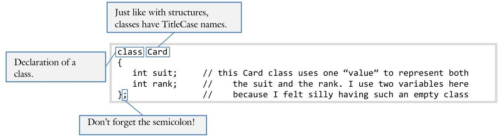

# Unit 2. Encapsulation 

> **In this Document:**
> [[toc]]

<div style="page-break-after: always;"></div>

### 2.2 Class Syntax

Sue is anxious to work on her programming project but is unsure of the syntax of a class. As she shuffles through her textbook for the hundredth time, it occurs to her that she would save a ton of time by memorizing the syntax

## Objectives

By the end of this chapter, you will be able to:

- Write the code defining a class
- Be able to convert a UML class diagram into a class
- Know how to make a variable public or private


## Prerequisites

Before reading this chapter, please make sure you are able to:

- Define a structure (Chapter 1.3)
- Create the UML class diagram describing a class matching a given problem definition (Chapter 2.0)


## What is the syntax of a class and why you should care

It is possible to write code in `C++` (or any other computer language for that matter) without memorizing the syntax of the basic constructs. This can be accomplished by looking at sample code similar to the problem you are trying to solve or by leafing through a textbook describing this syntax. While this works, it is extremely tedious and inefficient. In many ways, this is like trying to speak French in Paris without knowing the vocabulary. Standing in front of a Parisian with a French-to-English dictionary in your hand is not likely to win you any friends. Furthermore, with the language being such an obstacle, it is unlikely you will be able to communicate much more than the simplest ideas. Preach my Gospel emphasizes this:

Do not stop improving your language skills once people begin to understand you. As your ability to speak the language grows, people will listen more to what you say than to how you say it (p. 128).
Computer languages are no different than this. When you are fluent with a computer language, you can easily translate your ideas into working code without having to focus too much attention on the syntactic details of the language. In other words, it is definitely worth your time to memorize the syntax of basic constructs such as a class.

# Defining a class 

There are four parts of the class syntax: the class tag itself, the member functions, the access modifiers, and incorporating classes into header & source files.

## The class tag

The syntax of defining a class is nearly identical to that of a structure. The main difference is that we use the keyword "class" instead of "struct".



Note that a class is named exactly the same as a structure: with a TitleCase label. Note that the member variables are surrounded with curly braces. Don't forget that trailing semicolon. Just like with structures, the class definition is just a blueprint for the class. We can use this blueprint to create as many instances of the class as we like. Class instances are also called objects.

## Sam's Corner

The similarity between a class and a structure are more than skin deep. There is a strong family relationship between the two constructs. Just as we build our own class from structures in Chapter 2.1, the inventors of `C++` also built classes upon the foundation that structures afforded.

## Member functions

A method can be added to a class by including the function prototype in the class definition.

```cpp
class Card
{
    // member variables
    int value;
    // number functions a.k.a. methods
    void display();
    void setSuit(int suit);
    void setRank(int rank);
    int getSuit();
    int getRank();
};
```

All these member functions can access the member variable of the class the same way they would access their own local variables. This will be discussed in more detail later in the chapter as we discuss methods.

While structures typically lack member functions, classes just about always contain a few. The `C++` language chooses to implement structures and classes almost the same way. This means that it is legal to define a structure with member functions and to define a class with them. Just because it is possible does not mean you should do it! Conceptually a structure contains just member variables, nothing more! On the other hand, a class contains both member variables and member functions.
While the structure and the class clearly have different semantic meaning, `C++` chooses to implement them the same. To the compiler, the only difference between a structure and a class is that, lacking any access modifiers, the member variables and functions of a structure are public by default while in a class they are private. In other words, syntactically speaking, the two are interchangeable. That being said, you should use a structure when there are no methods and a class when there are! It is less confusing that way.

# Access modifiers 

Recall the UML we defined for our card class from Chapter 2.0:

| Card |
| :-- |
| - value |
| + display |
| + setRank |
| + setSuit |
| + getRank |
| + getSuit |
| - validate |

The plus and minus signs signify whether the variable or method is accessible to everyone or just to member functions. In the above example, the client can access the getters, the setters, and the display function. However only the member functions can access the member variable value and the method validate(). In `C++` we implement these access modifiers with the public and private keyword:

```cpp
class Card
{
    private:
    int value;
    public:
    void display();
    void setSuit(int suit);
    void setRank(int rank);
    int getSuit();
    private:
    bool validate();
};
```

```cpp
    // "private" means that everything from here
// down to the next access modifier is private
// "public" means that the next five methods
// are public, accessible by both the client
// and the member functions themselves
// we can have more than one "private" access
// modifier. Don't use too many, it can
// get confusing if you do
```

The public access modifier signifies to the compiler that anyone can access the member variable or member function. For example, if we create an object from the Card class (called "instantiate" a Card), we can access the public method display() but not the private method validate():

```cpp
{
    Card card;
    card.display();
    card.validate();
}
```

The private access modifier signifies only that another method can access the member variable or member function. This is an important tool helping us provide guarantees that the data contained in the member variables is always in a valid and well-formed state.

# Header and source files 

Recall the difficult time we had trying to divide a large procedural project into multiple files. The difficulty originated from trying to find which functions were "related enough" to justify a separate file. Fortunately this process is greatly simplified with classes.

Generally speaking, each class should be in its own file. This means that the class definition goes in the header file (where we put structure definitions and prototypes before) and the method implementation goes in the source files. This means that it is only necessary for the client to \#include the appropriate header file and modify his makefile in order to use a class. This is how we build our own libraries. The header file for our card class is thus:

```cpp
#ifndef CARD_H
#define CARD_H
#include <string> // because many of the functions take or return strings
#include <iostream> // because of the insertion and extraction operator
/*****************************************
* RANK: The ordering of the cards
*****************************************/
#define FIRST_RANK 0
#define LAST_RANK 12
const char RANKS[] = "234567890jqka";
/*****************************************
* SUIT: The ordering of the ranks
*****************************************/
#define FIRST_SUIT 0
#define LAST_SUIT 3
const char SUITS[] = "shcd";
// the current card is invalid
#define INVALID 255
#define NO_CARD "--"
/*****************************************
* CARD
* Card class
*****************************************/
class Card
{
    public:
        void initialize(); // set to two of spades
        void setCard(int iSuit, int iRank); // combination of setSuit and setRank
        void display(); // display the contents of the card
        bool isInvalid() const { return (value == INVALID);}
    private:
        // holds the value. Though there are 256 possible, only 52 are used
        unsigned char value; // internal representation
        // private functions
        bool validate() const; // are we in a valid state?
};
#endif // CARD_H
```

# Defining methods 

Defining a member function is much like defining any other function with the exception of how the method relates to the rest of the class. There are three parts to this syntax: specifying class membership through the scope resolution operator (::), accessing member variables, and the this pointer.

## Specifying class membership

When implementing a method, it is necessary to indicate to the compiler which class the method is associated with. This is done with the name of the class and the scope resolution operator : :

```cpp
int Card :: getSuit()
{
    return value / 13;
}
```

The same syntax is used regardless of the return type or the parameters passed to the function:

| Name of the class that <br> "owns" the method. | Scope Resolution <br> Operator. |
| :-- | :-- |

## Accessing member variables

There are three types of variables that are accessible from within procedural functions: global variables accessible from anywhere in the program, parameters that are accessible only from within the function but provide a conduit through which data passes between functions, and a local variable accessible only from within a function. With classes, a forth type of variable is available: member variables.

Member variables are like local variables except they are shared between all the member functions. They are instantiated when the class itself is instantiated and are destroyed when the class falls out of scope. This means that member variables have a longer life-span than the typical local variable. A member variable is accessible exactly the same as any other variable: by name:

```cpp
bool Card :: validate()
{
    return (value >= 0 && value < 52); // "value" is a private member variable,
}
// accessible by all member functions
```


## Sue's Tips

Recall from last semester (Procedural Programming in C++, Chapter 1.4) that it is desirable to minimize the scope of a variable. The longer the variable is alive, the greater the chance it will cause a bug. Since member variables have greater scope than local variables (because they are accessible by more than one function), they are a potential source of bugs.

Never use a member variable when a local variable or parameter will do the job.
Member variables should only be used when it is essential to the purpose and identity of the class. Everything else should be a local variable or a parameter.

this
The final component of the syntax of a method is the this pointer. Recall from Chapter 2.1 how it is necessary to pass a reference or a pointer to a structure if the function is to change the structure.

```cpp
void set(Card * pThis, int iSuit, int iRank) // we need to pass pThis as well as iSuit
{ // and iRank because pThis changes
    pThis->value = iRank + iSuit * 13;
}
```

We don't need to pass the reference with a member function:

```cpp
void Card :: set(int iSuit, int iRank) // no Card pointer is passed because we
{ // have access to the member variables
    value = iRank + iSuit * 13;
}
```

The way this works is a bit insidious. When a function is associated with a class through the scope resolution operator (namely the "Card :: " part of the method syntax), the compiler inserts another hidden parameter. The hidden parameter is a pointer to the class and it is called this. We can always access a member variable or a member function from a method in a class by using the this pointer:

```cpp
void Card :: set(int iSuit, int iRank) // though we don't see it, there is a
{ // hidden parameter called "this"
    this->value = iRank + iSuit * 13; // works exactly the same as "pThis" in
} // the top example
```

So why exactly is this necessary (besides the obvious opportunity for word-play)? Consider the following example:

```cpp
class Temperature
{
    public:
        bool set(int temp);
        int get();
    private:
        int temp;
};
```

In the method Temperature: :set(), notice how the parameter temp has the same name as the member variable temp. How are we to keep from getting them mixed-up? We could give them separate names but that would be silly; if two variables mean exactly the same thing they should have the same name. The name collision problem disappears with the this pointer.

```cpp
bool Temperature :: set(int temp) // same name as the member variable!
{
    // check for absolute zero
    if (temp > -273) // in this case, temp is the parameter
    {
        this->temp = temp; // this->temp is the member variable,
        return true; // temp is the local variable
    }
    return false;
}
```


# Sam's Corner 

You don't need to know how member variables are passed into the member functions nor how the this pointer is passed as a parameter in order to use it correctly. That being said, being aware of this hidden parameter sure makes understanding this much easier.

# Using a class 

The whole point of creating new data types and encapsulating code into classes is to make the job of the programmer easier. To see if `C++` 's implementation of classes accomplishes this goal, let's try to use our new card class.

```cpp
#include "card.h" // get access to the Card class through
// including the card header file
/**********************************************************************************************
* MAIN: a simple driver program for our card class
*********************************************************************************************/
int main()
{
    Card card; // how many member variables are used here?
                                    // How is the playing card stored?
                                    // Frankly, the client here does not care!
    // we need to initialize the card
    card.initialize(); // call the method with the dot operator
    cout << "Instructions: keep prompting the user for a suit and rank\n"
        << " until the suit is specified as 0.\n";
    for (;;) // forever. We will return when done. We usually do
    { // this only in driver programs
        //prompt for suit
        char chSuit; // this simple driver program will just
        cout << "Suit: "; // get user input in the most
        cin >> chSuit; // convenient way so we can exercise
        if (chSuit == '0') // the methods of Card
            return 0; // it is usually better to not return out of main()
                                    // like this, but in a driver program...
        // prompt for rank
        char chRank;
        cout << "Rank: ";
        cin >> chRank;
        // set the card
        card.setCard(card.iSuit(chSuit),
                card.iRank(chRank));
            // display the results
            cout << endl; // notice how we are able to call the
            card.display(); // display function without passing any
            cout << endl; // parameters. The data is silently
        } // passed through the hidden "this"
    return 0;
}
```

The complete solution for the card class, including the header file, source file, driver program, and makefile, are available at 2-2-card.html or:
/home/cs165/examples/2-2-card/

# Instantiating Classes 

Remember, we can use our Card class definition to create as many Card objects as we like, each of which will act independently from one another, containing their own copies of the member variables and member functions:

```cpp
#include <iostream>
#include <string>
using namespace std;
/* * * * * * * * * * * * * * * * * * * * * * * * * * * * * * * * * * * * * * * * * * * * * * * * * * * * * * * * * * * * * * * * * * * * * * * * * * * * * * * * * * * * * * * * * * * * * * * * * * * * * * * * * * * * * * * * * * * * * * * * * * * * * * * * * * * * * * * * * * * * * * * * * * * * * * * * * * * * * * * * * * * * * * * * * * * * * * * * * * * * * * * * * * * * * * * * * * * * * * * * *

# Example 2.2 - Time 

This example will demonstrate how to create a simple class with public and private methods as well and private member variables.

Write a class to represent the notion of time to match the following UML class diagram:

| Time |
| :-- |
| - minutes |
| + display |
| + set |
| + getMinutes |
| + getHours |
| - validate |

First, the class definition matching exactly the UML description:

```cpp
class Time
{
    public:
        void set(int hours = 0, int minutes = 0);
        void display();
        int getMinutes();
        int getHours();
    private:
        bool validate();
        int minutes;
};
```

The getMinutes () function needs to convert the internal data representation (minutes since midnight) to the properties (minutes since the beginning of the hour):

```cpp
int Time :: getMinutes()
{
    // paranoia...
    assert(validate());
    return minutes % 60;
}
```

Finally we have a driver program to test the new Time class:

```cpp
{
    Time time;
    Time.set(3, 5);
    Time.display();
}
```

As a challenge, modify the class so it also stores seconds. This means that the internal data representation will be "seconds since midnight" rather than "hours since midnight."

The complete solution is available at 2-2-time.html or:
/home/cs165/examples/2-2-time.cpp

Given the following UML class diagram:

| Complex |
| :-- |
| - real |
| - imaginary |
| + set |
| + display |

1. Write the class definition to match the above UML class diagram. Leave some extra space for problem 2 below.
2. Turn the above class definition into a header file with the appropriate \#ifdefs.
3. Implement the display() method.
4. Implement the set() method.
5. Write a program to instantiate a Complex object, initialize it to the value " $4.5+3.6 i$ ", and display the results on the screen.