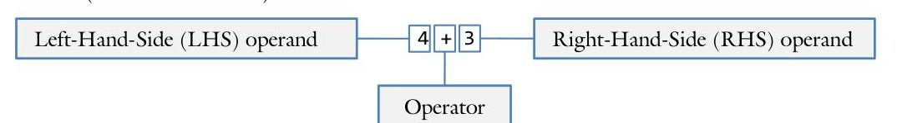
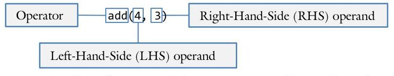

# Unit 2. Encapsulation 

> **In this Chapter:**
> [[toc]]

<div style="page-break-after: always;"></div>

### 2.6 Non-Member Operator Overloading

Sue is putting the finishing touches on her new Date class. She has got it working the way it is supposed to, but it still does not look as polished as she wishes it would. Why can she not make it as slick as the string class? Instead of calling date.display(), why can she not use cout << date; like the string class does? As she mulls this over, she flips through the textbook and discovers operator overloading.

**Objectives**

By the end of this chapter, you will be able to:

- Explain what is operator overloading and why you would want to use it
- Write the functions necessary to overload the common arithmetic operators
- Explain which parameters and return values are constant, and why


**Prerequisites**

Before reading this chapter, please make sure you are able to:

- Create a class definition matching a given UML class diagram (Chapter 2.2-2.5)
- Pass an object as a parameter to another function (Chapter 1.3 and 2.4)
- Explain the difference between pass-by-value & return-by-value and pass-by-reference & return-byreference (Procedural Programming in C++ Chapter 1.4 and 3.3)


## What is operator overloading and why you should care

Operator overloading is the process of using a more convenient and human-readable notation for calling a function (such as " $4+3$ ")...

... than the functional notation common in programming languages (such as "add(4, 3)").


In other words, operator overloading does not add any power to `C++`; there is nothing you can do with operator overloading that cannot be done with traditional functions. Instead, operator overloading makes it easier and more convenient for you and others to use your code.

To understand the benefit of operator overloading, it is first necessary to embrace the differences between working on a project alone and sharing code with others. When you are working on a project alone, it is equally important to make a function easy to write as it is to make a function easy to use. After all, you are the only person calling the function! When you are sharing code with others, one person's code can be used by dozens (or even thousands) of other people. Thus it is often worthwhile to go to great lengths to make things even slightly easier to use. Operator overloading is among the most powerful tools we have to that end.

# Infix notation 

Most programming languages such as `C++` use prefix notation to represent a function or operator. This notation is characterized by using the verb (or function name or operator) before the parameters (or operands). An example of prefix notation is "add four and three" in English or "add(4, 3)" in C++. In both cases, the operator ("add") precedes the operands (four and three).

Infix notation, on the other hand, is characterized by situating the operator between the operands. Examples of infix notation include "four plus three" or " $4+3$."

While most people find infix notation easier to understand than prefix notation, it is not without limitations. Prefix notation allows for an unlimited number of parameters while infix notation allows for only two. For example, "add $(4,3,7)$ " uses only one operator while " $4+3+7$ " uses two. Similarly, there is no ambiguity in the order in which functions are called with prefix notation whereas infix notation introduces ambiguity. Does " $4+3+7$ " mean " $(4+3)+7$ " or " $4+(3+7)$ "? We need parentheses and the order-of-operations to disambiguate how to evaluate expressions in infix notation, but neither are required for prefix.

Operator overloading is the process of using infix notation for a collection of special operators. These operations are:

| Operator | Example | Use and metaphor |
| :--: | :--: | :--: |
| insertion | a < b | Bitwise left-shift, send-to-left, display |
| extraction | a $>>$ b | Bitwise right-shift, send-to-right, get input from keyboard |
| addition | $a+b$ | Sum, add, adding onto, etc. |
| subtraction | $a-b$ | Difference, subtraction, distance between, removing from, etc. |
| multiplication | a * b | Multiplying, extending, etc. |
| division | a / b | Division, dividing, reducing, etc. |
| modulus | a \% b | Remainder |
| add onto | $a \leftarrow b$ | Add onto, increase by |
| subtract from | $a-=b$ | Subtract from, decrease by |
| multiply onto | a *= b | Multiplying onto, extending, etc. |
| divide from | a $/=$ b | Division, dividing, reducing, etc. |
| modulus from | a $\%=$ b | Apply the remainder to |
| increment | $a++++a$ | Add one, advance, move forward, increase |
| decrement | $a----a$ | Subtract one, retreat, move backwards, decrease |
| negative | $-a$ | Negative, opposite, disjoint set |
| not | !a | Logical not, opposite |
| equivalence | $a==b$ | Are they the same? |
| different | a $!=$ b | Are they different? |
| greater than | $a>b$ | Is one larger than another? |
| greater than or equal to | $a>=$ b | Is one larger or equal to another? |
| less than | a < b | Is one smaller than another? |
| less than or equal to | $a<=b$ | Is one smaller or equal to another? |
| and | a $& &$ b | Logical "and", subset |
| or | a || b | Logic "or", superset |

Because the infix operator goes between the operands, the two parameters are typically called 1hs(for lefthand-side) and rhs (for right-hand-side).

# Insertion operator 

The insertion operator (<<) is traditionally used to send (or insert) output to the screen. This makes it very convenient for just about all classes because it enables us to quickly and easily view the contents of an object.

## Using the operator

When displaying content on the console with cout, the insertion operator (<<) is the function, not cout. Each insertion operator in a statement constitutes a function call:

```cpp
{
    Complex c(3.1, 4.5);
    cout << c << endl;
// 3.0 + 4.5i
// insertion operator called twice
}
```

The left-hand-side of the insertion operator is cout. It turns out that cout is itself an object of type std::ostream and it must be passed to the insertion operator by-reference. The ofstream class that we use to write data to a file is also a derivative of ostream.

The right-hand-side is the object to be displayed. In this case, it is the Complex class. Since the insertion operator should not need to change Complex, we pass it by-reference as a constant.

The return value needs to be the ostream passed on the left-hand side. The reason for this is that the insertion operator can be "stacked" or "chained." Thus the cout statement can be re-written as:
(cout << c) << endl;
In order for cout to be passed to the second insertion operator (the one displaying the endl), the left-handside needs to be returned.

## Prototype

The prototype for the insertion operator defined with the Complex class on the right-hand-side is:

| The name of the function is "operator << ()". We can call it with "operator<<(cout, c)" or "cout << c" |  |  |  |
| :--: | :--: | :--: | :--: |
| ostream & operator << (ostream & out, const Complex & rhs); |  |  |  |
| Return the left-hand-side by-reference so we don't make a copy of cout | The left-hand-side is an ostream by-reference so we don't make a copy of cout | The right-hand-side is an object constant by-reference so we don't change or make a copy of rhs |  |

## Implementation

The following is the implementation of the extraction operator for the complex class:

```cpp
ostream & operator << (ostream & out, const Complex & rhs)
{
    out << rhs.getReal();
    if (rhs.getImaginary() != 0.0)
        out << " + " << rhs.getImaginary() << "i";
    }
```

The most common mistake is to forget to return out, thereby making it impossible to chain the insertion operator.

# Extraction operator 

The extraction operator ( $>>)$ is traditionally used to get input (or extract) from a file or the keyboard. As with the insertion operator, we use it with just about every class.

## Using the operator

When receiving input from the keyboard with cin, the extraction operator ( $>>)$ is the function, not cin.

```cpp
{
    Complex c1;
    Complex c2;
    cin >> c1 >> c2;
    // the default constructor initializes both c1
    // and c2 as (0.0 + 0.0i)
    // first fill c1 then fill c2
}
```

The left-hand-side of the extraction operator is cin. It turns out that cin is itself an object of type std: :istream and it must be passed to the extraction operator by-reference. The ifstream class that we use to read data from a file is also a derivative of istream.

The right-hand-side is the object to be filled with input. In this case, it is the Complex class. Since the extraction operator will be changing Complex, we pass it by-reference and not as a constant.
The return value needs to be the istream passed on the left-hand side. The reason for this is that the extraction operator can be "stacked" just like the insertion operator. Thus the cin statement can be re-written as:
(cin >> c1) >> c2;
In order for cin to be passed to the second extraction operator (the one filling c2), the left-hand-side needs to be returned.

## Prototype

The prototype for the extraction operator defined with the Complex class on the right-hand-side is:

| The name of the function is "operator >> ()". We can call it with "operator>>(cin, c)" or "cin >> c" |
| :--: |
| istream & operator >> (istream & in) Complex & rhs); |
| Return the left-hand-side by-reference so we don't make a copy of cin | The left-hand-side is an istream by-reference so we don't make a copy of cin | The right-hand-side is an object byreference because we will need to be changing rhs |

## Implementation

The following is the implementation of the extraction operator for the Complex class:

```cpp
inline istream & operator >> (istream & in, Complex & rhs)
{
    float real;
    float imaginary;
    in >> real >> imaginary; // first fetch input into local variables
    rhs.set(real, imaginary); // second set rhs with the data (real & imaginary)
    return in; // finally, do not forget to return "in"
}
```

The most common mistake is to forget to return in, thereby making it impossible to chain the extraction operator.

# Arithmetic operators 

The arithmetic operators include operators traditionally used for mathematical operations. There are many arithmetic operators supported in `C++` : addition $(+)$, subtraction $(-)$, multiplication $(*)$, division $(/)$, and modulus (\%). Additionally there are the bit-wise operators of bit-wise and (&), bit-wise or (|), and bitwise xor $(\wedge)$.

## When to use

Arithmetic operators are commonly used for mathematical functions like addition. Many other metaphors may apply. For example, the plus operator can also work for string concatenation (string1 + string2) and for advancement (position + velocity). The minus operator between two points can mean "the distance."

## Using the operator

In algebra, the notation for adding two complex numbers is the following:

$$
(3+7 i)+(2+9 i)=(5+16 i)
$$

To represent this in `C++`, we need two Complex objects and the addition operator:

```cpp
{
    Complex c1(3.0, 7.0); // (3.0 + 7.0i)
    Complex c2(2.0, 9.0); // (2.0 + 9.0i)
    cout << (c1 + c2) << endl; // displays "5.0 + 16.0i"
}
```

Both the left-hand-side and the right-hand-side are Complex objects. Since we don't want to needlessly make a copy of lhs or rhs, both are passed by-reference. Notice that we do not expect either c1 or c2 to change. This means that both lhs and rhs must be constant as well.

The return value of the addition operator is neither c1 nor c2, but rather a newly generated object. Therefore we will return a Complex by-value.

## Prototype

The prototype for the addition operator defined with the Complex class is the following:

| The name of the function is "operator + ()". We can |
| :-- |
| call it with "operator+(c1, c2)" or "c1 + c2" |

Complex operator + const Complex & lhs, const Complex & rhs);

Return a new object by-value
Both the left-hand-side and the right-hand-side are pass-bybecause it will not be lhs or
reference so we don't make a copy. They are also constant rhs
so we don't change lhs or rhs rhs

## Implementation

The following is the implementation of the addition operator for the Complex class:

```cpp
inline Complex operator + (const Complex & lhs, const Complex & rhs)
{
    return Complex(lhs.getReal() + rhs.getReal(), // use the non-default
        lhs.getImaginary() + rhs.getImaginary()); // constructor to
}
```

Note that since many of these operators are just one or two lines of code, it is common to make them inline.

# Add onto 

While the arithmetic operators do not change either operand, the add-onto operator ( $+=$ ) does. The whole point, after all, is to modify the left-hand-side of the equation. Other flavors of the "add-onto" include subtract-from $(-=)$, multiply-onto $(*=$ ), divide-from $(/=$ ), modulus-onto $(\%=)$, bitwise-and-onto ( $8=$ ), bitwise-or-onto $(|=)$, bitwise-exclusive-or-onto $(^=)$, bitwise-shift-left-onto $(<<=)$, and bitwise-shift-right-onto $(>>=$ ). Clearly the utility of overloading some of these operators is greater than others.

## Using the operator

The add-onto operator increases the value of the left-hand-side by the amount on the right-hand-side. Additionally, the left-hand-side is returned from the expression:

```cpp
{
    Complex c1(3.0, 7.0);
    // (3.0 + 7.0i)
    Complex c2(2.0, 9.0);
    // (2.0 + 9.0i)
    cout << c1 += c2 << endl;
    // displays the new value for c1: "5.0 + 16.0i"
    cout << c1 << endl;
}
```

The left-hand-side is the object to be changed. This means it must be passed by-reference.
The right-hand-side is the amount that the left-hand-side is to be changed by. Since we do not want to copy the right-hand-side, it is also passed by-reference. However, since the right-hand-side does not change, it is passed as a constant.

The return value is the newly updated left-hand-side. This means it must be returned by-reference.

## Prototype

The prototype for the add-onto operator defined with the Complex class is the following:

The name of the function is "operator += ()". We can call it with "operator+=(c1, c2)" or "c1 += c2"

Complex & operator += Complex & lhs, const Complex & rhs);

Return the left-hand-side by-reference so the add-onto operator can be chained

The left-hand-side is the object to be changed so it must be by-reference

The right-hand-side is by-reference so we don't copy rhs. It is also constant because we will not be changing rhs

## Implementation

The following is the implementation of the add-onto operator for the Complex class:

```cpp
inline Complex & operator += (Complex & lhs, const Complex & rhs)
{
    // (a + bi) + (c + di) = (a + c) + (b + d)i
    lhs.set(lhs.getReal() + rhs.getReal(),
        lhs.getImaginary() + rhs.getImaginary());
    return lhs;
}
```

Note that the right-hand-side does not need to be the same data type as the left-hand-side. We might choose to say "c1 += 7.0". In this case, the right-hand-side might be a double.

# Prefix increment & decrement 

The prefix increment and decrement operators ( $++x$ and --x) are much like the add-onto operators except there is no right-hand-side. This means that they are not truly infix operators and they take only one parameter.

## When to use

While the obvious uses for the increment and decrement operators are for adding or subtracting one, other metaphors apply. For example, ++ could mean "move ahead" or "next turn" or even "redo."

## Using the operator

The prefix increment and decrement operators update the object before the expression is evaluated. This means that if we display the results of $++c$, we expect to see the new value instead of the old:

```cpp
{
    Complex c(3.0, 7.0);
    cout << ++c << endl;
    cout << c << endl;
}
```

Since the increment and decrement operators are unary operators (only one operand), there is only one parameter. This parameter, the right-hand-side, must be by-reference because it changes.
The return value is the newly updated right-hand-side. This means it must be returned by-reference.

## Prototype

The prototype for the prefix increment operator defined with the Complex class is the following:

| The name of the function is "operator ++ ()". We can call it with "operator++(c)" or "++c" |
| :--: |
| Complex & operator ++ (Complex & rhs); |
| Return the right-hand-side by-reference because we return the newly updated copy | The right-hand-side is the object to be changed so it must be by-reference |

## Implementation

The following is the implementation of the prefix increment operator for the Complex class:

```cpp
inline Complex & operator ++ (Complex & rhs)
{
    return rhs += 1.0; // prefix ++ is exactly the same as += 1
}
```

It is very common to define the prefix-increment operator in terms of the add-onto operator. Just make sure that the add-onto operator is defined first.

# Postfix increment & decrement 

The postfix increment and decrement operators ( $x++$ and $x--$ ) are much like the prefix versions ( $++x$ and --x) with one important exception. While the prefix versions return the newly updated value of the variable, the postfix versions return the old value.

## Using the operator

The postfix increment and decrement operators update the object after the expression is evaluated. This means that if we display the results of $c++$, we expect to see the old value instead of the new:

```cpp
{
    Complex c(3.0, 7.0);
    cout << c++ << endl;
    cout << c << endl;
}
```

Since the increment and decrement operators are unary operators (only one operand), it seems like there is only need for one parameter: the left-hand-side that is being changed. This parameter must be by-reference. However, `C++` requires us to define a second parameter so we can tell the difference between the two.

The return value is the old value of left-hand-side, before the update happened. This means we must return a copy of the old value by-value.

## Prototype

The prototype for the post-fix increment operator defined with the Complex class is the following:

| The name of the function is "operator ++ ()". We can call it with "operator++(c, 1)" or "c++" |  |
| :--: | :--: |
| Complex | operator ++ (Complex & lhs, int postfix); |
| Return a copy by-value of the left-hand-side, the value before the increment changed it | The left-hand-side is the object to be changed so it must be by-reference |

Because we need to distinguish between the prefix and the postfix versions of the increment operator, a second dummy parameter is needed. I always name it "postfix"

## Implementation

The following is the implementation of the postfix increment operator for the Complex class:

| inline Complex operator ++ (Complex & lhs, int postfix) |
| :-- |
| \{\begin{array}{l}\text { Complex old(lhs); } \\ \text { lhs }+=1.0 ; \\ \text { return old; }\end{array} \\ \text { \} }\end{array}$ | // the easiest way is to remember the old value |
| and return it after we have done |
| the increment |

Note that the postfix version of the the increment operator is necessairely less efficient than the prefix version. This is because the copy constructor must be called at least once!

# Negative and not 

The negative $(-)$ and not (1) operators, like the increment and decrement operators before them, are unary. This means that there is only one operand. In addition to negation and not, there are other unary operators supported in `C++` : bitwise not $(\sim)$, the dereference operator $(*)$, and the address-of operator ( $&$ ).

## When to use

The negative operator can be used in the traditional algebraic manner or it could be used as "opposite" or "backwards" or even "turn around."

## Using the operator

The negative and not operators do not change the variable or object; they only return the result of the expression:

```cpp
{
    Complex c(3.0, 7.0);
    // (3.0 + 7.0i)
    cout << -c << endl;
    cout << !c << endl;
    cout << c << endl;
}
```

Since negative and not are unary operators, there is only one operand. We pass the right-hand-side byreference because we don't want to change the object. The parameter is a constant because it does not change.

The return value is a new object of the same type as the right-hand-side. This means it must be returned byvalue.

## Prototype

The prototype for the negative operator defined with the Complex class is the following:

| The name of the function is "operator - ()". We can |
| :-- |
| call it with "operator-(c)" or "-c" |

Complex operator - (const Complex & rhs);
Return a new object so it must
be by-value. It does not
matter if it is constant or not

The right-hand-side is not to be changed so it must be a constant. It should not be copied so it should be by-reference

## Implementation

The following is the implementation of the negative increment operator for the Complex class:

```cpp
inline Complex operator - (const Complex & rhs)
{
    return rhs * -1.0; // -c is the same as c * -1.0
}
```

The logical-not operator is similar to negative:

```cpp
inline bool operator ! (const Complex & rhs)
{
    return (rhs.getReal() == 0.0 && rhs.getImaginary() == 0.0);
}
```

# Comparision operators 

The comparisons operators such as equivalence (==) and greater-than (>) take two parameters and return a Boolean value.

## Using the operator

In algebra, the notation for comparing two complex numbers is the following:

$$
(3+7 i) \neq(2+9 i)
$$

Notice how the expression is either true or it isn't. To represent this in C++, we need two Complex objects and the comparison operators:

```cpp
{
    Complex c1(3.0, 7.0); // (3.0 + 7.0i)
    Complex c2(2.0, 9.0); // (2.0 + 9.0i)
    if (c1 == c2)
        cout << "Same!\n";
    if (c1 != c2)
        cout << "Different!\n";
}
```

Both the left-hand-side and the right-hand-side are Complex objects. Since we don't want to needlessly make a copy of lhs or rhs, both are passed by-reference. Notice that we do not expect either c1 or c2 to change. This means that both lhs and rhs must be constant as well.

The return value of the comparison operator is a Boolean value.

## Prototype

The prototype for the equivalence operator defined with the Complex class is the following:

| The name of the function is "operator == ()" We can call it with "operator==(c1, c2)" or "c1 == c2" |  |
| :--: | :--: |
| bool operator == (const Complex & lhs, const Complex & rhs); |  |
| Return true or false, depending on whether the expression is true. | Both the left-hand-side and the right-hand-side are pass-byreference so we don't make a copy. They are also constant so we don't change lhs or rhs |

## Implementation

The following is the implementation of the equivalence operator for the Complex class:

```cpp
inline bool operator == (const Complex & lhs, const Complex & rhs)
{
    return (lhs.getReal() == rhs.getReal() &&
        lhs.getImaginary() == rhs.getImaginary());
}
```

For the most part, we do not need to implement all the comparison operators independently. We can do it in terms of the other operators we previously defined. Note that if we define some, we should probably define them all. For example, if we define the less-than operator, we should also define the greater-than operator.

All the comparison operators associated with our Complex class are:

```cpp
inline bool operator == (const Complex & lhs, const Complex & rhs)
{
    return (lhs.getReal() == rhs.getReal() &&
        lhs.getImaginary() == rhs.getImaginary());
}
inline bool operator != (const Complex & lhs, const Complex & rhs)
{
    return !(lhs == rhs);
}
inline bool operator > (const Complex & lhs, const Complex & rhs)
{ // the distance from the origin
    return (lhs.getReal() * lhs.getReal() +
            lhs.getImaginary() * lhs.getImaginary()) >
            (rhs.getReal() * rhs.getReal() +
            rhs.getImaginary() * rhs.getImaginary());
}
inline bool operator >= (const Complex & lhs, const Complex & rhs)
{
    return (lhs > rhs) || (lhs == rhs);
}
inline bool operator < (const Complex & lhs, const Complex & rhs)
{
    return !(lhs >= rhs);
}
inline bool operator <= (const Complex & lhs, const Complex & rhs)
{
    return !(lhs > rhs);
}
```


# Sue's Tips 

Defining a comparision operator in terms of other comparision operators is easy and, if the functions are inline, incurs no performance penalty. However, there is a hidden pitfall. What would happen if the $>$ operator was defined in terms of the < operator and the < operator was defined in terms of the $>$ operator? The result would be a circular reference. To avoid this, only reference functions defined above the current location in the file.

# Example 3.6 - Complex 

This example will demonstrate how to build a class with number-like properties implementing most of the arithmetic operators.

A complex number can be thought of as a two-dimensional number: the first dimension is the real component similar to floats in `C++` and the second dimension is the imaginary component. Write a class to represent complex numbers and implement all the convenient operators. This includes the insertion (<<) and extraction (>>), increment (++) and decrement (--), addition (+) and subtraction (-), multiplication (*) and division (/), negative ( - ) and logical not (!), add-onto ( $+=$ ) and subtract-from (-$=)$, and the comparision $(>=,>,<=,<,==$, and $!=$ ) operators. .

The driver program for this class is the following:

```cpp
int main()
{
    Complex c1;
    for (;;)
    {
        cout << "Old value: " << c1 << endl;
        // prompt for new value
        Complex c2;
        cout << "\n\nEnter a complex number: ";
        cin >> c2;
        cout << "New value: " << c2 << endl << endl;
        // plus
        cout << '(' << c1 << ")+(" << c2 << ") == " << c1 + c2 << endl;
        // minus
        cout << '(' << c1 << ")-(" << c2 << ") == " << c1 - c2 << endl;
        // times
        cout << '(' << c1 << ")*(" << c2 << ") == " << c1 * c2 << endl;
        // c1 = c2 and loop again...
        c1.set(c2.getReal(), c2.getImaginary());
    }
    return 0;
}
```

When the program is run, the output is:

```cpp
Old value: 4 + 5i
Enter a complex number: 7 2
New value: 7 + 2i
(4 + 5i) + (7 + 2i) == 11 + 7i
(4 + 5i) - (7 + 2i) == -3 + 3i
(4 + 5i)*(7 + 2i) == 18 + 43i
```

The complete solution is available at 2-6-complex.html or:
/home/cs165/examples/2-6-complex/

# Example 2-6 - Card 

This example will demonstrate how operator overloading can work with a class that does not contain values that work like traditional numbers.

Write a card class that implements all the convenient operators. This includes the insertion (<<) and extraction (>>), increment (++) and decrement (--), addition (+) and subtraction (-), add-onto ( $+=$ ) and subtract-from $(-=)$, and the comparision $(>=,>,<=,<,==$, and $!=$ ) operators. .

The insertion operator is the following:

```cpp
istream & operator >> (istream & in, Card & card)
{
    // input comes in the form of a string
    string input;
    in >> input;
    // do the actual work
    card.parse(input);
    assert(card.validate());
    // return the input stream
    return in;
}
```

The extraction operator is:

```cpp
ostream & operator << (ostream & out, const Card & card)
{
    if (card.isInvalid())
        out << NO_CARD;
    else
        out << card.getSuit() << card.getRank();
    // return the output stream
    return out;
}
```

The greater-than operator is:

```cpp
bool operator > (const Card & lhs, const Card & rhs)
{
    //only comparing the ranks
    unsigned char iLHS = lhs.getValue() % 13;
    unsigned char iRHS = rhs.getValue() % 13;
    return iLHS > iRHS;
}
```

The complete solution is available at 2-6-card.html or:
/home/cs165/examples/2-6-card/

# Problem 1 

Given the following class:

```cpp
class Angle
{
    public:
        Angle() : angle(0) {}
        Angle(float a) : angle(a) {}
        Angle(const Angle & a);
        void setAngle(float a);
        float getAngle() const;
    private:
        float angle;
};
```

Which operators should be overloaded?

## Problem 2

Given the following class:

```cpp
class Velocity
{
    public:
        Velocity() : angle(0.0), speed(0.0), pos() { }
        Velocity(const Velocity & v);
        float getAngle() const;
        float getSpeed() const;
        Position getPosition() const;
        void setAngle(float a);
        void setSpeed(float s);
        void setPosition(const Position & pos);
    private:
        float angle;
        float speed;
        Position pos;
};
```

Which operators should be overloaded?

# Problem 3 

Given the following class:

```cpp
class Coordinate
{
    public:
        Coordinate();
        Coordinate(int r, int c);
        Coordinate(const Coordinate &);
        float getR() const;
        float getC() const;
        void set(int r, int c);
    private:
        int row;
        int col;
};
```

Overload the insertion and the extraction operators.

## Problem 4

Given the following class:

```cpp
class Gpa
{
    public:
        Gpa();
        Gpa(float gpa);
        Gpa(const Gpa & gpa);
        float get() const;
        void set(float);
    private:
        float gpa;
};
```

Overload the insertion, extraction, equivalence, and greater-than operators.