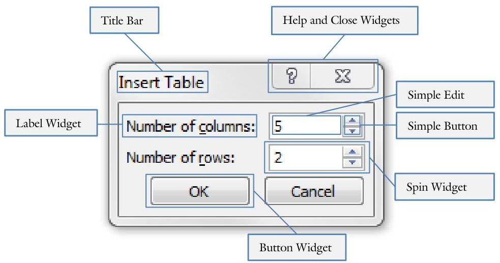
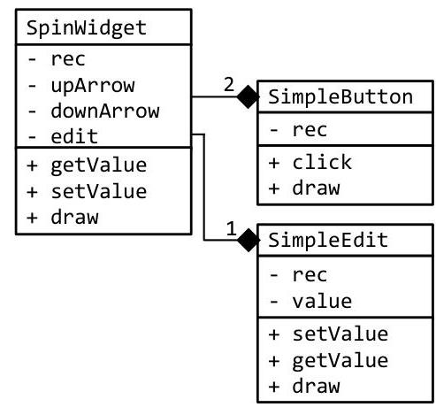
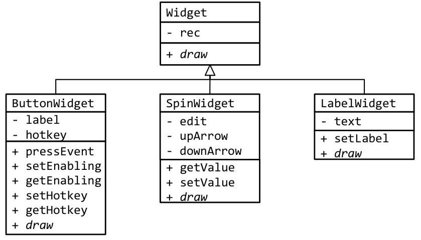
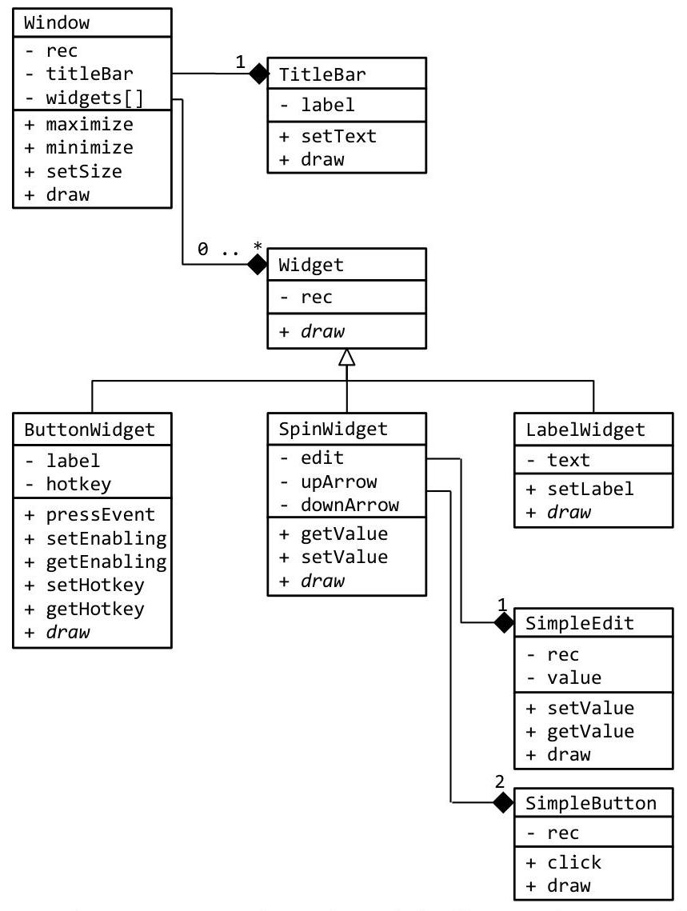
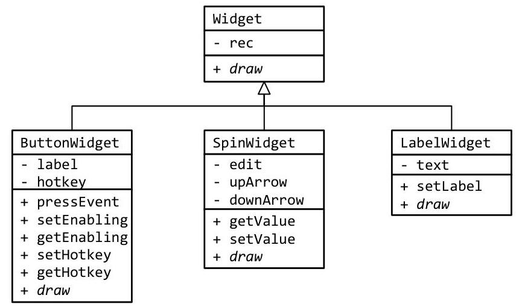
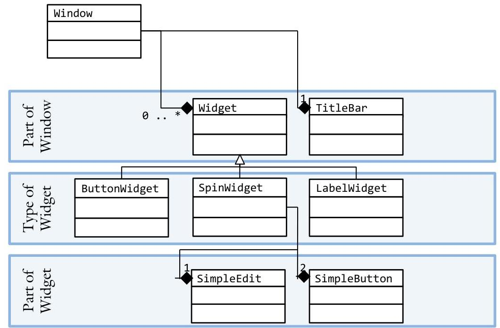
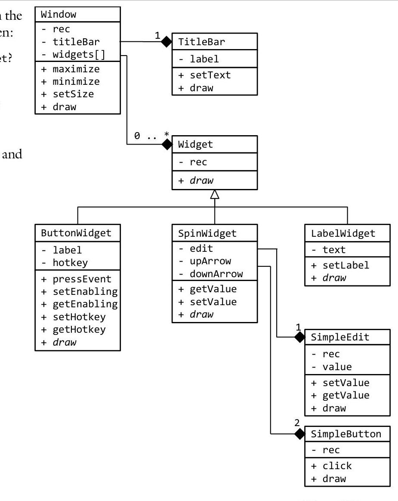

# Unit 3. Inheritance & Polymorphism {.unit-1-background style="clip-path: unset"}

| ---
| [3.0 Class Relations](.) {.table-of-contents}
| [3.1 Building Polymorphism](../Chapter-3.1/3.1-Building-Polymorphism.ai.md)
| [3.2 Inheritance.](../Chapter-3.1/3.1-Building-Polymorphism.ai.md)
| [3.3 Inheritance Qualifiers](../Chapter-3.1/3.1-Building-Polymorphism.ai.md)
| [3.4 Virtual Functions](../Chapter-3.1/3.1-Building-Polymorphism.ai.md)
| [3.5 Pure Virtual Functions](../Chapter-3.1/3.1-Building-Polymorphism.ai.md)

> **In this Chapter:**
> [[toc]]

# Unit 3. Inheritance & Polymorphism {.unit-1-background}

### 3.0 Class Relations

There is something that has been bothering Sue since she began working on the Skeet project. Though she can see the value in creating a separate class for each of the many game entities, a couple of the classes look a lot alike. Particularly, she noticed that $90 \%$ of her Bullet class and her Bird class are the same. Surely there has got to be a way to leverage these similarities and avoid all of this redundant code.

**Objectives**

By the end of this chapter, you will be able to:

- Describe the difference between "is-a" and "has-a" relations
- Draw the UML class diagram describing "is-a" and "has-a" relations
- Explain why a programmer would want to use class relations in a program design

**Prerequisites**

Before reading this chapter, please make sure you are able to:

- Draw the UML class diagram for a single class (Chapter 2.0)
- Recite, describe, and use the four encapsulation design rules (Chapter 2.0)

## What are class relations and why you should care

Often there exist relationships between the custom data types we create in a programming project. In the context of a Graphical User Interface (GUI), a window may consist of a collection of widgets, where a widget could be a button, scrollbar, or edit control. While it is possible to design a GUI from a set of disconnected objects, this design would not be leveraging the similarities of the classes and would have a great deal of redundant code. Class relations encompass all the different ways in which two classes can be related.

This chapter will help us to identify the basic types of class relations, learn design tools enabling us to identify and visualize these relationships, and discover guidelines to help us find the best way to capture these relationships in our data-structure designs.

# Design patterns 

On the simplest level, a class can be built from primitives (built in types such as integers and floats) or from other classes. When a class is defined in terms of another class, two possible relationships exist: "has-a" or "composition" where one class consists of a collection of subordinate classes, and "is-a" or "derivation" (also called "inheritance") where one class is a manifestation or type of a parent class.

## Has-A

The simplest type of relationship is when one class is defined in terms of a collection of other classes. Back to our GUI example, a scrollbar consists of two buttons (up and down arrows), the moveable button (slider), and the track (where the moveable button slides). This is commonly called a "has-a" relationship because the scrollbar "has a" down-arrow button, "has an" up-arrow button, "has a" slider, and "has a" track.
Note that in composition relationships, one class has a distinct and persistent relationship with the parents. The up-arrow button, for example, behaves exactly the same in the scrollbar as it would if it were by itself.

## Is-A

A more complex relationship between classes is when one class inherits many (but not necessarily all) of the properties of a parent (or the class we are building a new class off of). In many cases, it is a "type of" the parent. Back to our GUI example, a window has a collection of widgets. Every widget has a collection of properties, including the position ( $x, y$ ), size ( $x$ Size, ySize), and some draw functionality. A button "is a" widget. It inherits the position and size properties from its widget parent, but it also has a collection of other properties (text label, click behavior, and enabling state to name a few). An edit control is another widget. It also inherits the position and size properties from its widget parent, but has a different collection of properties (user data, cursor location, and click and keyboard behaviors for example). Both the button and the edit control exhibit an "is-a" relationship with the widget because they inherit common properties and have a collection of other properties unique to them.
As an example, consider the following dialogue. It "has-a" Title Bar and it "has-a" collection of widgets. There are several types of Widgets: the Label Widget "is-a" type of Widget, as is the Button Widget and the Spin widget. The Spin Widget "has-a" Simple Edit and it "has-a" Simple Button.

# UML class diagrams 

Possibly the best way to visualize class relations are through UML class diagrams. Through this tool, we can represent both composition (has-a) and inheritance (is-a) relationships.

## Class diagrams for has-a

The composition relationship between classes is demonstrated in UML in a hierarchy by drawing arrows to the side of the container (or newly built class) from the side of the parent (what we are building from) using a filled diamond $(\bullet)$ with solid lines ( - ). We also specify the number of instances (called multiplicities) a given parent object is used in the child. This is important because composition relationships can include a large number of children. This could also be a range (1..4) or unlimited (*). Common multiplicities include: $0 . .1$ (no instances or one instance), 1 (exactly one instance), $0 . . . *$ (zero or more instances), and $1 . . . *$ (at least one).

In this example, the SpinWidget class has a SimpleEdit and two SimpleButtons. Observe the three member variables (edit, upArrow, downArrow) typical of "has-a" relations. There are actually four flavors of "has-a" relationships: dependency, association, aggregation, and composition. In the context of this class, we will treat them all the same.

| Name | Definition | Example |
| :-- | :-- | :-- |
| Dependency | Objects of one class work briefly with objects of   another class. | A local variable in a   method |
| Association | Objects of one class work with objects of another   class for a prolonged amount of time. | A private member   variable |
| Aggregation | One class owns but shares a reference to objects   of another class | A public member   variable |
| Composition | One class contains objects of another class | The SpinWidget   example above. |

(Miles & Hamilton, 2006, p. 84)

# Class diagram for is-a 

The inheritance relationship between classes is demonstrated in much the same way except a triangle arrow $(\Delta)$ is used and the lines lead from the top of the derived class and into the bottom of the base class. Note that you can't have more than one instance of a parent because, unlike composition relationships, inheritance is essentially the elaboration on a single type.

In this example, there are three manifestations of a Widget: the ButtonWidget, the SpinWidget, and the LabelWidget. Every child contains all the elements of the base Widget class. In this example, the rec property and the draw() function are in each of the derived classes.

There are two types of "is-a" relationships. The first is when the child adds properties and methods to the parent. This makes the child an elaboration of the parent. In the above example, ButtonWidget adds properties (label and hotkey) and methods (pressEvent, setEnabling, getEnabling, setHotkey, and getHotkey) to Widget. Therefore the ButtonWidget has three member variables (rec, label, and hotkey) and seven member functions.

The second type is when the child redefines a method from the parent. This is called polymorphism or "multiple shapes." In our example above, Button, Edit, and ScrollBar each have a special version of draw(). We signify this type of relationship by italicizing the method draw().

# Example 5.0 - GUI 

This example will demonstrate how "is-a" and "has-a" class relations can co-exist in a single problem. Though this problem may seem complex and contrived, it is fairly representative of a C++ program.

Write a UML class diagram to represent items on a Graphical User Interface (GUI). Start with the window level and drill down to the interactive elements on individual controls.

Both composition and derivation relationships exist in the object hierarchy of GUI elements.

In this example, a Window has a TitleBar and an unbounded collection of Widgets. There are three types of widgets: a ButtonWidget, a SpinWidget, and a LableWidget. While the ButtonWidget and LabelWidget are not composed of any other objects (ignoring the Rectangle type for the sake of simplicity), the SpinWidget is composed of three other objects (upArrow and downArrow SimpleButtons, the SimpleEdit).

# Design considerations 

In order to minimize the chance that our class relations design will become unwieldy or overly-complicated, a few design rules are in order: manage variant and invariant attributes carefully, be conscious of layers of abstraction, and prefer abstraction over universalization.

## Rule \# 1: Manage variant and invariant attributes carefully

Use "is-a" relations when two classes share both variant properties (things that are different or distinct between the classes) and invariant properties (things that are shared or common between the classes).

When working with "is-a" relations, it is important to draw the line between the properties invariant between the children (every child and the parent share the same property), and the properties that are designed to be variant (many children are likely to have a different implementation). In one extreme, every property is variant. This raises the question of whether the children really should be related at all. If the children have nothing in common, why specify a relationship that does not truly exist or is meaningless? On the other extreme, if every property is invariant, then there are no differences between the children. If this is the case, why do we specify different children if there truly are no differences?
When designing an "is-a" relationship, the parent or base-class should contain all the invariant properties. This will ensure that all the children inherit the invariant properties. Specify in the child classes all the variant properties. This will represent what is unique about each child.
For example, consider our Widget class with its three children:

Each Widget will have a position (Widget::rec) and a draw method (Widget::draw()). Therefore, these are invariant and are therefore rightfully in the base class. The invariant part of the Button class includes the label ButtonWidget::label), the hotkey value (ButtonWidget::hotkey), and a host of methods.

> [!Danger] Sue's Tips
> {.sue}
> Designing class relations is much easier when you think in terms of variants and invariants. As long as the list of invariants is not empty (there is something in common between the classes being considered) and the list of variants is not empty (there is something unique about each class), then class relations through "is-a" is likely to be a good choice.

# Rule \#2: Be conscious of layers of abstraction 

When more than one or two "is-a" relations exist, the relations hierarchy can become cumbersome and fragile. You can avoid this problem by making sure that each level of abstraction is consistent and meaningful.

A parent class represents a higher level of abstraction than the child because the child is a more specific version of the parent. When there are several levels of inheritance, the number of levels of abstraction can become quite complex. One design consideration when working with object relationships is to try to make the levels of abstraction consistent and meaningful.

Possibly the best example of this is the major taxonomic levels of living things such as plants and animals. This taxonomy, called the Linnaean taxonomic system (from Carolus Linnaeus 1707-1778 who described it in 1735), consists of seven major divisions: \{Kingdom, Phylum, Class, Order, Family, Genus, Species\}. There are two aspects of this taxonomy: hierarchy and rank. Hierarchy is preserved because the lower you go in the taxonomy the more similar the organism. Members of a Species, for example, are guaranteed to be more similar than members of a Genus. The second, rank, relates to the layers of abstraction. The level of specificity for definition of a Species is consistent across the taxonomy. In other words, the requirements for creating a new Species is the same across all Genera of the taxonomy.

Consider the levels of abstraction in our GUI example. If done correctly, each level should mean something. Changes made to the hierarchy contrary to the layers of abstraction are likely to compromise any benefit of the abstraction in the first place.

Pay careful attention to maintaining a consistent abstraction (or rank) level across your design (Wong, Union Design Pattern, 2007). Changes made to the hierarchy contrary to the layers of abstraction are likely to compromise any benefit of the abstraction in the first place

# Rule \#3: Prefer abstraction over universalization 

Though universalization solves the same set of problems as abstraction, the universalization approach yields tighter coupling and looser cohesion. Generally, abstracting is a superior design approach.

There are two basic approaches to representing object relationships: universalizing and abstracting. Universalizing is the process of making a single type containing all possible attributes. In our GUI example from earlier, this would entail creating a single object containing a superset of the properties of every widget type. This would mean that the vast majority of the properties would not be meaningful in a given context. The property cursorPosition might be very useful in the Edit widget, but have no meaning in the Button widget. The approach of creating one object representing everything is called universalizing.

Abstracting, on the other hand, is the process of creating an entity capturing the essence of relationships and allowing specific implementations to describe their details. In this scenario, only the pertinent properties are available for the object; no irrelevant attributes exist.

Object oriented design principles lean heavily on the abstracting approach over the universalizing approach in an effort to reduce irrelevant data and develop more cohesive data types. Be mindful of temptations to create universal designs; a better abstract design is probably available.

Working with universalization is complex and problematic. If there are 100 variations of a given entity in a program, then every function working with entities needs to be aware of all 100 variations. This means that every time an entity is added to the list, every function knowing about entities will need to be modified. Even a single missed function will result in a bug! Programmers used universalization techniques in the past because there were no good abstraction tools. Now, with object oriented languages such as `C++`, there is seldom a good reason to resort to universalization.
As a general rule, if the predominant line in your function is a massive SWITCH statement, universalization may be rearing its ugly head!

Given the UML class diagram on the right, what is the relation between:

1. SimpleEdit and SpinWidget?
2. ButtonWidget and Widget?
3. SimpleEdit
and
SimpleButton?
4. Widget and TitleBar?
5. Window and TitleBar?

Please see page 205 and 206 for a hint.

## Challenge 6 

Create a UML class diagram describing the data-structures in the game "Deal or No Deal." You can play the game at:
/home/cs165/examples/3-0-dealOrNoDeal.out

Please see page 208 for a hint.

## Challenge 7

Create a UML class diagram describing the data-structures for the card game "War." You can play the game at:
/home/cs165/examples/3-0-war.out