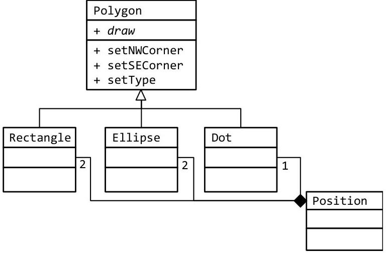

# 3.1-Building-Polymorphism

# Unit 3. Inheritance \& Polymorphism 

### 3.1 Building Polymorphism

Sam loves the idea of using class relations to solve programming problems. However, he can't see how it can work. Worse! He is afraid that it will incur a huge performance penalty. The only way he can trust a new programing technique is to know how it works. While digging around the internet to get to the bottom of this mystery, he remembers reading about V-Tables earlier in the semester. This should make "is-a" relations quite easy...

## Objectives

By the end of this chapter, you will be able to:

- Describe how "is-a" relations can be accomplished with V-Table assignments
- Appreciate how efficient "is-a" can be


## Prerequisites

Before reading this chapter, please make sure you are able to:

- How to define a pointer to a function (Chapter 1.5)
- How to build a class out of a structure and function pointers (Chapter 2.1)
- Create a UML class diagram describing "is-a" relations (Chapter 3.0)


## What is polymorphism and why you should care

Polymorphism is the process of one class having more than one variation. Each variation honors the same contract (called "interface") though the behavior details (called "implementation") may be different. Consider, for example, a time class. An object of this class is able to display a time in the traditional US format " $3: 28 \mathrm{pm}$." We also wish to have variations of this class that use a different time format. We might have the military time format " $15: 28$ " as well as the German format " 15.28 " and the Italian format of " $03: 28$ PM." If we were to have an array of time objects, some of which were traditional, some are military, some German, and some Italian, then polymorphism would be at work. Though each member of the array is of time Time, four different flavors are represented in the array.


The purpose of this chapter is to illustrate how the compiler is able to implement polymorphism. This is important for understanding the performance and space implications of making a class polymorphic. Additionally, polymorphism in $\mathrm{C}++$ has a few quirks that are difficult to understand unless you can see the underlying mechanisms. By seeing how the compiler implements polymorphism, these quirks make a lot more sense and polymorphism becomes much easier to use.

# Binding 

Binding is the process of connecting the name of a function or variable with the location in memory where the code or data resides. If, for example, you instantiate an integer called count (int count;), the compiler sets aside four bytes of memory for the integer and binds the memory to the name count. The same happens with functions. When a function is defined, the instructions corresponding to the function are placed into memory and the compiler binds the name with that memory address. If the programmer attempts to call a function that is not defined, then the compiler (actually the linker) reports the binding error and compilation is halted.

There are two flavors of binding that occur in a program: early binding and late binding.

## Early binding

Early binding is the flavor of binding that the compiler performs. In a traditional program, the function name is "connected" with the code of the function at compile time. In other words, when a function is referenced in some caller code, the compiler knows exactly where the code for the function is. This process is called "early binding" because the binding between the name of the function and the code of the function occurs before the program is executed. Errors in early binding are displayed as a compiler error.

## Late binding

Late binding is the flavor of binding that occurs while the program is executing or running. Consider an array of ten integers. If the program initializes one of the members of the array with "array[index] = 0;", then it is impossible for the compiler to tell which location in memory is being changed. The reason is that the value of index is not known at compile time; it is resolved at run-time. If the programmer attempts to access an item in an array with an index that is out of bounds (such as index $==-1$ ), the compiler cannot catch the programmer's error. Instead we will get a run-time error such as a crash or a segmentation fault.

Segmentation fault (core dumped)
All late binding mechanisms involve pointers, and all uses of pointers indicates late binding is at work. Therefore pointers to variables, arrays, and pointers-to-functions are indications of late binding.

In polymorphic scenarios, the compiler does not know which version of a function will get executed until run time. In this scenario, the function name is actually a pointer. When the object owning the pointer gets instantiated, then the pointer gets initialized. In other words, it is unknown which version of the function will get associated with (or assigned to) the pointer until the object is created. This process an example of late binding because the binding between the name of the function and the code of the function occurs after the program execution has begun.

Polymorphism in $\mathrm{C}++$ is accomplished by assigning the v-table to a class when an object is instantiated allowing the programmer to specify the flavor of a class at run-time.

# Virtual method tables and polymorphism 

Recall from Chapter 2.1 how a class can be built from a structure and function pointers. This could be done by having one function pointer for each method or by creating a special structure called a virtual method table (v-table) containing all the function pointers.

```cpp
struct VTableTime
{
    void (*display)(const Time * pThis);
    void (*set)(Time * pThis, int hour, int minute, int second);
    void (*get)(const Time &* pTime, int & hour, int & minute, int & second);
};
```

In most cases, all the objects from a given class use the same v-table. For example, if there are ten Time objects, each object will use the same display() function. What happens when you want to have many variations of the Time class: one displaying a date using the short format $3: 28 \mathrm{pm}$, another using the military version 15:28, and yet another using the Italian format $05: 28 \mathrm{PM}$ ?


The only differences between these three classes is the different display() functions.

```cpp
void displayTime(const Time * pThis); // 3:28pm
void displayTimeMilitary(const Time * pThis); // 15:28
void displayTimeItalian(const Time & pThis); // 03.28 PM
```

With these functions, we can initialize our three v-tables:

```cpp
const VTableTime V_TABLE_TIME = // for the Time variation
{
    &displayTime, // for Time::display() with 3:28pm
    &setTime, // for Time::set()
    &getTime // for Time::get()
};
const VTableTime V_TABLE_TIME_MILITARY = // for the Military Time variation
{
    &displayTimeMilitary, // for Time::display() with 15:28
    &setTime, // for Time::set()
    &getTime // for Time::get()
};
const VTableTime V_TABLE_TIME_ITALIAN = // for the Italian Time variation
{
    &displayTimeItalian, // for Time::display() with 03:28 PM
    &setTime, // for Time::set()
    &getTime // for Time::get()
};
```

In Chapter 2.1, we saw how to turn a UML class diagram into a structure:

| Time |
| :-- |
| - seconds |
| + display |
| + set |
| + get |

The class implementation of Time using structures is:

| struct Time | // the class/structure tag Time |
| :-- | :-- |
| \{ | // the one member variable: seconds |
| int seconds; | // all the methods are in VTableTime |
| VTableTime *__vtptr; | // using the standard name __vtptr |

As you may recall, using this manual method of instantiating an object requires us to assign the v-table to the object in a separate step:

```cpp
{
    Time time1;
    time1.__vtptr = &V_TABLE_TIME;
    time1.__vtptr->set(&time1,15, 28, 0);
    Time time2;
    time2.__vtptr = &V_TABLE_MILITARY;
    time2.__vtptr->set(&time2, 15, 28, 0);
    Time time3;
    time3.__vtptr = &V_TABLE_ITALIAN;
    time3.__vtptr->set(&time3, 15, 28, 0);
    // now display all three Times
    time1.__vtptr->display(&time1);
    time2.__vtptr->display(&time2);
    time3.__vtptr->display(&time3);
}
```

There are a couple key take-aways from this:

- The cost of binding a v-table to an object is a single instruction. This is extremely fast.
- Once the appropriate v-table is binded to the object immediately after the object is instantiated, there is no run-time cost to polymorphism.
- Having one derived class off of Time and having a thousand derived classes cost the same. Therefore there is zero cost to adding a derived class to a base class.

# Example 3-1 - Date 

This example will demonstrate how to create a simple polymorphic Date class using structures and function pointers instead of true $\mathrm{C}++$ classes.

Write a program to represent three variations of dates: a long date in the form of " 11 th of November, 1888," a short date in the form of " $11 / 12 / 1888$," and an empty date displaying the empty string.

The first part of the solution is to make a v-table representing the methods of Date:

```cpp
struct VTableDate
{
    bool (*set ){ Date * pThis, int year, int month, int day);
    void (*display)(const Date * pThis);
};
```

Next the class definition will include the three member variables and the v-table:

```cpp
struct Date
{
    VTableDate *__vtptr;
    int year;
    int month;
    int day;
};
```

Finally it is necessary to bind the appropriate v-table to the newly created Date object.

```cpp
void bind(Date * pThis, DateType td)
{
    // these need to be static. If not, when the function is returned, these
    // variables will fall out of scope and be destroyed. That will cause
    // the program to crash...
    static VTableDate vTableDateShort = { &setDate, &displayShort };
    static VTableDate vTableDateLong = { &setDate, &displayLong };
    static VTableDate vTableDateNone = { &setDate, &displayNone };
    switch (td)
    {
        default:
            assert(false); // this should never happen!
            // fall through
        case NONE:
            pThis->__vtptr = &vTableDateNone;
            break;
        case SHORT:
            pThis->__vtptr = &vTableDateShort;
            break;
        case LONG:
            pThis->__vtptr = &vTableDateLong;
            break;
    }
}
```

The complete solution is available at 3-1-date.html or:
/home/cs165/examples/3-1-date.cpp

# Example 3.1 - Numbers 

This example will demonstrate how to create a simple polymorphic Number class using structures and function pointers instead of true $\mathrm{C}++$ classes.

Write a program to represent two variations of numbers: one displaying the value as an integer and the second as US dollars currency.


The first part of the solution is to make a v-table representing the methods of Number:

```cpp
struct VTableNumber
{
    void (*add)( Number * pThis, const Number & rhs);
    void (*subtract)( Number * pThis, const Number & rhs);
    void (*display)( const Number * pThis);
};
```

The class definition is extremely simple:

```cpp
struct Number
{
    double value;
    const VTableNumber *__vtptr;
};
```

The binding occurs in main():

```cpp
int main()
{
    ... code removed for brevity ...
        num1.__vtptr = &V_TABLE_NUMBER; // default member functions
        num2.__vtptr = &V_TABLE_NUMBER_CURRENCY; // currency member functions
    ... code removed for brevity ...
        num1.__vtptr->display(&num1); // 42
        num2.__vtptr->display(&num2); // $41.99
};
```

The complete solution is available at 3-1-numbers.html or:
/home/cs165/examples/3-1-numbers.cpp

# Problem 1 

Write the UML class diagram for the following class:

```cpp
class Date
{
public:
    void set(int year, int month = 1, int day = 1);
    void display() const;
    bool operator == (const Date & rhs) const;
    bool operator != (const Date & rhs) const;
    const Date & operator = (const Date & rhs);
private:
    bool isLeapYear() const;
    int daysSince1753;
};
```

Please see page 110 for a hint.

## Problem 2

Write the UML class diagram for the following class:

```cpp
class Assignment
{
public:
    const Assignment & operator = (const Date & rhs );
    const Assignment & operator = (const string & rhs);
    void setScore( int score);
    void setPoints(int points);
    void display() const;
    const string & getName() const;
    const Date & getDate() const;
    int getScore() const;
    int getPoints() const;
private:
    bool isValid(int score, int points);
    Date date;
    string name;
    int score;
    int points;
};
```

# Problem 3 

Write the UML class diagram for the following class:

```cpp
class GradeBook
{
public:
    const GradeBook & operator += (const Assignment & rhs);
    const Assignment & operator [] (int index);
    void display() const;
private:
    vector <Assignment> grades;
};
```

Please see page 205 for a hint.

## Problem 4

Write the UML class diagram for the following class:

```cpp
class Date
{
public:
    void set(int year, int month = 1, int day = 1);
    void (*display)(const Date *pThis);
    void setLanguage(int code);
    int getYear() const;
    int getMonth() const;
    int getDay() const;
private:
    bool isLeapYear() const;
    int daysSince1753;
};
void displayEnglish(const Date *pThis);
void displayGerman( const Date *pThis);
void displayFrench( const Date *pThis);
```

# Problem 5 

Write the class definition to match the following UML class diagram:

| Position |
| :-- |
| - $x$ |
| - $y$ |
| + setX |
| + setY |
| + getX |
| + getY |
| + operator $=$ |
| + operator $==$ |

Please see page 127 for a bint.

## Problem 6

Write the class definition for Rectangle to match the following UML class diagram:

| Position | 2 | Rectangle |
| :-- | :-- | :-- |
|  |  | - cornerNW |
|  |  | - cornerSE |
|  |  | + setNWCorner |
|  |  | + setSECorner |
|  |  | + draw |

Please see page 127 for a bint.

## Problem 7

Write the class definition for Polygon to match the following UML class diagram:

| Polygon |
| :-- |
| + draw |
| + setNWCorner |
| + setSECorner |
| + setType |



Please see page 216 for a bint.