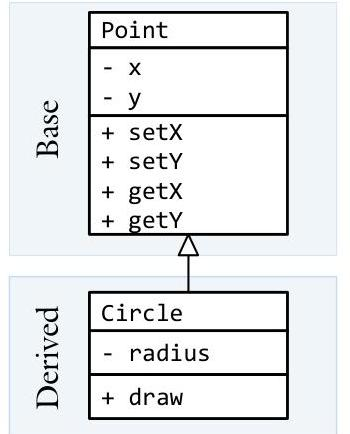
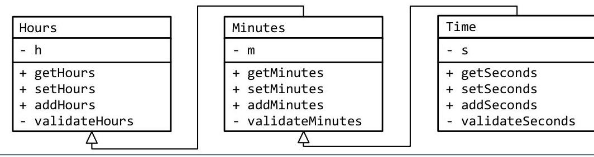
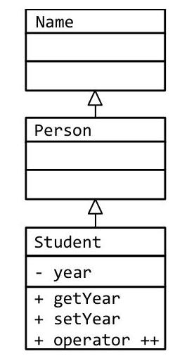

# Unit 3. Inheritance & Polymorphism {.unit-1-background}

> **In this Chapter:**
> [[toc]]

# 3.2 Inheritance

Sam has just finished a Position class to represent where a drawn object resides on the screen for his Skeet game. This class has a collection of getters and setters allowing the client to move objects as the game is played. Next Sam is going to write a class to represent the Bird. This means that all the getters and setters for the Position class needs to be reproduced in the Bird class. If only there was a better way...

**Objectives**

By the end of this chapter, you will be able to:

- Define inheritance and explain when it would be useful
- Define a class that inherits off of a base class


**Prerequisites**

Before reading this chapter, please make sure you are able to:

- Define a class matching a UML class diagram (Chapter 2.0, 3.0)
- Draw a UML class diagram representing an "is-a" relation (Chapter 3.0)
- Design a program with UML class diagrams utilizing "is-a" relations (Chapter 3.0)


## What is inheritance and why you should care

Inheritance is the process of building one class off of another. It represents the simplest form of "is-a" object relationships. There are two classes involved with inheritance: the base class and the derived class. The base class, also known as the parent class, is the class we start with. Any class can be a base class. The derived class, also known as the child class, is the class that is built from the base class. Inheritance occurs when the derrived class inherits all the properties and methods from the base class.
Consider a class that stores a Point. In this case, Point represents the base class because another class will be built from it. Now we will build a derived class called Circle that will inherit the Point properties and methods. In addition to Point's properites, Circle will also have a radius. In other words, the Circle is "all that and more" to the Point.


Inheritance helps us leverage what is common (or invariant) between related classes with zero duplicate code. There is no need to write another version of Point's getters and setters with inheritance, Circle simply inherits them from the base class.

# Syntax of inheritance 

When specifying inheritance relations, all the syntax exists in the base class. C++ does not allow the programmer to indicate inheritance from the standpoint of the base class. If, for example, we wish to inherit Circle from Point, then the Point definition is completely standard:

```cpp
class Point // no indication of inheritance in base class
{
    public:
        Point() : x(0), y(0) { }
        Point(int x, int y) { setX( x); setY( y); }
        Point(const Point &pt) { setX(pt.x); setY(pt.y); }
        int getX() const { return x; }
        int getY() const { return y; }
        void setX(int x) { this->x = x; }
        void setY(int y) { this->y = y; }
        friend ostream & operator << (ostream & out, const Point & pt);
        friend istream & operator >> (istream & in, Point & pt);
    private:
        int x;
        int y;
};
```

To indicate a derived class is inherited from a base class, it is necessary to put an inheritance indicator in the derived class definition. Consider the Circle class:

Here we indicate that Circle is a derived class from Point. We inherit all that Point has, including the member variables and methods.

```cpp
class Circle : public Point // this indicates we inherit off of Point
{
    public:
        Circle() : Point(), radius(0) { }
        Circle(int r, int x, int y) : Point(x, y) { setRadius(r); }
        Circle(const Circle & circle);
        int getRadius() { return radius; }
        void setRadius(int r) { this->radius = r; }
        friend ostream & operator << (ostream & out, const Circle & c);
        friend istream & operator >> (istream & in, Circle & c);
    private:
        int radius;
};
```

The Circle class definition begins by inheriting all that Point has with the " : public Point" part of the class definition. Notice how a circle, in this case, is just a point with a radius. This is usually how class relationships work; the derived class will have everything the base class does, and then some.

```cpp
{
    Circle c(100, 10, 10);
    c.setX(20);
    c.setY(20);
    c.setRadius(5);
    cout << c << endl;
} // this constructor also initializes x and y
// the member functions from Point are
// inherited in Circle
// we also get our own member functions
// since the RHS of << is a Circle, we call
// Circle's method instead of Point's
```

# What is inherited? 

In a derived class, all the member variables and all the member functions of the base class are made a part of (or inherited from) the new class. There are three exceptions to this rule: constructors, destructors, and the assignment operator. They are not inherited.

## Constructors and destructors are not inherited

Consider the following code:

```cpp
class Base
{
    public:
        Base() // default constructor
        {
            pBase = new int(0); // allocate an int and assign to 0
            cout << "Base constructor\n"; // display a message
        }
        ~Base() // destructor
        {
            delete pBase; // free the allocated memory
            cout << "Base destructor\n"; // display a message
        }
    private:
        int * pBase;
};
class Derived : public Base
{
    public:
        Derived() // default constructor. Note that
        {
            pDerived = new float(0.0); // allocate a float to 0.0
            cout << "Derived constructor\n"; // display a message
        }
        ~Derived() // destructor. Note that
        {
            delete pDerived; // free the allocated memory
            cout << "Derived destructor\n"; // display a message
        }
    private:
        float * pDerived;
};
```

Here we have a simple base class and a derived class. Note that when we instantiate a Derived object, the base class constructor is not inherited but it is called.

```cpp
int main()
{
    Derived d;
    return 0;
}
```

The output is:

```cpp
Base constructor
Derived constructor
Derived destructor
Base destructor
```

The complete solution is available at 3-2-constructors.html or: /home/cs165/examples/3-2-constructors.cpp.

# Assignment operators are not inherited 

Assignment operators are also not inherited. This means that we commonly need to define assignment operators for all the derived classes if one is defined for the base class. Consider the following code:

```cpp
class Base
{
    public:
        Base() { pBase = new int(0); } // constructor allocates
        ~Base() { delete pBase; } // destructor frees
        Base & operator = (const Base & rhs) // assignment operator will
        {
            *pBase = *rhs.pBase; // addresses) of pBase
            cout << "Base assignment operator\n"; // display a message
            return *this;
        }
    private:
        int * pBase;
};
class Derived : public Base
{
    public:
        Derived() { pDerived = new float(0.0); } // constructor allocates
        ~Derived() { delete pDerived; } // destructor frees
    private:
        float * pDerived;
};
```

Note that there is no assignment operator defined for Derived. The compiler will generate a new one for us, one that will copy the member variables (addresses in this case! This will be a bug due to the pointers!) and will call the base-class assignment operator:

```cpp
/**************************** default assignment operator ******************************/
Derived & operator = (const Derived & rhs) // default assignment operator
{
    Base::operator=(rhs); // calls the base-class assignment
    pDerived = rhs.pDerived; // ERROR: this copies the member
    return *this; // variables which is a pointer!
} // We should copy the data instead!
```

Now if we define our own assignment operator, the assignment operator in Base is not called!

```cpp
/**************** assignment operator failing to call the base class ******************************/
Derived & operator = (const Derived & rhs) // our own assignment operator
{
    *pDerived = *rhs.pDerived; // ERROR: base-class = not called
    return *this; // we need to copy the data, not the
}
```

Note that Base's assignment operator is not called! We therefore need to call it explicitly. The correct implementation for the assignment operator in the Derived class is:

```cpp
/************************** the correct assignment operator ******************************/
Derived & operator = (const Derived & rhs)
{
    Base::operator=(rhs); // call the base-class assignment
    *pDerived = *rhs.pDerived; // copy the data, not the addresses
    return *this; // return *this
}
```

The complete solution is available at 3-2-assignment.html or: /home/cs165/examples/3-2-assignment.cpp.

# Constructors 

Thus far the syntax of inheritance seems straight-forward. The only thing that is necessary to derive off of a base-class is to include the " : public BaseClass" indication in the class definition.

To illustrate this point, consider the following example:

```cpp
class Base
{
    public:
        Base() : value(0) { } // default constructor
        Base(int value) : value(value) { } // non-default constructor
        Base(const Base & rhs) { value = rhs.value; } // copy constructor
        int get() const { return value; }
    private:
        int value;
};
class Derived : public Base // inherit Base::getBase() and value
{
    public:
        Derived() { } // Base::Base() gets called
        Derived(int value) : Base(value) { } // call Base::Base(int)
        Derived(const Derived & rhs);
};
```

We can explicitly call any version of the base classes' constructor we choose. If none is explicitly called, the default will be called for us. Otherwise, we can specify the version we wish in the initialization section.

Note that the only place we can call the base classes' constructor is from the initialization section. If we attempt to do so from the body of the constructor, we will get unexpected results.

```cpp
Derived :: Derived(const derived & rhs)
{
    Base(rhs.get()); // ERROR: we will create a new Base object
} // and this->value is not set!
```

In this example, we create a new instance of Base in the body of the copy constructor. This object never gets assigned to a variable so it is called an "anonymous object."

> [!Danger] Sue's Tips
> {.sue}
> It is a good idea to explicitly call the base classes's constructor from each constructor in the derived class. This makes the intention of the programmer clear.

# Redefining 

A derived class can add additional methods and variables to those provided by the base class. It is also possible for the derived class to define a method with the same signature as that of the base class. This is called "redefining." Consider the following example:

```cpp
class Point
    public:
        void display() const { cout << '(' << x << ", " << y << ")\n"; }
... code removed for brevity ...
    private:
        int x;
        int y;
};
class Circle : public Point
    public:
        void display() const
            {
                cout << '(' << getX() << ", " << getY() << " r=" << radius << ")\n"; }
            }
... code removed for brevity ...
    private:
        int radius;
};
```

In this example, we have two functions (Circle::display() and Point::display()) with the same signature. When we call display() from a Circle object, we get the Circle version.

```cpp
{
    Point pt;
    pt.display(); // call Point::display()
    Circle c;
    c.display(); // since display() is redefined in Circle, we
} // call Circle::display() here
```

Just because we re-defined a method in a derived class does not mean that we will never have access to it again. With the scope resolution operator (::), we can specify which version of a given redefined class we want to call. Back to our Point and Circle example from above:

```cpp
{
    Point pt(4, 7);
    pt.display(); // (4, 7)
    Circle c(10, 3, 8);
    c.display(); // (10, 3 r=8)
    c.Point::display(); // (10, 3)
}
```

## Example 3-2 - Circle 

This example will demonstrate how to do simple inheritance with a single base class and a single derived class.

Write a class called Circle which inherits off of Point. Both Circle and Point implement the usual getters and setters as well as the insertion and extraction operators.

| Point |
| :-- |
| - x |
| - y |
| + setX |
| + setY |
| + getX |
| + getY |
| $+<<$ |
| $+>>$ |
| Circle |
| - radius |
| + getRadius |
| + setRadius |
| $+>>$ |
| $+<<$ |

The class definition to Point and Circle is presented earlier in the chapter. The following functions and methods illustrate how much access each has to private member variables.

```cpp
ostream & operator << (ostream & out, const Circle & circle)
{
    out << '(' << circle.getX() // need to use getters here. The member
        << ", " << circle.getY() // variables are not accessible.
        << ", r=" << circle.radius // we do have access to the radius private
        << ')';
    return out;
}
```

```cpp
istream & operator >> (istream & in, Circle & circle)
{
    int x; // we don't have access to Point::x so
    int y; // we need to read into variables
    // read data from in
    in >> x >> y >> circle.radius; // since radius is part of Circle and >>
                                // is a friend, we use circle.radius
    // now set the values
    circle.setX(x); // only the public Point::setX() and
    circle.setY(y); // Point::setY() is visible to Circle
    return in;
}
```

The complete solution is available at 3-2-circle.html or:
/home/cs165/examples/3-2-circle.cpp

## Example 3-2 - Time 

This example will demonstrate how to accomplish multiple levels of inheritance. In other words, a derived class can also serve as a base class.

Write a class called Hours, one called Minutes which inherits off of Hours, and one called Time which adds seconds to Minutes.


The Hours class is the base class so it has no indications of inheritance:

```cpp
class Hours
{
public:
    Hours() : h(12) { }
    Hours(int h) : h(0) { setHours(h); }
    Hours(const Hours & hours) { setHours(hours.getHours()); }
    int getHours() const { return h; }
    void setHours(int h) { if (validateHours(h)) this->h = h; }
    void addHours(int h);
private:
    bool validateHours(int h) const { return (0 <= h && h <= 23); }
    int h;
};
```

The Minutes class inherits from Hours. Notice how we must call our parent's constructor in the initialization section or Hours: : h will not get set:

```cpp
class Minutes : public Hours
{
public:
    Minutes() : m(0), Hours() { }
    ... code removed for brevity ...
private:
    int m;
};
```

Finally, the Time class inherits from Minutes which, in turn, inherits off of Hours.

```cpp
class Time : public Minutes
{
public:
    Time() : s(0), Minutes() { }
    ... code removed for brevity ...
private:
    int s;
};
```

The complete solution is available at 3-2-time.html or:
/home/cs165/examples/3-2-time.cpp

## Example 3.2 - PhoneNumber 

This example will demonstrate multiple levels of inheritance as well as redefining member functions.

Write a class called PhoneNumber which inherits from Extension.

| Extension |
| :-- |
| - extension |
| + getExtension |
| + display |
| PhoneNumber |
| - exchange |
| + getNumber |
| + getExchange |
| + display |

The class definition of PhoneNumber is the following:

```cpp
class PhoneNumber : public Extension
{
    public:
        PhoneNumber(int exchange, int ext) : Extension(ext),
                                    exchange(exchange) {
        int getNumber() const { return exchange * 10000 + getExtension(); }
        int getExchange() const { return exchange;
        void display() const { cout << exchange << '-' << getExtension(); }
    private:
        int exchange;
};
```

Notice how the constructor for PhoneNumber calls Extension's constructor in the initialization section. Notice also how PhoneNumber: :display() redefines Extension: :display().

```cpp
cout << "phoneNumber.display(): ";
phoneNumber.display(); // redefined from Extension
cout << endl;
cout << "phoneNumber.Extension::display(): ";
phoneNumber.Extension::display(); // call Extension's version
cout << endl;
```

As a challenge, see if you can create a new class called LongDistanceNumber which adds the area code to PhoneNumber.

| Extension | PhoneNumber | LongDistanceNumber |
| :-- | :-- | :-- |
| - extension | - exchange | - areaCode |
| + getExtension | + getNumber | + getNumber |
| + display | + getExchange | + getAreaCode |
|  | + display | + display |

The complete solution is available at 3-2-phoneNumber.html or:
/home/cs165/examples/3-2-phoneNumber.cpp

> ## Problem 1 
> 
> Consider the following class:
> 
> ```cpp
> class Name
> {
>     public:
>         Name();
>         Name(const Name & name);
>         void setFirst( const string & s);
>         void setMiddle(const string & s);
>         void setLast( const string & s);
>         const string & getFirst() const;
>         const string & getMiddle() const;
>         const string & getLast() const;
>     private:
>         string first;
>         string middle;
>         string last;
> };
> ```
> 
> Derive a class Person that adds gender to Name.
>   <input style="min-height: 200px">
> 
> ## Problem 2
> 
> Given the above defined Name and Person class, define a class called Student adding academic year:\
> 
>   <input style="min-height: 200px">
> 
> *Please see page 228 for a hint.*
