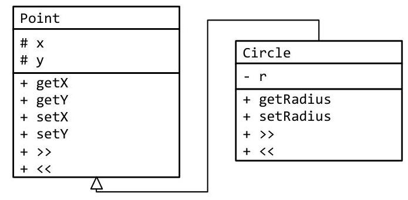

# Unit 3. Inheritance & Polymorphism 

> **In this Document:**
> [[toc]]

<div style="page-break-after: always;"></div>

### 3.3 Inheritance Qualifiers

Sue has just completed writing a class which is derived off of a base class. While using inheritance proved to be much simpler that duplicating all the functionality from the base class, there is an unfortunate side-effect. In order to make the methods of the derived class as efficient as possible, it is necessary for them to work with the base class' data rather than the publically exposed properties. How can this be done without exposing this data to the client as well?

## Objectives

By the end of this chapter, you will be able to:

- Explain why inheritance qualifiers strengthens encapsulation by allowing the programmer to finetune access to class data
- Describe protected and list scenarios when it would be handy to use it
- For a given base class and derived class, explain why access to a given method or member variable is allowed or not allowed


## Prerequisites

Before reading this chapter, please make sure you are able to:

- Explain the differences between public and private qualifiers (Chapter 2.2)
- Create a UML class diagram representing an "is-a" relation (Chapter 3.0)
- Create a class definition matching a given UML class diagram (Chapter 3.0)


## What are inheritance qualifiers and why you should care

Access qualifiers such as public and private indicate the scope in which a given member variable or method is accessible. As you may recall, the public access qualifier indicates that a given member variable or method is accessible to both the client and the member functions within a class. The private access qualifier indicates that only a member function has access to a given method or member variable. A third access qualifier, protected, is used to indicate that a given member variable or method is accessible to either members of the class or classes which derive off of the base class. We use the \# sign to signify this in a UML class diagram:

| ClassName |
| :-- |
| + publicVariable |
| \# protectedVariable |
| - privateVariable |
| + publicMethod |
| \# protectedMethod |
| - privateMethod |

# Protected 

The protected qualifier signifies a degree of access somewhere between public and private. There are three ways in which a given method or member variable might need to be accessed:

- Within: From within the class where the method or member variable is defined
- Derived: From within the class derived from a class where the method or variable is defined
- Object: From an object instantiated from the class where the method or variable is defined

While the public access modifier allows access from all three, and private restricts access within a class, protected is between:

|  | private | protected | public |
| :--: | :--: | :--: | :--: |
| Within: from within a class | $\checkmark$ | $\checkmark$ | $\checkmark$ |
| Derived: from within a derived class |  | $\checkmark$ | $\checkmark$ |
| Object: from an object instantiated from a class |  |  | $\checkmark$ |

When the protected keyword works exactly like private when there is no derived class:

```cpp
class Base
{
    public:
        int basePublic;
        void basePublicMethod();
    protected:
        int baseProtected;
    private:
        int basePrivate;
};
```

The access an object has to member variables within Base is restricted to the public member variables.

```cpp
{
    Base base;
    base.basePublic = 1; // legal. basePublic is public so we have access from
                                // the client.
    base.baseProtected = 1; // ERROR! Only methods within Base (there are none) or
                                // methods in the derived class have access
    base.basePrivate = 1; // ERROR! No access to privates from the object
}
```

However, the method Base: :basePublicMethod() has access to all the member variables:

```cpp
void Base :: basePublicMethod()
{
    basePublic = 1; // public member variables are accessible to methods
    baseProtected = 1; // protected member variables are also accessible
    basePrivate = 1; // privates are accessible here only
}
```

When working with a single class, protected and private work exactly the same. Why, then, would one want to make a member variable or member function protected? The answer is: because we would want to give a derived class access to a given member variable or method. In other words, we don't want to reveal details of our class implementation to the client but we might want to reveal those details to a derived class. The protected access modifier allows for this.

Consider the following class which derives off of Base:

```cpp
class Derived : public Base
{
    public:
        void derivedPublicMethod();
        int derivedPublic;
    protected:
        int derivedProtected;
    private:
        int derivedPrivate;
};
```

The access an object has to member variables within Base and Derived is restricted to the public member variables.

```cpp
{
    Derived derived; // six member variables
    derived.basePublic = 1; // legal because basePublic is public.
    derived.baseProtected = 1; // ERROR: no access to protected items from the object
    derived.basePrivate = 1; // ERROR: no access to privates from the object
    derived.derivedPublic = 1; // legal because derivedPublic is public
    derived.derivedProtected = 1; // ERROR: no access to protected items
    derived.derivedPrivate = 1; // ERROR: no access to privates
}
```

Therefore, only public items are accessible from the object. From a member function, however, we have access to the base classes' public and protected items.

```cpp
void Derived :: derivedPublicMethod()
{
    derivedPublic = 1; // all member variables and member functions defined
    derivedProtected = 1; // in a class are accessible from a method
    derivedPrivate = 1; // belonging to that class.
    basePublic = 1; // we have access to the base class's publics
    baseProtected = 1; // we also have access to the protected items
    basePrivate = 1; // ERROR! no access to privates from the
} // derived class
```

From this example, we can see that methods within the derived class have more access to the member variables in the base class than does the client. The client (objects created from the class) only has access to public methods and variables. Methods in the derived class have access to public and protected methods and variables. Methods and variables under the private designation are only access to methods within the same class.

# Sam's Corner 

The access qualifiers of public, protected, and private are compile-time checks. They only serve to help the programmer catch errors as the class is compiled rather than provide any run-time checks. Therefore they are early-binding constructs. This means that there is no performance penalty to using protected or any other access qualifier.

# Inheritance indicators 

Recall the syntax for defining a class that inherits off another class:

```cpp
This is called an inheritance indicator. We specify not only which
class from which we inherit, but also how the inheritance occurs
class Derived : public Base
{
... code removed for brevity ...
};
```

An inheritance indicator is the part of the class definition where the programmer specifies which if any class is the base class. Up until this point, we always inherited as public. As you may have guessed, we can also inherit as protected or as private.

## Public inheritance

When a derived class inherits a base class as public, all the access qualifiers from the base class remain unchanged. Therefore, if a method or member variable is public in the base class, then it will remain public in the derived class. This is desirable when the programmer wishes to allow access to the public methods of the base class exactly as if the object was made from the base class. All the examples up to this point used public inheritance indicators.

## Protected inheritance

When a derived class inherits a base class as protected, then all the access qualifiers in the base class that were public are treated as if they were protected. This serves to allow the derived class methods to access the public and protected items in the base class, but objects instantiated from the derived class cannot:

```cpp
class DerivedProtected : protected Base // using the same Base class as before
{
    public:
        void derivedProtectedMethod(); // only one method in a class. That is silly!
};
```

Objects instantiated from DerivedProtected will not be able to access Base member variables:

```cpp
{
    DerivedProtected derived;
    derived.basePublic = 1; // ERROR: was public but now is protected
    derived.baseProtected = 1; // ERROR: was protected and now is still
    derived.basePrivate = 1; // ERROR: no access to privates
}
```

Though there is no access to Base's member variables from an object, there is from DerivedProtected()'s methods.

```cpp
void DerivedProtected :: derivedProtectedMethod()
{
    basePublic = 1; // legal! basePublic is now protected
    baseProtected = 1; // legal! was protected and now still is
    basePrivate = 1; // ERROR: basePrivate is still private
}
```

We can only further restrict access with the inheritance indicator, we cannot remove restrictions.

# Private inheritance 

When a derived class inherits a base class as private, then all the access qualifiers in the base class that were public or protected are treated as if they were private. This means that all the member variables and methods in the base class are only visible to the methods in the derived class. The client or other classes deriving off the derived class have no indication that a base class exists.

```cpp
class DerivedPrivate : private Base // using the same Base class as before
{
    public:
        void derivedPrivateMethod(); // only one method in a class. That is silly!
};
```

Objects instantiated from DerivedPrivate will not be able to access Base member variables:

```cpp
{
    DerivedPrivate derived;
    derived.basePublic = 1; // ERROR: everything from the base class is now
    derived.baseProtected = 1; // private so there is no access from the
    derived.basePrivate = 1; // object to any of the methods or variables
}
```

From within the method derivedPrivateMethod(), everything from Base now appears as private:

```cpp
void DerivedPrivate :: derivedPrivateMethod()
{
    basePublic = 1; // legal! basePublic is now private
    baseProtected = 1; // legal! baseProtected is now private
    basePrivate = 1; // ERROR: basePrivate is still private
}
```

Up until this point, there is no difference between inheriting as protected and private. The only difference appears when another class is derived off it:

```cpp
class DerivedDerived : public DerivedPrivate
{
    public:
        void derivedDerivedMethod()
        {
            basePublic = 1; // ERROR: To DerivedPrivate these are now
            baseProtected = 1; // private so anyone deriving off of
            basePrivate = 1; // DerivedPrivate wil have no access to them
        }
};
```


## One simple rule

This may all seem terribly complex with so many cases. However, there is a simple rule to explain it all:
Inheritance indicators can only add access restrictions, they cannot release them

> [!Danger] Sue's Tips
> {.sue}
> In almost all cases, we use the public inheritance indicator when deriving off of a base class. It is extremely rare to need to restrict access to the base class.

# Example 3.5 - Inheritance Qualifiers 

This example is completely contrived and does not relate to any real-world problem. The purpose here is to demonstrate all possible inheritance variations. Many lines are commented out. In those cases, the corresponding compile errors are presented below in a comment. Feel free to remove the comment and see the compile errors for yourself.

The base class from which everything is derived is the following:

```cpp
class Base
{
    public:
        void pub() {} // Has access to all members of Base
    protected:
        void prot() {} // Also has access to all members of Base
    private:
        void priv() {} // Also has access to all members of Base
};
```

If we derive off of Base using the public inheritance indicator, we get the following compile errors:

```cpp
class DerivedPub : public Base
{
    public:
        void derivedPublic()
        {
            pub(); // Was public in the Base, now public from DerivedPub
            prot(); // Was protected in Base, now still protected so no change
            priv(); 3-3-qualifers.cpp: 19: error: "void Base::priv()" is private
    protected: 3-3-qualifers.cpp:32: error: within this context
        // Same rules apply here as for derivedPublic() with regards to access
        // to Base. Of couse, we have access to all members of DerivedPub
        void derivedProtected() {}
    private:
        // Same rules apply here as for derivedProtected() and derivedPublic()
        void derivedPrivate() {}
};
```

Now if we try to access these methods from the object, some restrictions apply:

```cpp
int main()
{
    Base base;
    base.pub();
base.prot();
base.priv();
DerivedPub derivedPub;
derivedPub.pub();
derivedPub.prot();
derivedPub.priv();
derivedPub.derivedPublic();
derivedPub.derivedProtected();
derivedPub.derivedPrivate();
}
```

```cpp
// legal. Base::pub() is public
3-3-qualifers.cpp:17: error: "void Base::prot()" is protected
3-3-qualifers.cpp:29: error: "void Base::priv()" is private
// legal. Base::pub() is still public
3-3-qualifers.cpp:17: error: "void Base::prot()" is protected
3-3-qualifers.cpp:19: error: "void Base::priv()" is private
// legal. Derived::derivedPublic() is public
3-3-qualifers.cpp:42: error: "derivedProtec()" is protected
3-3-qualifers.cpp:45: error: "derivedPrivate()" is private
```

The complete solution is available at 3-3-qualifiers.html or:
/home/cs165/examples/3-3-qualifiers.cpp

# Example 3.3 - Circle 

This next example will demonstrate how to use inheritance to more easily have access to the base class' private member variables without the data being exposed to the client.

Write a class called Circle which inherits off of Point. Both Circle and Point implement the usual getters and setters as well as the insertion and extraction operators.


With the protected inheritance qualifiers used for the Point member variables, the class definition is:

```cpp
class Point
{
... code removed for brevity...
    protected:
        int x;
        int y;
};
```

This allows for Circle's friend functions to have access to Point's member variables:

```cpp
ostream & operator << (ostream & out, const Circle & circle)
{
    out << '(' << circle.x // access to Point's privates
        << ", " << circle.y
        << ", r=" << circle.r // access to Circle's privates
        << ')';
    return out;
}
```

```cpp
istream & operator >> (istream & in, Circle & circle)
{
    in >> circle.x >> circle.y >> circle.r; // access to Point's privates
    return in;
}
```

As a challenge, modify the code so Circle inherits Point as protected instead of public. Does this change anything? Do the same as a private. Why would one want to use the protected or private inheritance indicator instead of public? Hint: what happens when main() attempts to access getX() or getY()? What happens when another class is derived off of Circle?

The complete solution is available at 3-3-circle.html or:
/home/cs165/examples/3-3-circle.cpp

Given the following class definition:

```cpp
class Base
{
    public: void pub();
    protected: void prot();
    private: void priv();
};
class DerivedPub : public Base
{
    public: void derivedPublic();
    protected: void derivedProtected();
    private: void derivedPrivate();
};
class DerivedPro : protected Base
{
    public: void derivedPublic();
    protected: void derivedProtected();
    private: void derivedPrivate();
};
class DerivedPriv : private Base
{
    public: void derivedPublic();
    protected: void derivedProtected();
    private: void derivedPrivate();
};
```

Which of the following lines will yield a compile error?

```cpp
void DerivedPub :: derivedPublic()
{
    pub();
    (a):
    prot();
    (b):
    priv();
    (c):
}
void DerivedPro :: derivedPublic()
{
    pub();
    (d):
    prot();
    (e):
    priv();
    (f):
}
void DerivedPriv :: derivedPublic()
{
    pub();
    (g):
    prot();
    (h):
    priv();
    (i):
}
```

Given the following class definitions:

```cpp
class Base
{
    public: void pub() { }
    protected: void prot() { }
    private: void priv() { }
};
class DerivedPub : public Base
{
    public: void derivedPublic() { }
    protected: void derivedProtected() { }
    private: void derivedPrivate() { }
};
class DerivedPro : protected Base
{
    public: void derivedPublic() { }
    protected: void derivedProtected() { }
    private: void derivedPrivate() { }
};
class DerivedPriv : private Base
{
    public: void derivedPublic() { }
    protected: void derivedProtected() { }
    private: void derivedPrivate() { }
};
```

Which of the following lines will yield a compile error?

```cpp
{
    Base base;
    base.pub();
    base.prot();
    base.priv();
    DerivedPub derivedPub;
    derivedPub.pub();
    derivedPub.prot();
    derivedPub.priv();
    derivedPub.derivedPublic();
    derivedPub.derivedProtected();
    derivedPub.derivedPrivate();
    DerivedPro derivedPro;
    derivedPro.pub();
    derivedPro.prot();
    derivedPro.priv();
    derivedPro.derivedPublic();
    derivedPro.derivedProtected();
    derivedPro.derivedPrivate();
    DerivedPriv derivedPriv;
    derivedPriv.pub();
    derivedPriv.prot();
    derivedPriv.priv();
    derivedPriv.derivedPublic();
    derivedPriv.derivedProtected();
    derivedPriv.derivedPrivate();
}
```

# Challenge 3-5 

The game of battleship is played on two $10 \times 10$ grids where ships can take anywhere from 2 to 5 squares. The game is played by each player trying to guess the location of the opponent's ships by calling out shots such as "D4."
3. Create a UML class diagram to represent a location on the grid. Call the class coordinate.
4. From our coordinate class, create a class to represent a ship in the Battleship game. The ship resides on the board and has a length from 2 to 5 points. Also, each ship has a name such as Carrier, Battleship, etc.
5. There are several derivations of ship in the game Battleship: the Aircraft Carrier (size 5), the Battleship (size 4), the Submarine (size 3), the Cruiser (size 3) and the Destroyer (size 2). Create a class to represent the Submarine.