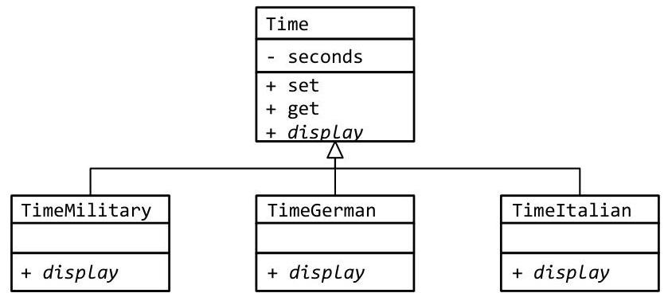
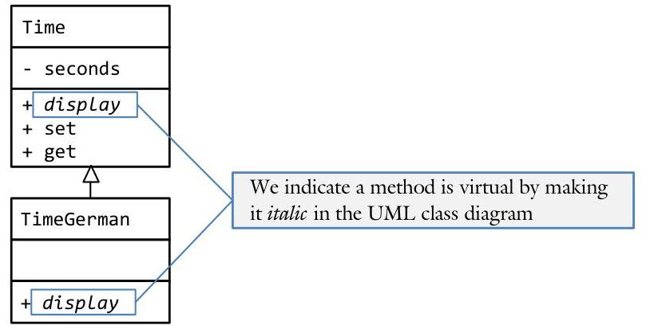
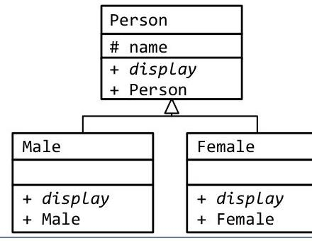
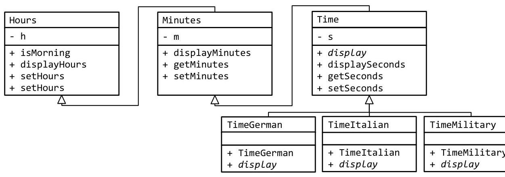

# Unit 3. Inheritance & Polymorphism {.unit-1-background}

> **In this Chapter:**
> [[toc]]

<div style="page-break-after: always;"></div>

#### 3.4 Virtual Functions

Sam is working on his Chess project but can't quite get it to work the way he wants. While he can create a Rook class that derives off of a Piece, he can't find a way to make a board of Pieces. Every time he tries to put his Rook into a Piece array, they forget they were Rooks and become Pieces! He is frustrated! Is there something he is missing?

**Objectives**

By the end of this chapter, you will be able to:

- Make a function a virtual function through the use of the virtual keyword
- Define upcasting, downcasting, and the slicing problem
- Avoid the slicing problem through the use of pointers


**Prerequisites**

Before reading this chapter, please make sure you are able to:

- Generate a UML class diagram describing "is-a" class relations (Chapter 3.0)
- Define polymorphism and explain when it might be useful in program (Chapter 3.1)
- Define binding, early binding, and late binding (Chapter 3.1)
- Define a class that inherits off of a base class (Chapter 3.2 and 3.3)


## What are virtual functions and why you should care

A virtual function is a member function that resides in the v-table associated with a class. This means that an object has a pointer to which version of a method is to be called. Consider, for example, a Time base class having three derived classes: TimeEnglish, TimeGerman, and TimeItalian. Each variation of the Time class is identical to the parent with one exception: they have different display() methods.


Through inheritance, it is possible to create the German derivation of Time. However, it is not possible to have an array of Times, each one remembering that it is actually English, German, or Italian. The reason is that as soon as the TimeGerman object is placed into a Time array, it forgets that it was German! Through virtual functions, it becomes possible for TimeGerman to remember its German nature and call the appropriate display() function.

# Binding and polymorphism 

Recall the notion of binding from the first two pages of Chapter 3.1 (see the Binding section). Early binding occurs when the compiler has all the information necessary to match a named item (such as a variable or a function) to a location in memory. Inheritance is an example of early binding because, based on the data type of the object, the compiler knows exactly which version of a method belongs to the object. Thus, it turns out that the compiler does not need to implement a v-table for a class exhibiting inheritance. Consider the following code:

```cpp
class Time
{
    public:
        void display(); // displays "3:28pm"
... code removed for brevity ...
};
class TimeGerman : public Time
{
    public:
        void display(); // displays "15.28"
... code removed for brevity ...
};
int main()
{
    Time timeNormal; // the compiler knows this is a Time object so
    timeNormal.display(); // it knows which version of display() to
                                    // call: Time::display()
    TimeGerman timeGerman; // similarly, the compiler knows this is a
    timeGerman.display(); // TimeGerman object so TimeGerman::display()
} // is called here
```

When early binding is at work, pointers are not necessary. After all, pointers are late-binding tools.
Late binding is needed when the compiler does not have all the information necessary to determine which data-item or function is needed in a given circumstance. Consider an array where the index is provided by the user. The compiler has no way of knowing which item in the array is needed; that decision can only be made at run-time. Since the decision must be made at runtime, late binding is at work. Since late binding is at work, pointers must be involved. Sure enough, arrays are implemented with pointers! Pointers allow the program to determine at run-time which data-item or function is needed. It follows that we will need pointers to implement polymorphism.
In order to make a given class polymorphic, it is necessary to indicate to the compiler that a given function will have more than one variation which will be determined at run-time. We call such methods virtual functions. Virtual functions are all those functions which need to be put in a v-table so they can be assigned at run-time. To indicate that a given method is virtual in a UML class diagram, we use italic.


# Virtual functions in class definitions 

To make a method virtual in a class definition, we use the virtual keyword before the function declaration:

```cpp
class Time : public Minutes
{
    public:
    Time()
    The virtual keyword indicates that this function is
        virtual and will be put in a v-table.
    Time(const Time & time);
    virtual void display() const
    {
        cout << getHours() / 12 << ':'
            << getMinutes() << (getHours() > 11 ? "pm" : "am");
    }
    void set(int hours, int minutes = 0; int seconds = 0);
    int getSeconds() const { return seconds; }
    private:
    int seconds; Even though this function is defined in the class definition,
    }; it is not inline. Virtual functions cannot be inline.
```

The virtual keyword has one purpose: to put the associated method in a v-table. This enables the class to be polymorphic. Now if the programmer wishes to create a German variant of the Time class, a German version of the display() function can be written. To do this, the German version will inherit from Time.

```cpp
class TimeGerman : public Time
{
    public:
    TimeGer
    The virtual keyword is not needed; it is inherited off
    the base-class. It is a good idea to include it though.
    TimeGerman(const TimeGerman & time);
    virtual void display() const
    {
        cout << getHours() << '.' << getMinutes;
    }
    };
    Only the constructors and the virtual functions need to
    be defined in the derived class.
```

Note that we can only make member functions virtual. Therefore, we can make operators virtual, as long as they are member operators. It is impossible to make the insertion operator (<<) virtual because it cannot be a member function.

> [!Danger] Sue's Tips
> {.sue}
> Only make a method virtual if it will be re-defined in the derived-class. While the performance penalty of a virtual function is small, it is not zero. The most important reason to minimize the number of virtual functions is that it is misleading to make a function virtual if it does not need to be.

# The slicing problem 

Consider the scenario where we have a Time base class and a TimeGerman derived class containing the display() virtual function. If we create an object of type Time, then it is easy to figure out which version of display() is needed. The same is true if we create an object of type TimeGerman. However, what happens when we assign a time object to a timeGerman object or vice-versa?

```cpp
{
    Time time; // the data type is "Time"
    time.set(15 /*h*/, 23 /*m*/);
    time.display(); // display "3:23pm" using the Time::display() version
    TimeGerman timeGerman; // the data type here is "TimeGerman" and the compiler
    timeGerman.set(15, 23); // knows exactly what the data type is
    timeGerman.display(); // "15.23" using TimeGerman::display()
    timeGerman.set(19, 51);
    time = timeGerman; // here only the data is copied over. The time object
    time.display(); // is still a Time so we get "7:51pm"
    time.set(13, 1);
    timeGerman = time; // here only the data is copied over. The timeGerman
    timeGerman.display(); // object is still TimeGerman so we get "13.01"
}
```

The important thing to get from this example is that assigning an object of one data type to another does not change the data type. We cannot make a Time behave like a TimeGerman or vice-versa. Sometimes, however, the problem can be quite serious. Consider the following UML class diagram:

| Point |
| :-- |
| - x |
| - y |
| + display |
|  |
| Circle |
| - radius |
| + display |

In this example, we are creating a Circle class from a Point class with a display() virtual function. Clearly Circle has three member variables ( $x, y$, and radius) while Point has two $(x, y)$. What happens when I try to assign a Circle into a Point or vice-versa? Because there are a different number of member variables, we have a problem.

## Downcasting

Downcasting is the process of casting a base class into a derived class. In the above example, it is assigning a Point onto a Circle:

```cpp
{
    Point point(3, 5); // point has the values of (3, 5)
    Circle circle = point; // what is the value of circle.radius?
    circle.display(); // ERROR: circle.radius is undefined!
}
```

Downcasting is dangerous because the program is required to "make up" information that is not provided. Since a Point does not have a radius but the Circle does, the circule.radius member variable is uninitialized.

# Upcasting or "slicing" 

Upcasting, otherwise known as the slicing problem, is the process of casting a derived class into a base class. In this case, we are ignoring what is unique about the derived class and retaining only the base class information. In other words, we are "slicing off" the Circle-ness so it can become a Point.

```cpp
{
    Circle circle(3, 8, 10);
    Point point = circle;
    point.display();
}
```

In some rare situations, this may be what you want. It may be needed to slice off the derived values and treat an object like its base class. In situations like these, is better to create a member function returning the base class. We can do it explicitly:

```cpp
Point Circle :: getPoint() const
{
    return (Point) (*this);
}
```

The slicing problem can happen any time an object is cast or when an object is assigned to a variable of the base type. While the assignment operator is one way this could happen, another common way is through passing objects to a function when the parameter is by-value. Recall that by-value parameter passing makes a copy of the variable (whereas by-reference and by-pointer parameters avoid this copying).
In the following example, a new Time object " $t$ " is created and only the base class portion of the timeGerman object is copied into it, thus resulting in the slicing problem.

```cpp
void display(Time t)
// notice this is passed by-value
{
    t.display(); // ERROR! Sliced to base Time object
}
int main()
{
    TimeGerman timeGerman;
    display(timeGerman); // we think we are passing a TimeGerman, but we
} // actually are passing a Time
```


## Avoiding the slicing problem

Sometimes we want to have an array of the base class where each member of the array remembers which derived class it belongs. This is difficult because all the items in an array must be of the same data type:

```cpp
{
    TimeItalian timeItalian; // "12.00 PM"
    TimeGerman timeGerman; // "12.00"
    Time array[2]; // base-type is of type "Time"
    array[0] = timeItalian; // ERROR! sliced to Time
    array[1] = timeGerman; // ERROR! sliced to Time also
    array[0].display(); // "12:00pm"
    array[1].display(); // "12:00pm"
}
```

To accomplish this it is necessary to not have an array of items, but rather have an array of pointers. This means that each item in the array gets to retain what is unique about it:

```cpp
{
    Time * array[2];
    array[0] = new TimeItalian;
    array[1] = new TimeGerman;
    array[0]->display();
    array[1]->display();
    delete array[0];
    }
    // base-type is of type "Time *"
    // assigning a "TimeItalian *" to "Time *"
    // assigning a "TimeGerman *" to "Time *"
    // "12.00 PM" (not "12:00pm" because...
    // "12.00" ... display() is virtual)
    // since we dynamically allocated our two
    // Times, we need to delete them when done
}
```

In other words, we avoid the slicing problem by working with pointers rather than objects themselves.
As with arrays, this slicing problem is avoided with functions by making sure that we do not create a separate copy of the parameter, but rather passing a pointer or a reference to the value. If the parameter is passed by pointer, the syntax would look as follows:

```cpp
void display(Time * pTime)
{
    pTime->display();
}
int main()
{
    TimeGerman timeGerman;
    display(&timeGerman);
}
```

In the above example, because the function is expecting the address of a Time object, when it is called, we must use the "address of" operator ( $&$ ) before our object. This is simplified by using the pass-by-reference syntax to the following (which also avoids the slicing problem):

```cpp
void display(Time & t)
{
    t.display();
}
int main()
{
    TimeGerman timeGerman;
    display(timeGerman);
}
```

In each of the two previous examples, no new copies of the timeGerman object are created, but rather the parameter $t$ refers to the original variable, and in so doing, the slicing problem is avoided.

> [!danger] Sue's Tips 
> {.sue}
> 
> Every time polymorphism is used, there needs to be a virtual function and a pointer. If the pointer is missing, we have the slicing problem. If the virtual keyword is missing, we are lacking the v-table.

## Example 3.4 - Person 

This example will demonstrate the simplest polymorphism example: one derived class and two base classes, each one with a single virtual function.

Write a class to represent a person. Additionally, create a Male and Female derived class.


The class definition of the base-class and one derived class is:

```cpp
class Person
{
    public:
        Person(const string & s);
        virtual void display();
    protected:
        string name;
    };
```

```cpp
class Male : public Person
{
    public:
        Male(const string & s);
        virtual void display();
    };
```

Observe how only the constructor and the virtual functions need to be defined in the derived class. To test the class, we need to create some Males and some Females and put them in a vector.

```cpp
{
    // first, we will create a bunch of people.
    Male male1( string("Hurst"));
    Female female1(string("Dewey"));
    Female female2(string("Richards"));
    // A collection of people. Note that each is a pointer to a Person,
    // not a Person. If we make them a Person then we will have the
    // slicing problem and they will lose their gender
    Person * people[3];
    // add them to my collection of people
    people[0] = &male1;
    people[1] = &female1;
    people[2] = &female2;
    // Note how the array only knows about Persons. It knows nothing
    // about males or females. Yet somehow the correct display
    // function is called for each. This is because we are
    // using polymorphism; each person has a vtable which
    // points to the correct function
    for (int i = 0; i < 3; i++)
        people[i]->display();
}
```

The complete solution is available at 3-4-people.html or:

## Example 3.4 - Date 

In this second example, we will see that we don't necessarily have to have pointers to do polymorphism. We can also use pass-by-reference which works basically the same way.

Write a program that has a Date base-class and two derived classes: the DateShort form displaying " $1 / 1 / 2000$ " and the DateLong form displaying " 1 " of January, 2000".

The base-class and each derived class need to implement the display() virtual function:

```cpp
ostream & DateShort :: display(ostream & out) const
{
    out << month << "/" << day << "/" << year;
    return out;
}
```

With these polymorphic display() functions, we can then the insertion operator for Date needs to call the appropriate version of display():

```cpp
ostream & operator << (ostream & out, const Date & date)
{
    return date.display(out);
}
```

To test this, we will create an array of Date pointers, assign them to local variables (of type Date, DateShort, and DateLong), and display each with the insertion operator.

```cpp
{
    Date date; // each local variable is a Date, DateShort,
    DateShort dateShort; // or DateLong. We never slice so each one
    DateLong dateLong; // retains its own version of display()
    Date * dates[3]; // array of pointers to Date so not to slice
... code removed for brevity...
    dates[0] = &date; // since dates is an array of pointers to Date,
    dates[1] = &dateShort; // we need to use the address-of operator &
    dates[2] = &dateLong; // to assign the pointers
... code removed for brevity...
    cout << "Base class with empty display: \"" << *dates[0] << "\"n";
    cout << "Short version: \"" << *dates[1] << "\"n";
    cout << "Long version: \"" << *dates[2] << "\"n";
}
```

As a challenge, can you add a third derived class that displays just the year?
1888

The complete solution is available at 3-4-date.html or:
/home/cs165/examples/3-4-date.cpp

## Example 3.4 - Time 

This next example will demonstrate how to mix simple inheritance with polymorphism. Here Minutes will inherit from Hours and Time will inherit off of Minutes. Additionally, there will be three variations of Time: TimeGerman, TimeItalian, and TimeMilitary.

Write three variations of a Time class, each displaying the time using a different format.


The Time class needs to both inherit from Minutes and make display() virtual:

```cpp
class Time : public Minutes
{
public:
    Time() : s(0), Minutes() { }
    Time(int s) : s(0), Minutes() { setSeconds(s); }
    Time(const Time & time);
    int getSeconds() const { return s;
    void setSeconds(int s) { if (validateSeconds(s)) this->s = s; }
    void addSeconds(int s);
    void displaySeconds() const
    {
        cout << (s < 10 ? "0" : "") << s;
    }
    virtual void display() const
    {
        displayHours(false /*is24*/); // we will display the hours...
        cout << ':'; // ... followed by the colon ...
        displayMinutes(); // ... followed by the minutes ...
        cout << (isMorning() ? "am" : "pm"); // ... and ending with the am/pm
    }
private:
    bool validateSeconds(int s) const { return (0 <= s && s < 60); }
    int s;
};
```

As a challenge, can you add another variation of Time that displays the seconds as well? Call this new format TimeLong:
$3: 28: 19 \mathrm{pm}$

The complete solution is available at 3-4-time.html or:
/home/cs165/examples/3-4-time.cpp

## Example 3.4 - Slicing problem 

In this final example will demonstrate the slicing problem. Specifically, we will create a trivial base class with a single virtual method and derived class. We will then attempt to copy the derived class onto the base class, yielding the slicing problem.

The base-class has a single virtual function called method():

```cpp
class Base
{
public:
    virtual void method() { cout << "Base!\n"; } // trivial virtual method
};
```

The derived class inherits off of Base and redefines method():

```cpp
class Derived : public Base
{
public:
    virtual void method() { cout << "Derived!\n"; }
};
```

Our drive program will demonstrate the slicing problem:

```cpp
int main()
{
    // we will create a Derived
    Derived derived;
    // this will display "Derived!"
    derived.method();
    // here we will assign Derived to Base but, due to the slicing problem,
    // we forget that we ever were a Derived. We become, in essence, a Base
    // here. This is the slicing problem.
    Base base = derived;
    // even though we assigned derived to base, we are of type base. We
    // have Base's VTable, not Derived.
    // this will display "Base!"
    base.method();
    // now we will avoid the slicing problem. We will not turn derived
    // into base, we will just copy the pointer. This means that we keep
    // what was unique about it.
    Base *pBase = &derived;
    // this will display "Derived!"
    pBase->method();
    return 0;
}
```

The output of this program is:

```
Derived!
Base!
Derived!
```

The complete solution is available at 3-4-slicingProblem.html or:
/home/cs165/examples/3-4-slicingProblem.cpp

> ## Problem 1 
> 
> What is the output of the following code:
> 
> ```cpp
> class Person
> {
>     public:
>         Person(const string & s) : name(s) { }
>         void display() { cout << name << endl; }
>     private:
>         string name;
> };
> class Male : public Person
> {
>     public:
>         Male(const string & s) : Person(s) { }
>         void display() { cout << "Mr. " << name << endl; }
> };
> class Female : public Person
> {
>     public:
>         Female(const string & s) : Person(s) { }
>         void display() { cout << "Ms. " << name << endl; }
> };
> int main()
> {
>     Male smith("Smith");
>     Female jones("Jones");
>     Person array[2];
>     array[0] = smith;
>     array[1] = jones;
>     array[0].display();
>     array[1].display();
> }
> ```
>   <input style="min-height: 200px">
> 
> ## Challenge 2 - 4 
> 
> \
> 2. Create the UML class diagram to represent the four types of accounts in a bank. Each account will be updated daily based on its interest rate and each account can display the balance.
>   <input style="min-height: 200px">
> 
> | Checking | Fee for each check |
> | :-- | :-- |
> |  | Minimum balance |
> | Savings | Interest |
> | Credit | Annual fee |
> |  | Interest |
> | Loan | Term |
> |  | Interest |
> 
> 3. Write the class definition for the checking class from the above UML class diagram.
>   <input style="min-height: 200px">
> 4. Create an array of Accounts, each of which is a Checking or Savings...
>   <input style="min-height: 200px">
