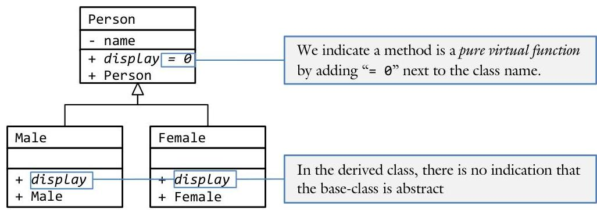

# Unit 3. Inheritance & Polymorphism {.unit-1-background}

> **In this Chapter:**
> [[toc]]

# 3.5 Pure Virtual Functions

Sue has just completed her chess program. She has decided to have a base-class called "Piece" and the following derived classes: Space, King, Queen, Rook, Bishop, Knight, and Pawn. Because she has a Space derived class, there is never a time when she would want to instantiate a Piece object. In fact, any attempt to do so would signify a mistake. Wouldn't it be great if the compiler could help Sue find such a mistake?

**Objectives**

By the end of this chapter, you will be able to:

- Define the terms abstract class and pure virtual function
- Describe a situation where a pure virtual function would be the correct tool for the job
- Implement a class containing a pure virtual function


**Prerequisites**

Before reading this chapter, please make sure you are able to:

- Design a class using UML class diagrams illustrating "is-a" relations
- Describe the difference between early-binding and late-binding
- Implement a polymorphic class using virtual functions


## What are pure virtual functions and why you should care

A pure virtual function is a member function within a base-class that has no implementation. A class derived off of this base class, on the other hand, must have a definition for this function. This means that it is impossible to instantiate a class containing a pure virtual function (because there is no implementation for the pure virtual function) but it is legal to instantiate one of the derived classes. A class containing at least one pure virtual function is called an "abstract class."

The motivation for pure virtual functions is that it is often desirable to create a collection of derived classes when the base-class makes no sense by itself. As a trivial example, consider a Person base-class having two derived classes: Male and Female.


In this example, it is possible to create an object of type Male as well as type Female, but it is impossible to instantiate a Person. A person without gender makes no sense. We would therefore call the display method a pure virtual function and the entire Person class is an abstract class.

# Designing with pure virtual functions 

Recall from Chapter 3.0 one of the motivations for designing with class relations: to leverage the similarities between classes in an effort to remove redundant or duplicate code. This means that all the invariant (or same) data and methods should reside in the base-class while all the variant (or "unique) data and methods should reside in the derived classes. It follows that there is nothing to stop us from designing a base class that does not make sense on its own. For example, there are a lot of invariant attributes shared between a Male and a Female. In fact, aside from their gender (and the odd chromosome), there is no difference. Therefore, the bulk of the functionality and data of the Male and Female classes should reside in a common base class. We will call this base-class Person, the genderless individual. This presents a problem: it makes no sense at all to have a Person! What is a person without their gender, an essential characteristic of any individual?
Clearly every Person object needs to have a getIsMale() method allowing the caller to ascertain the gender of the individual. This method is easy to define for the Male and Female class, but not so with the Person baseclass. We call methods like this pure virtual functions and a class having such a function is an abstract class. When a function is pure, we do not have to provide an implementation for it.

In a UML class diagram, we can specify that a given method is pure by appending " $=$ " next to the method name:


Note that abstract classes are a special form of the "is-a" relation. Not all virtual functions are pure but all pure functions are virtual! Therefore, we can only use pure virtual functions when the function is already virtual. We can only append the " $=$ " suffix next to a method that is italic.

> [!Danger] Sue's Tips
> {.sue}
> When considering whether to make a base class abstract, ask yourself if this is the right thing to do: Is there never a reason why the client will want to implement such a class? Is there no method implementation that makes sense? When the answer to these questions is "yes," then an abstract class might be the right tool for the job. Otherwise, find a suitable default behavior for the methods in question.

# Syntax of a pure virtual function 

The syntax for indicating that a virtual function is pure is similar to the UML class diagram notation: simply put " $=$ " next to the function declaration:

```cpp
class Base
{
public:
    /*******************************************************************************
    * BASE :: METHOD
    * This is a pure virtual function (because of the = 0) at the end of the method
    * definition Thus the VTable has a NULL pointer and the compiler will not allow us
    * create an object of type Base
    ****************************************************************************/
    virtual void method() = 0;
};
```

When we put " $=$ " next to the function, we cannot implement the function later. There are two main fallouts for making a virtual function pure: the inability of the client to instantiate objects of the base class type and the elimination of the slicing problem.

## No abstract objects

One big impact of making a function pure is that we can not longer instantiate an object of that type. Attempts to do so will yield a compile error. This is a useful tool because it prevents the programmer from accidentally instantiating an object based on a class that has no meaning.

## No slicing problem

Probably the best thing about making a base class abstract is that we eliminate the slicing problem. Recall from Chapter 3.4 that the slicing problem originates from the programmer attempting to cast a derived class down to a base class. The result of such an operation is that all that is unique about the derived class is "sliced away" yielding only a base class. In most cases, this is undesirable.
Slicing is impossible with abstract classes because the compiler will not let the programmer instantiate an object based on an abstract class. Any attempt of the programmer to do so will yield a compile error.
This is particularly helpful because slicing problems tend to be subtle. The program compiles and seems to work, but somehow things do not work the way the programmer expects! Trying to find the problem by inspecting the code can be difficult because the statement containing the error looks right. However, when an abstract class is used, the compiler directs the programmer to the exact line of code containing the error. These bugs are much easier to fix.

> [!tldr] Sam's Corner
<!-- > {.sam} -->
> Recall that virtual functions are function pointers residing in a v-table attached to a class. This means that each function pointer is assigned an address at run-time corresponding to which version of the function is to be executed. In the case of pure virtual functions, there is no function implementation for the v-table to point to. Therefore, the function pointer is given the NULL or zero address. This is why the " $=$ " notation is used both in the UML class diagram and in the `C++` class definition.

## Example 3.5 - Abstract class 

This example demonstrates what happens when the programmer attempts to implement an abstract class. In other words, the expected output is a compile error.

The base class is an abstract class with the a virtual function called method(). This means that the v-table has NULL pointer and the compiler will not allow us to create an object of type Base:

```cpp
class Base
{
public:
    virtual void method() = 0; // this is a pure virtual function
};
```

The derived class inherits Base as public and implements the virtual function method(). Note that, though it is defined in the class definition, it is not an inline function. Virtual functions cannot be inline:

```cpp
class Derived: public Base
{
public:
    virtual void method() // implement the virtual function here
    {
        cout << "Derived!\n";
    }
};
```

We then attempt to instantiate a Base in main():

```cpp
int main()
{
    Base base; // compile error. Because Base is an Abstract Class due to the
            // pure virtual function method(), we cannot
            // instantiate an object of this type.
    // even if we could create an object called base, we would crash
    // here due to the NULL pointer in the VTable of Base
    base.method();
    return 0;
}
```

The resulting compile error is:

```cpp
3-5-abstractClass.cpp: In function "int main()":
3-5-abstractClass.cpp:53: error: cannot declare variable "base" to be of abstract
                                    type "Base"
3-5-abstractClass.cpp:17: note: because the following virtual functions are pure
                                    within "Base":
3-5-abstractClass.cpp:26: note: virtual void Base::method()
```

The complete solution is available at 3-5-abstractClass.html or:
/home/cs165/examples/3-5-abstractClass.cpp

## Example 3.5 - People 

This example demonstrates a simple abstract class with two derived classes. In this example there is only one virtual function: the display() function.

Write an abstract class to represent a person. Additionally, create a Male and Female derived class.


Note how the display() function is pure.
The only difference between this Person class and the Person class from "Example 3.4 - People" is that the method display() is a pure virtual function now.

```cpp
class Person
{
    public:
        Person(const string & s) { name = s; }
        virtual void display() const = 0; // pure virtual function
    protected:
        string name;
};
```

The functionality of program is the same as the example from the previous chapter. This is because we only attempt to instantiate a Male or a Female in the driver program:

```cpp
int main()
{
    // first, we will create a bunch of people.
    Male male1( string("Hurst")); // we can instantiate a number of
    Female female1(string("Richards")); // Males and Females, but we
    Female female2(string("Dewey")); // cannot instantiate a Person
    // A collection of people. Note that each is a pointer to a Person,
    // not a Person. Therefore since there is no instantiated Person, we
    // will not get the abstract class compile error
    vector <Person *> people;
    ... code removed for brevity ...
}
```

As a challenge, can you add a member variable to Female called isMarried? Add a parameter to the constructor for Female that defaults to false. Finally, modify the display() function to prepend "Mrs." if the individual is married and "Miss." if she is not.

The complete solution is available at 3-5-people.html or:
/home/cs165/examples/3-5-people.cpp

## Example 3.5 - Date 

Recall from "Example 3.4 - Date" the empty display() function for the Date base class. Without pure virtual functions, we need to do hacks like this when a function in the base class is meaningless. This example will demonstrate how to avoid such hacks.

Modify the `Date` class from "Example 3.4 - Date" to make the display() method pure. We will also need to remove the object instantiated from Date in the driver program to avoid the compile error that would result otherwise.

The `Date` class from "Example 3.4 - Date" is the following:

```cpp
class Date
{
... code removed for brevity...
    // empty display function
    virtual ostream & display(ostream & out) const { return out; }
... code removed for brevity...
};
```

The same class with a pure display() function:

```cpp
class Date
{
... code removed for brevity...
    // NULL display function
    virtual ostream & display(ostream & out) const = 0;
... code removed for brevity...
};
```

For this to compile, the corresponding Date objects need to be removed as well:

```cpp
// without pure virtual functions
int main()
{
    Date date;
    DateShort dateShort;
    DateLong dateLong;
    Date * dates[3];
    cin >> date;
    dateLong.copy(date);
    dateShort.copy(date);
    dates[0] = &date;
    dates[1] = &dateShort;
    dates[2] = &dateLong;
    cout << *dates[0] << endl
        << *dates[1] << endl
        << *dates[2] << endl;
    return 0;
}
```

```cpp
// with pure virtual functions
int main()
{
    DateShort dateShort;
    DateLong dateLong;
    Date * dates[2];
    cin >> dateLong;
    dateShort.copy(dateLong);
    dates[0] = &dateShort;
    dates[1] = &dateLong;
    cout << *dates[0] << endl
        << *dates[1] << endl;
    return 0;
}
```

The complete solution is available at 3-5-date.html or:
/home/cs165/examples/3-5-date.cpp

## Example 3.5 - Time 

In "3.4 - Time," the base class displayed the time in the United States - English format. This is a bit presumptuous - why should the default time format be English? Instead, we will make Time an abstract base class and have a new TimeEnglish derived class displaying the United States - English format.

Modify "3.4 - Time" to make the Time class abstract and have a new TimeEnglish derived class:


The first step is to make the Time class abstract:

```cpp
class Time : public Minutes
{
... code removed for brevity...
    virtual void display() const = 0; // pure virtual function
... code removed for brevity...
};
```

Next a new TimeEnglish class needs to be added:

```cpp
class TimeEnglish : public Time
{
public:
    TimeEnglish() : Time() {}
    TimeEnglish(int s) : Time(s) {}
    TimeEnglish(const TimeEnglish & time) : Time(time) {}
    virtual void display() const // virtual function
    {
        displayHours(false /*is24*/); // we will display the hours...
        cout << ':'; // ... followed by the colon ...
        displayMinutes(); // ... followed by the minutes ...
        cout << (isMorning() ? "am" : "pm"); // ... and ending with the am/pm
    }
};
```

Finally, we need to remember to instantiate a TimeEnglish in the driver program rather than a Time. Failure to do so will result in a compile error.

The complete solution is available at $\underline{3-5 \text {-time.html }}$ or:
/home/cs165/examples/3-5-time.cpp

> ## Review 1 
> 
> What is the output of the following code?
> 
> ```cpp
> class Base
> {
>     public:
>         virtual void method() { cout << "Base!\n"; }
> };
> class Derived : public Base
> {
>     public:
>         virtual void method() { cout << "Derived!\n"; }
> };
> int main()
> {
>     Derived d1;
>     Base b = d1;
>     Derived d2 = b;
>     d1.method();
>     d2.method();
>     b.method();
>     return 0;
> }
> ```
> 
>   <input style="min-height: 200px">
>
> *Please see page 250 for a hint.*
> 
> ## Problem 2
> 
> What is the output of the following code?
> 
> ```cpp
> class B
> {
> public:
>     virtual void funky() { cout << "B!\n"; }
> };
> class A: public B
> {
> public:
>     virtual void funky() { cout << "A!\n"; }
> };
> int main()
> {
>     A a;
>     B b;
>     a.funky();
>     b.funky();
> }
> ```
> 
>   <input style="min-height: 200px">
> 
> *Please see page 222 for a hint.**
> 
> ## Problem 3 
> 
> What is the output of the following code?
> 
> ```cpp
> class B
> {
> public:
>     virtual void funky() = 0;
> };
> class A: public B
> {
> public:
>     virtual void funky() { cout << "A!\n"; }
> };
> int main()
> {
>     B b;
>     b.funky();
> }
> ```
> 
>   <input style="min-height: 200px">
> 
> *Please see page 255 for a hint.**
> 
> ## Problem 4
> 
> What is the output of the following code?
> 
> ```cpp
> class B
> {
> public:
>     virtual void funky() { cout << "B!\n"; }
> };
> class A: public B
> {
> public:
>     virtual void funky() { cout << "A!\n"; }
> };
> int main()
> {
>     A a;
>     a.funky();
>     B b = a;
>     b.funky();
> }
> ```
> 
>   <input style="min-height: 200px">
> 
> ## Problem 5 
> 
> What is the output of the following code?
> 
> ```cpp
> class B
> {
> public:
>     virtual void funky() { cout << "B!\n"; }
> };
> class A: public B
> {
> public:
>     virtual void funky() { cout << "A!\n"; }
> };
> int main()
> {
>     A a;
>     B * pB = &a;
>     pB->funky();
> }
> ```
> 
>   <input style="min-height: 200px">
> 
> *Please see page 245 for a hint.**
> 
> ## Problem 6.7
> 
> Given the following UML class description:
> 
> 6. Provide the `C++` class definition for the `Date` class and the DateJapan class.
>   <input style="min-height: 200px">
> 7. Implement the display() method for each of the derived classes:
>   <input style="min-height: 200px">
> 
> DateUSA: $\quad 5 / 21 / 2010$\
> DateUK: $\quad 21 / 05 / 2010$\
> DateGermany: 21.05.2010\
> DateJapan: $\quad 2010 / 05 / 21$\
