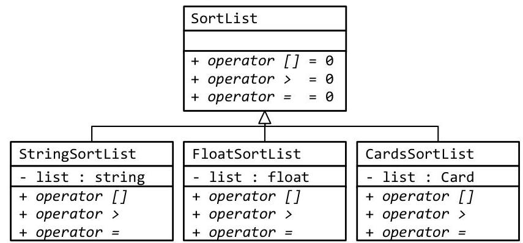

# Unit 4. Abstract Types 

4.0 Type-Independent Design ..... 264
4.1 Void Pointers and Callbacks ..... 273
4.2 Function Templates ..... 285
4.3 Class Templates ..... 293
4.4 Linked Lists ..... 300
4.5 Iterators ..... 313
4.6 Standard Template Library ..... 324

> **In this Document:**
> [[toc]]

<div style="page-break-after: always;"></div>

# Unit 4. Abstract Types 

### 4.0 Type-Independent Design

Sam wrote a binary search function for integers last semester. This year he re-purposed that same algorithm to work with the string class. As much as he likes the algorithm, he suspects that he will have to make it work for another data type in the near future. There has got to be a better way!

## Objectives

By the end of this chapter, you will be able to:

- Identify situations when generic algorithms and generic data-structures may be used
- Understand the relationship between type-independent design and polymorphism


## Prerequisites

Before reading this chapter, please make sure you are able to:

- Describe the principles of modularization and explain why they yield more re-usable code (Procedural Programming in C++, Chapter 2.0)
- Describe the principles of encapsulation and explain why they yield more re-usable code (Chapter 2.0)
- Describe how "is-a" class relations can work with polymorphism (Chapter 3.0, 3.4)


## What is type-independent design and why you should care

Type-independent design is the process of designing algorithms and data-structures that can work with a wide variety of data types. Perhaps this is best explained by example. Consider binary search, an algorithm designed to quickly find the location of a given item in a sorted list. This algorithm was developed without a single data type in mind. The binary search algorithm is an example of a type-independent design because it can work with many data types.

Type-independent design is a useful design methodology because it increases the re-usability of code. Just as the principles of modularization lead to more re-usable functions and encapsulation lead to more re-usable classes, type-independent design techniques enable code to be repurposed into a wide variety of previously unforeseen contexts. Consider a tractor-trailer truck. While it certainly exhibits a high degree of modularization (a single well-defined purpose and a simple interface with the highway), the re-usability value comes from the fact that it can work with such a wide variety of payloads (or data types). As long as the payload meets certain requirements, the tractor-trailer can easily be configured to haul it. Type-independent design similarly enables the programmer to develop algorithms and data-structures that work with a wide variety of data types.

# Prerequisites for type-independent design 

The essence of type-independent design, also called templates, is to create a function or class that can operate on a wide variety of data types, many of which do not have to be known by the developer of the function or class. To make this happen, two requirements typically need to be met: the algorithm or data-structure needs to be sufficiently generic so as to be useful for a wide variety of data types, and the data types need to support a set of functions or operators needed by the algorithm. These two requirements will be described in turn.

A template is
a mechanism in `C++` allowing a programmer to develop a function to work with generic data types

## Generic algorithms

Consider the binary search algorithm or the bubble sort algorithm. Both of these algorithms are useful for integers, floating point numbers, text, playing cards, and many other applications. The author of these algorithms certainly did not envision every possible data type that could possibly use a sort or search routine. Instead, the algorithm was designed with all possible data types in mind.
Another class of generic algorithms includes transformation algorithms. For example, data compression or encryption algorithms are inherently data independent. Though HTML files or JPG images certainly have very different data-structures, each could be encrypted using the same algorithm.

## Generic data-structures

Data-structures also commonly use templates. A data-structure is an organizational unit of individual data elements. The simplest data-structure is an array, composed of a simple list. Of course the array data-structure can be used for integers, Boolean values, names, and any other data type. Other data-structures include queues (first-in, first-out lists), stacks (first-in, last-out lists), trees, and a host of more advanced and complex structures. In each case, the utility of the data-structure extends beyond a single data type.

## Operations

In order to work with a new data type, a minimum number of operations or functions working with the data must be known. This list of operations depends on the context. For example, in order to find a given element in a list, it is necessary to determine if a given instance is the same as the one that is searched for. Thus, the equals (=) operator must be defined for that data type. Another example is a sort algorithm, requiring the data type to support comparisons as well as a swapping operation.
The more operations a given data type supports, the wider variety of generic algorithms the data type can use. Conversely, the more operations a generic algorithm requires of a type, the smaller number of data types are supported by the algorithm. It is therefore desirable for a custom data type to support the widest possible number of operations (typically in the form of operator overloading) and for a generic algorithm to require the smallest possible number of operations.

## Sue's Tips

The more operations that a data type must support to use a given template, the more difficult it will be for the client to use your template. It is therefore a good idea to carefully manage the list of operations that a given generic data-structure or algorithm uses when designing your template.

# Comparison with polymorphism 

At this point, you may have noticed that polymorphism addresses many of the same problems that typeindependent design is meant to solve. In the case of templates, each data type needs to support a given set of operators to work with a generic algorithm. In the case of polymorphism, the derived classes need to implement the required functions for the generic algorithm to work. They solve the same set of problems.
Consider the bubble sort. To make the bubble sort handle multiple types of lists using polymorphism, it is necessary to define an abstract type called SortList with three operations ([], >, and =). Note that two child classes (StringSortList and FloatSortList) may implement a given operator ( $>$ ) completely differently.


Through the late-binding feature of polymorphism, the appropriate function will be selected at run-time and the sort() function will work with all child data types:

```cpp
void sort(SortList & list)
{
    for (int iOutside = n - 1; iOutside > 0; iOutside--)
        for (int iInside = 0; iInside <= iOutside - 1; iInside++)
            if (list[iInside] > list[iInside + 1])
            {
            SortList tmp = list[iInside];
            list[iInside] = list[iInside + 1];
            list[iInside + 1] = tmp;
            }
}
```

To do the same thing with a template, a single sort routine will be called using a generic or template data type for the input list. From here, the [], >, and = operators will be called in the expected way. Then, when a given instance of sort() is referenced from the code, the compiler will create a new version of the sort() function specific to the passed data type. If the passed data type does not support all the operators referenced in the template function, it will simply fail to compile.

```cpp
template <class T>
void sort(T & list)
{
    for (int iOutside = n - 1; iOutside > 0; iOutside--)
        for (int iInside = 0; iInside <= iOutside - 1; iInside++)
            if (list[iInside] > list[iInside + 1])
            {
                T tmp = list[iInside];
                list[iInside] = list[iInside + 1];
                list[iInside + 1] = tmp;
            }
}
```

The data type T is substituted for the caller's passed data type at compile time.

All T data types must support the > operator
All T data types must support the $>$ operator
All T data types must support the = operator
All T data types must support the [ ] operator

We will learn the syntax of templates in Chapter 4.2 and 4.3.

# How to design with templates 

Designing with type-independent design in mind is a multi-step process. It starts with the question of whether templates are the right tool for the job, then moves on to designing the algorithm or data-structure with a simple data type, and finishes with making all references to the data type generic.

## Step 1: Is a template the right tool for the job?

Type-independent design all begins with the question "would this algorithm or data-structure work with more than one data type?" For example, a Sudoku solving function will only work with Sudoku boards. It does not make sense to use it for other data types. However, a data-structure designed to contain a set of strings may be a candidate: that same data-structure may be repurposed to contain a set of Accounts.

Many template problems can also be solved using polymorphism as alluded to previously. Which tool should be used? When there is already a shared base-type, polymorphism is the obvious choice. When none exists, templates would probably be a better solution. Consider the following scenarios:

| Scenario | Rational | Recommendation |
| :--: | :--: | :--: |
| All the clients of a given algorithm share the same base type. | Since there already exists a common base class, there is no additional overhead to using polymorphism rather than building a template. | Polymorphism |
| The size of the data type is extremely important | Templates duplicate code. Each version of a template function results in another copy of the function as generated by the compiler. Polymorphism does not do this, instead increasing the size of the data type through the use of v-tables. | Templates |
| Size of the executable is extremely important | Because templates copy code (see above), their use will bloat the size of the executable. It is far cheaper to use polymorphism in this case. | Polymorphism |
| A simple algorithm is used with a wide variety of data types | Since the data types are so diverse, it does not make sense to create an abstract type to wrap around each individual data type. Templates avoid this necessity. | Templates |

## Step 2: Use a stand-in data type

The second step is to write the function or data-structure using a simple stand-in data type. Though the function is designed to work with any data type, start with something easy like floats. Back to the Bubble Sort example previously, the function should first be written using floating point numbers or some other built-in data type. Care should be taken to test the code thoroughly; it is far easier to find bugs with built-in simple data types than more complex data types that may be used later on.

## Step 3: Make the data type generic

The final step in the design process is to replace all references to the stand-in data type (such as floats) with the template code. There are several ways to do this: use a void pointer (void *) as the data type (see Chapter 4.1) "use the template mechanism built into `C++` (see Chapter 4.2 and 4.3 ).

## Sue's Tips

Some programmers like to use integers as their stand-in data type. This is easy and convenient, but there is one problem. Because integers are often used as counters and as indexes into arrays, it becomes difficult to tell which variables are declared with the stand-in and which need to remain integers. It is therefore a good idea to always use floats as the stand-in data type.

# Example 4.0 - Stack 

This example will demonstrate the process a programmer may go through when deciding whether a given data-structure should be made into a template.

A stack is a data-structure that contains a list of items. Two operations are supported with a stack: push and pop. Push is the process of adding an item onto the end of the list. Pop is the process of taking an item off the end of the list. Would the stack data-structure be an appropriate application for typeindependent design?

The first step is to determine if a template is the right tool for the job. This involves asking a couple questions:

- Would this data-structure work with more than one data type? One can imagine wishing to have a stack of names (people wishing to have access to a professor's office hours for example), a stack of cards (for a variety of card games), and a stack of bills. Yes, a stack can be used with a wide variety of data types.
- Would polymorphism be a better tool for the job? Since there is no obvious base-type connecting all the data types potentially using a stack, templates appear to be a better tool for the job.

The second step is to implement the stack with a stand-in data type: floats.

```cpp
class Stack
{
    public:
        // create the stack with a zero size
        Stack() : size(0) {}
        // add an item to the stack if there is room. Otherwise throw
        void push(float value) throw(bool)
        {
            if (size < MAX)
                data[size++] = value; // must support the assignment operator
            else
                throw false;
        }
        // pop an item off the stack if there is one. Otherwise throw
        float pop() throw(bool)
        {
            if (size)
                return data[--size]; // must support the assignment operator
            else
                throw false;
        }
    private:
        float data[MAX]; // a stack of FLOATS for now
        int size; // number of items currently in the stack
};
```

The third step (make the data-structure work for all data types) will be saved for Chapter 4.1 and 4.3.
The stack implementation using floats as the stand-in data type is available at 4-0-stack.html or:
/home/cs165/examples/4-0-stack.cpp

# Example 4.0 - Binary Search 

This example will demonstrate the process a programmer may go through when deciding whether a given algorithm should be made into a template.

The binary search algorithm is an algorithm useful for finding the location of a given item in a sorted list. Would the binary search algorithm be an appropriate application for type-independent design?

The first step is to determine if a template is the right tool for the job. This involves asking a couple questions:

- Would this algorithm work with more than one data type? One can imagine searching through a list of names (finding a name in the telephone book), searching through a list of cards (is a given card in a player's hand?), and searching for a file in a folder. Yes, the binary search algorithm can be used with a wide variety of data types.
- Would polymorphism be a better tool for the job? Since there is no obvious base-type connecting all the data types potentially using the binary search algorithm, templates appear to be a better tool for the job.

The second step is to implement the binary search algorithm with a stand-in data type: floats.

```cpp
bool binarySearch(const float numbers[], int size, float search)
{
    int iFirst = 0;
    int iLast = size - 1;
    // loop through the list
    while (iLast >= iFirst)
    {
        int iMiddle = (iLast + iFirst) / 2;
            if (numbers[iMiddle] == search) // must support == operator
                return true;
            if (numbers[iMiddle] > search) // must support > operator
                iLast = iMiddle - 1;
            else
                iFirst = iMiddle + 1;
    }
    return false;
}
```

The third step (make the algorithm work for all data types) will be saved for Chapter 4.1 and 4.2.
The stack implementation using floats as the stand-in data type is available at 4-0-binarySearch.html or:
/home/cs165/examples/4-0-binarySearch.cpp

# Example 4.0 - Generic Display 

This example will demonstrate the process a programmer may go through when deciding whether a given algorithm should be made into a template.

Would a generic display function be an appropriate application for type-independent design?

The first step is to determine if a template is the right tool for the job. This involves asking a couple questions:

- Would this algorithm work with more than one data type? On the surface, the answer appears to be "yes." One might want to create a display function for just about any class. This may work with a graphics application like Asteroids or a Date data type or even a chess board. The problem is that there is basically no shared code between these applications. They do the same types of thing, but in a completely different way. The lack of shared code severely curtails the utility of templates in this application.
- Would polymorphism be a better tool for the job? Since the only thing the same between an Asteroids, Date, and Chess display function is the name, then polymorphism does appear to be a candidate for the job. However, there is no obvious base-class representing what is common (or invariant) between these classes. The lack of invariant properties severely curtails the utility of polymorphism in this application.

We will not proceed to the second or the third step of the process because templates are not a good tool for the job here.

# Problem 1, 2 

Consider a function to prompt the user for a float, taking error handling into account:

```cpp
float prompt(const char * prompt,
    const char * reprompt = NULL)
{
    bool done = false;
    assert(prompt != NULL);
    float value;
    do
    {
        // instructions
        cout << prompt << ": ";
        cin >> value;
        if (cin.fail())
        {
            if (reprompt != NULL)
                cout << reprompt << endl;
            cin.clear();
            cin.ignore(256, '\n');
        }
        else
            done = true;
    }
    while (!done);
    return value;
}
```

1. Transform the function to work with Dates.
2. Back to our prompt function, which operators and methods must be supported by our Date class to work with prompt()?

# Problem 3, 4 

Consider a class to store a collection of floats as a stack.

```cpp
class Stack
{
    public:
        Stack() : size(0) {}
        void push(float value) throw(bool)
        {
            if (size < MAX)
                data[size++] = value;
            else
                throw false;
            }
            float pop() throw(bool)
            {
                if (size)
                    return data[--size];
                else
                    throw false;
            }
    private:
        float data[MAX];
        int size;
};
```

3. Transform the class to work with Dates.
4. Back to our Stack class, which operators and methods must be supported by our Date class to work with Stack?