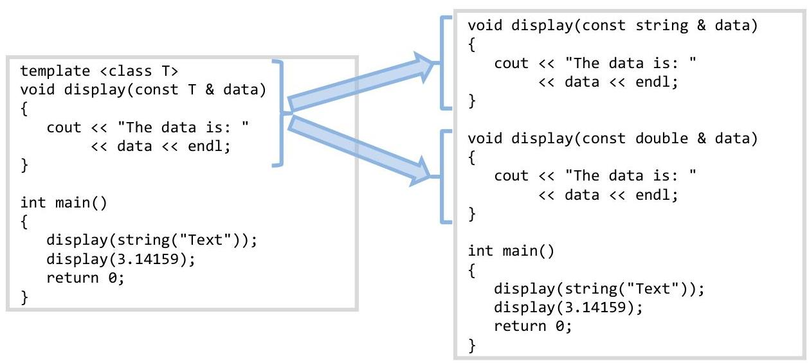

# 4.2-Function-Templates

# Unit 4. Abstract Types 

### 4.2 Function Templates

Sam has just finished implementing the bubble sort with void pointers and callback functions. Unfortunately, he called the bubble sort function with a callback function corresponding to different data than that was in his void pointer array. This mixup produced a crash that was difficult to find and debug. If only the compiler could help him catch such bugs...

## Objectives

By the end of this chapter, you will be able to:

- Define function templates and explain when they can be used
- Implement a generic function using function templates


## Prerequisites

Before reading this chapter, please make sure you are able to:

- Explain circumstances when generic functions can help make code more reusable (Chapter 4.0)
- Enumerate the steps used to define type-independent algorithms (Chapter 4.0)
- Identify the operators required to work with a given generic function (Chapter 4.0)


## What are function templates and why you should care

A function template is a mechanism in $\mathrm{C}++$ allowing the programmer to implement a generic algorithm that works with any data type. They are an early-binding mechanism allowing the compiler to catch most of the errors introduced by the data abstraction process (unlike the void pointer and callback mechanism doing the same thing (see Chapter 4.1)).
Function templates enable us to implement generic algorithms which work with many data types. In effect, the compiler turns our one function template into many individual functions according to the needs of the program:


# Function template syntax 

There are two aspects to the syntax of a function template: the definition of the template data type (called the template prefix) and the use of the template data type in the function (called the type parameter).

## Template prefix

In order to tell the compiler that a given function uses a template, it is necessary to use a template prefix:
template <class T>
The template prefix goes immediately before the function definition, stating that this function will have at least one parameter that uses an unknown data type.

Note that we can call our new data type " $T$ " though any other valid C++ name will work. By convention we use " $T$ " because data types should be TitleCased and because we don't know anything else about the data type to give it a more descriptive name.

There is one other aspect about the template prefix: it is possible for a function to accept two abstract data types corresponding to potentially dissimilar types. In this case, we can declare two templates in the prefix:
template <class T1, class T2>

## Type parameter

Once a template prefix has been created, the programmer can then use the data type $T$ the same as he would with any other data type in the program. This means that variables and parameters can be declared as type $T$ rather than with a built-in data type (such as int, float, bool, etc.) or with a class (such as Date, Point, etc.).

```cpp
{
    T variable; // the variable is of type T
}
```


## Template prefix with type parameter

Consider the standard swap() function:

```cpp
void swap(float & lhs, float & rhs)
{
    float tmp = lhs;
    lhs = rhs;
    rhs = tmp;
}
```

The same function, using a template prefix and a type parameter, would be:

```cpp
template <class T>
void swap(T & lhs, T & rhs)
{
    T tmp = lhs;
    lhs = rhs;
    rhs = tmp;
}
```

Since it is necessary for both the left-hand-side and the right-hand-side to be the same data type for the swap() function to work, only one type parameter is used for both the parameters.

Warning: all the type parameters represented in the template prefix must be represented in the function template parameters. If not, the compiler will not be able to tell which version of the template to use.

# How function templates work 

Though we introduced the term "template" in conjunction with abstract data types in Chapter 4.0, no explaination was given why we call them "templates." The answer comes from how templates are used.
When the compiler encounters a standard function definition, it turns the $\mathrm{C}++$ code into machine language which eventually resides in an executable program. This occurs because, at compile time, the compiler knows all it needs to know to turn the $\mathrm{C}++$ function into CPU-ready machine language.
When the compiler encounters a function template, it cannot generate the $\mathrm{C}++$ code. The reason is that it does not know what data type the type parameter " $T$ " refers to. Only when the compiler discovers how the template function is used does the necessary machine language code get generated. To illustrate this point, consider the following code using our newly defined swap() template function.

```cpp
{
    int value1 = 100;
    int value2 = 200;
    swap(value1, value2);
// the compiler will now know that an integer
}
// version of swap() is required
```

When the compiler encounters this code, it know know that an integer version of swap() is required. It will first see if an integer version was created and, if not, generate a new copy of swap():

```cpp
template <class T>
void swap(T & lhs, T & rhs)
{
    T tmp = lhs;
    lhs = rhs;
    rhs = tmp;
}
```

```cpp
void swap(int & lhs, int & rhs)
{
    int tmp = lhs;
    lhs = rhs;
    rhs = tmp;
}
```

The compiler will literally copy the original version of swap() that has the template information and replace all instances of the type parameter " $T$ " with the data type of the parameter: int. In other words, it is called a "template" because the compiler uses the declaration of the function as a pattern describing how to generate the version of the function that gets compiled.

## A warning...

Consider this very simple (and utterly useless) function template:

```cpp
template <class T1, class T2>
void displayTwo(T1 & t1, T2 & t2)
{
    cout << t1 << t2;
}
```

If there are 20 available data types in a given program (including built-in data types as well as class definitions), that means that there are $20 \times 20=400$ combinations. If we call the displayTwo() function with every combination of data types, this means that 400 copies of displayTwo() will be generated by the compiler. Therefore the compiler creates a unique copy of the template function for every combination of parameters
$\square$ sent to it. This can result in an unnecessarily large executable.

## Sue's Tips

In practice, we seldom encounter more than a couple copies of a given template function in one program. However, the programmer should always be aware of the potential for codebloat.

# Function template quirks 

There are a few quirks about function templates that all programmers should be aware of. If we think about how the compiler treats templates (namely generating new copies of the template function), each of the quirks should make sense.

## Templates and function signatures

The first quirk is that the compiler needs to figure out which version of the function template is needed based on the function signature. Namely, the function signature implied when the function template is called should unambiguously describe all the type parameters.

To illustrate this point, consider the following function template:

```cpp
template <class T>
T getValue() // ERROR: the type parameter T is not in the parameter list!
{
    T value;
    cin >> value;
    return value;
}
```

This will result in a compile error:

```cpp
error.cpp: In function "int main()":
error.cpp:23: error: no matching function for call to "getValue()"
```

All the type parameters needs to be in the parameter list:

```cpp
template <class T>
void getValue(T & value) // no problem because the caller can specify the data type
{ // of the type parameter "T"
    cin >> value;
}
```


## Supported operators

The second quirk is that the all the operators used in the function template need to be supported by the data type which the type parameter represents. For example, the insertion operator is supported by int:

```cpp
{
    int value;
    getValue(value); // legal because the insertion operator used in getValue()
} // supports the data type "int"
```

However, we will get a compile error of the data type is not supported by the insertion operator:

```cpp
{
    struct Coord // recall that we can declare a structure in a function
    {
        int row;
        int col;
    } coordinate; // recall that we can instantiate a variable at declaration
    getValue(coordinate); // ERROR: type Coord does not support the insertion operator
}
```

Every data type that is used by the type parameter must support all the operators used in the template function. If an operator is not supported, we will get a compile error.

# Example 4-2 - Swap 

This example will demonstrate the simplest function template, the swap() function. Clients of the swap() function only need to support the assignment operator.

Write a generic swap() function that can work with any data type. The function will swap the data in the left-hand-side with that of the right-hand-side.

In Chapter 4.1, we had the following void pointer version of the swap function:

```cpp
void swap(void * & pLhs, void * & pRhs)
{
    void * pTemp = pLhs;
    pLhs = pRhs;
    pRhs = pTemp;
}
```

The template version does away with the void pointer:

```cpp
template <class T> // only one type parameter because both the
void swap(T & lhs, T & rhs) // lhs and rhs are the same data type
{
    T tmp = lhs; // we could also say "T tmp(lhs);" and it
    lhs = rhs; // would work, but it would require T
    rhs = tmp; // to support both the copy-constructor
} // and the assignment operator
```

Now our driver program will use both the string class and floating point numbers:

```cpp
int main()
{
    // swap text
    string text1("First");
    string text2("Second");
    swap(text1, text2);
    cout << "The values swapped: " << text1 << ' ' << text2 << endl;
    // swap numbers
    double value1(3.14159);
    double value2(2.71828);
    swap(value1, value2);
    cout << "The values swapped: " << value1 << ' ' << value2 << endl;
    return 0;
}
```

Notice how two versions of swap() will be generated: both the string version and the double.
As a challenge, modify the driver program to swap c-strings. Why does it not work? Hint: how does the assignment operator work for c-strings?

The complete solution is available at 4-2-swap.html or:
/home/cs165/examples/4-2-swap.cpp

# Example 4.2 - Prompt function 

This example will demonstrate how to use function templates to write generic algorithms. As long as the data type which will eventually be replacing the type parameter supports the extraction operator and can copy itself, the function should work as the client expects.

Write a generic prompt() function that can work with any data type. The prompt() function will display the instructions on the screen and handle invalid input.

Recall from "Example 4.1 - Prompt function" that we previously used the return mechanism to send the user input value back to the caller. With function templates, we must send the value back to the caller as a by-reference parameter so the data type of type parameter can be known:

```cpp
template <class T>
void prompt(T & t, const char * prompt, const char * reprompt = NULL)
{
    bool done = false;
    assert(prompt != NULL); // the prompt is not optional
    do
    {
        // instructions
        cout << prompt << ": ";
        cin >> t; // T needs to support the insertion
        if (cin.fail())
        {
            if (reprompt != NULL) // the reprompt is optional
                cout << reprompt << endl;
                cin.clear();
                cin.ignore(256, '\n');
            }
            else
                done = true;
    }
    while (!done);
}
```

This function works with any data type supporting the extraction operator ( $>>)$.

```cpp
int main()
{
    // first with strings
    string text;
    prompt(text, "Please enter text");
    cout << "The text you entered is: " << text << endl;
    // second with double
    double number;
    prompt(number, "Please enter a number", "Invalid character");
    cout << "The number you entered is: " << number << endl;
    return 0;
}
```

The complete solution is available at 4-2-prompt.html or:
/home/cs165/examples/4-2-prompt.cpp

# Example 4.2 - Binary search 

This example will demonstrate how use function templates with complex generic algorithms. The type parameter of this function will need to support the greater-than operator ( $>$ ) and the equivalence operator $(==)$.

Write a generic binarySearch() function that can work with any data type. The prompt function will determine whether a given value is in the passed array.

The easiest way to make a function template for binarySearch() is to modify the version with a float stand-in from "Example 4.0 - Binary search" and replace "float" with "T":

```cpp
template <class T>
bool binarySearch(const T array[], // an array of values
            int size, // number of items in array
            const T & search) // the search value
{
    int iFirst = 0;
    int iLast = size - 1;
    // loop through the list
    while (iLast >= iFirst)
    {
        int iMiddle = (iLast + iFirst) / 2;
        if (array[iMiddle] == search) // must support == operator
            return true;
            if (array[iMiddle] > search) // must support > operator
                iLast = iMiddle - 1;
            else
                iFirst = iMiddle + 1;
    }
    return false;
}
```

Observe how the template version of this function is nearly identical to the float stand-in; it is only necessary to replace all instances of "float" with "T".

As a challenge, can you modify the driver program to search through an array of string objects? Why would it work with string objects but not with c-strings?

The complete solution is available at 4-2-binarySearch.html or:
/home/cs165/examples/4-2-binarySearch.cpp

# Problem 1 

Write a function to return the maximum of two values. The two values passed as parameters can be of any data type that supports the greater-than operator ( $>$ ). Example of how the function can be used:

```cpp
{
    cout << max(5, 2) << endl;
    cout << max(string("first"), string("last"));
}
```

Please see page 289 for a bint.

## Problem 2

Write a function to display the contents of an array. Each item in the array will have a space separating them on the screen. The data type of the array, of course, can be anything. Example:

```cpp
{
    int data1[] = { 4, 2, 7, 3};
    display(data1, 4); // displays "4 2 7 3 "
    char data2[] = "template";
    display(data2, 8); // displays "t e m p l a t e "
}
```

Please see page 291 for a bint.

## Problem 3

Write a function sum the contents of an array. Return the sum. The data type of the array can be anything of course. Example:

```cpp
{
    int data1[] = { 4, 2, 7, 3};
    cout << sum(data1, 4) << endl; // displays "16"
    string data2[3] = { string("Thomas "), string("E. "), string("Ricks") };
    cout << sum(data2, 3) << endl; // displays "Thomas E. Ricks"
}
```