# Unit 4. Abstract Types 

### 4.4 Linked Lists

Arrays are a great data-structure for storing a collection of values. It is easy to add items to the end of an array and to access any item in the middle of the array provided the index is known. However it is difficult to remove items from the middle of an array. Doing so requires us to shift all the items in the array. Sam is confronted with this while working on his Asteroids project. While it is easy to add a bullet to the collection of game entities, it is difficult to remove a dead bullet without shifting the entire list. If only there was a more convenient data-structure!

## Objectives

By the end of this chapter, you will be able to:

- Define and describe the following terms: linked list, node
- Describe the UML class diagram of a Node class or structure
- Create a structure definition matching a linked list description
- Explain the situations when a linked list would be preferable to an array and vice-versa


## Prerequisites

Before reading this chapter, please make sure you are able to:

- Define the NULL pointer (Procedural Programming in C++, Chapter 4.1)
- Define a structure matching a given UML class diagram (Chapter 1.3)
- Define a generic data-structure as it pertains to abstract types (Chapter 4.0)
- Define a class template (Chapter 4.3)


## What are linked lists and why you should care

A linked list is a type of data-structure where each item in the list is connected to the rest of the list through pointers. Each item in a linked list is called a node. A node is a structure or class consisting of some dataitem and a pointer to the next node in the list.

| Node <br> data <br> pNext | One data-item |
| :-- | :-- |
|  | Pointer to the next Node in the list |

When a collection of nodes point to each other, we have a linked list.
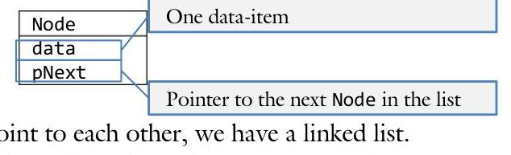

Because the nodes in a linked list do not need to reside next to each other in memory as they do with arrays, it is possible to add items to the middle of a linked list without shifting the rest of the list. This makes them more efficient than arrays in many situations.

## Sue's Tips

When working with linked lists, it is almost always helpful to draw the block diagram like the one represented above. This helps you keep your pointers straight.

# Linked lists and arrays 

Arrays were the first "aggregate" or "bucket-of" data-structures we learned about last semester. Arrays have the property that each $\mathrm{i}^{\text {th }}$ item in the array is guaranteed to be in the memory location beside the $(\mathrm{i}+1)^{\text {th }}$ item. This is convenient because you can always jump directly to a given item in the list (we call this "random access"). Unfortunately, this makes it difficult to add or remove items from the middle of the list. In order to accomplish this, we typically need to shift all the items after the added or removed item, which can be expensive. Consider an array of four items: $\{2,4,6,8\}$. If the second item (4) were to be removed, all the items after it will need to be shifted over by one spot.
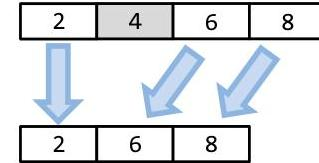

Unlike arrays, linked lists are free from proximity constraints. In other words, the $i^{\text {th }}$ and $(i+1)^{\text {th }}$ item do not have to be next to each other in memory. While this design feature precludes random access (you need to walk through the list one item at a time to find a given element), it greatly simplifies modification to the list. If the second item in a linked list is to be removed, it is only necessary to redirect the pointer from the first item; there is no need to adjust the rest of the linked list.
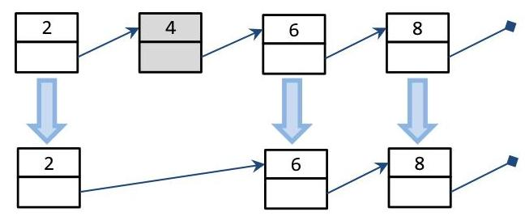

Notice that a linked list and an array solve the same class of problems: they hold a collection of data. We call these collections "containers". In a sense, a linked list is an array of objects. However, linked lists have some fundamental differences from arrays: allocation, indexing, and manipulation.

In an array, we can leave data unused and uninitialized. In other words, items in the array can be left empty. Each item in a linked list, on the other hand, must be allocated. This is typically done with the new operator. Therefore, it is much more expensive to create a linked list than an array of corresponding size.

Because the nodes in a linked list do not need to be in a pre-specified order in memory, the only way to find the next item in the list is through following the pointer from the previous node. This means that linked lists do not support random access. Unlike arrays, the only way to find the $i^{\text {th }}$ item in the list is the loop through the previous items. It is impossible to jump to that location using pointer arithmetic as we did with arrays.

If you wanted to delete or insert data in an array, the rest of the items in the array need to be shifted. This can be expensive. With linked lists, however, insertion and deletion can be done without affecting any of the other items in the list. This makes these operations much less expensive. Whenever a programming problem calls for a container that can handle efficient modification of data in the middle of a list, a linked list should be considered.

# Syntax of linked lists 

As previously defined, every linked list is a collection of nodes. A node can be any structure or class as long as it has at least two member variables: the data comprising what is stored in the linked list (commonly called data), and a pointer to the next node in the list (commonly called pNext).
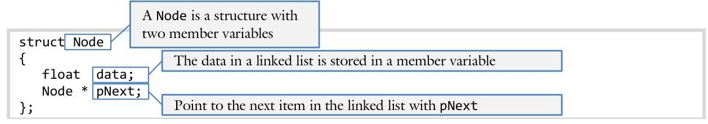

By convention, we signify a Node is at the end a linked list by giving pNext the NULL address:

```cpp
{
    Node linkedList; // each linked list is started with a head
    linkedList.data = 3.14159; // node; the rest can be reached through pNext
    linkedList.pNext = NULL; // each node contains data
    // when pNext equals NULL, there are no nodes
} // after it in the list
```

If three items are to be added to a linked list, then three Nodes will need to be allocated.

```cpp
{
    Node * pHead;
    // add the first node
    pHead = new Node;
    pHead->data = 2.0;
    // add the second node
    pHead->pNext = new Node;
    pHead->pNext->data = 4.0;
    // add the third node
    pHead->pNext->pNext = new Node;
    pHead->pNext->pNext->data = 6.0;
    // mark the end of the list
    pHead->pNext->pNext->pNext = NULL;
}
```

Notice how we can access successive items on the linked list by using the pNext->pNext chain. The final item in the chain points to NULL. We signify this with the $\longrightarrow$ symbol.

## Sam's Corner

Though the examples in this chapter work exclusively with linked lists of floats, it is possible to make a linked list using any data type. You can either substitute float for any other data type, or make the structure a template. The latter is probably your best bet; once you get your linked list code working, why would you ever want to change it or rewrite it?

# Looping through a linked list 

Up to this point, we have two standard FOR loops: the loop through an array using an index and the loop through a c-string using a pointer. The introduction of linked lists requires a third standard FOR loop.

## Loop 1: arrays

When writing a FOR loop to traverse an array, we start at the 0 index and move onto the end:

```cpp
for (int i = 0; i < size; i++) // must know the size
    cout << array[i] << endl;
```

When working with a vector, the loop is nearly identical:

```cpp
for (int i = 0; i < array.size(); i++) // get size with array.size()
    cout << array[i] << endl;
    // use [] operator
```


## Loop 2: c-strings

With c-strings, we typically do not know the length of the string; we need to search for the null character (' $\backslash 0$ '). Since the null character is zero or false, the second standard FOR loop is:

```cpp
for (char * p = text; *p; p++) // stop when *p is false
    cout << *p << endl;
    // access data with *p
```


## Loop 3: linked lists

In order to loop though a linked list, we have a new standard FOR loop:

The beginning of the loop starts with a pointer, p, which will begin by pointing to the first node in the list, defined as pHead. Like the c-string loop, we use a pointer to walk through a linked list.

Recall that we signify the end of a linked list with the NULL address for pNext. Therefore, whenever our current node (p) is the NULL address, we stop the loop. Recall that the NULL, address evaluates to false.

The loop will increment by updating p to point to the next item in the list. The next item in the list is reached with p$>$ pNext. Thus, to advance $p$ in the list use the following statement:

$$
p=p->p N e x t
$$

Notice we also use the dereferencing arrow ( $->$ ) when we output the value. This is because the value member variable holds the data of the list.

## Suc's Tips

The linked list FOR loop is exactly the same regardless of data type of the data member variable. It is used so often that is it is worth memorizing.

# Example 4.4 - Loop through a linked list 

This example will demonstrate how to loop through a linked list using the third standard FOR loop. Each Node will need to be both allocated and deleted.

Write a program to prompt the user for a value and put the value on the end of a linked list. Next display the values and empty the list when finished.

We will use the standard Node definition for our linked list:

```cpp
struct Node
{
    float data;
    Node * pNext;
};
```

To fill the linked list, it is necessary to allocate the nodes one-by-one. We will need a variable to keep track of the head of the list (pHead) as well as one to keep track of our current position in the linked list (pCurrent). Note how we need to carefully manage our pNext pointer on each Node.

```cpp
void fill(Node * & pHead) // because pHead will receive a new value
{
    // add the first node // when we allocate that node, we
    pHead = new Node;
    cout << ">";
    cin >> pHead->data; // use the arrow operator -> to reach
    // add the second node // the member variable from a pointer
    pHead->pNext = new Node;
    cout << ">";
    cin >> pHead->pNext->data;
... code removed for brevity...
}
```

The loop to display the contents of the linked list is the third standard FOR loop:

```cpp
ostream & operator << (ostream & out, const Node * pHead)
{
    for (const Node * p = pHead; p; p = p->pNext)
        out << p->data << ' ';
    return out;
}
```

Note that we will need to delete the nodes when finished. This requires us to loop through the nodes, one by one, and delete each one. Again the third standard FOR loop is needed:

```cpp
void empty(Node * & pHead)
{
    for (Node * p = pHead; p; p = p->pNext)
        delete p;
}
```

The complete solution is available at 4-4-loop.html or:
/home/cs165/examples/4-4-loop.cpp

# Adding an item to the head 

To add a node to the head of a linked list, it is necessary to do three things: allocating a new Node, initializing the next pNext pointer in the newly allocated Node, and resetting pHead to point to the new Node.
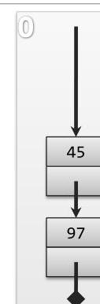

We start this process with an existing list. This list will have two nodes containing the values 45 and 97 .

The function to change this list will take a pointer to the head node (pHead) as a parameter. However, since we are going to change what the head node points to, it must be pass by-reference:

```cpp
void addToHead(Node * & pNode, float data)
{
    // insertion code will go here
}
```

Thus we pass a pointer by-reference because we need to change pHead.
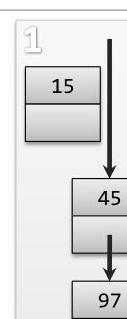

The first step of this process is to allocate a new Node. We will call this node pNew, keeping with the naming convention we have for all pointers. At allocation time, we will also initialize the value of our node (to 15 in this case):

```cpp
// 1. allocate and initialize create a new node
Node * pNew = new Node; // allocate the node
pNew->data = data; // set the data member variable
```

Recall that, since we are working with pointers to a structure, we need to use the arrow operator ( $->$ ) to access the member variables of pNew.

The next step is to attach the new node to the existing list. We will do this by making the pNext member variable of pNew (containing the value 15) refer to the old head of the list (pHead containing 45). When we are done, both pHead and pNew->pNext will refer to the same node (node 45):

```cpp
// 2. put pHead in line after the new node
pNew->pNext = pHead; // set pNext, the old head
```

The final step is to make sure the linked list starts with our new node, not with the old head. We accomplish this by assigning pHead to pNew (15):

```cpp
// 3. finally, pNew is the new head
pHead = pNew; // pNew is the new head. Note that
// pHead is a pointer by-reference
```

Recall that pHead is a parameter variable, not a local variable. This line of code changes the pHead. If pHead was pass-by-pointer alone, we would be only changing our copy of the head of the list, not the variable passed by the caller. Therefore, in order for the client's pHead to be changed, the pointer must be pass-by-reference.

# Adding an item to the middle 

Adding an item to the middle of a linked list is very similar to adding to the start. Again, with linked lists, we don't have to worry about shifting all of the elements in the list when adding a new item. There will be three steps in this process: allocating a new node, initializing the next pNext pointer in the newly allocated node, and resetting pHead to point to the new node
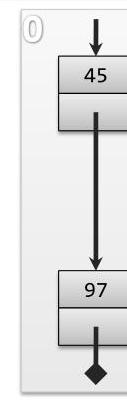

We start this process with a list containing two items. We will wish to add our new node between item 45 and 97. The function to change this list will take a pointer to the node before the one we will add the new number (pNode) as a parameter as well as the data to be added (data):

```cpp
void add(Node * pNode, float data)
{
    // 0. if the list is empty, use addToHead()
    if (pNode == NULL)
        return;
}
```

In this process, the first step is to allocate the node using the new operator. Just like before, we will call this node pNew. At allocation time, we will also initialize the value of our node (to 15 in this case):

```cpp
// 1. create a new node
    Node * pNew = new Node; // allocate the node
    pNew->data = data; // set the data member variable
```

Again, since we are working with pointers to a structure, we need to use the arrow operator ( $->$ ) to access the member variables of pNew.
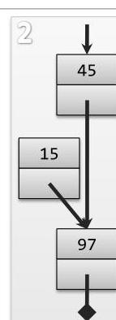

The next step is to attach the new node to the existing list. Recall that we received from the caller as a parameter a pointer to the node before the one where we will add the new node (pNode). This node currently has the value 45.

Now we update the new node pointer (pNew->pNext) to the where pNode->pNext used to point. This means pNew->pNext and pNode->pNext both point the same place (97):

```cpp
// 2. fix the pNext pointer from pNew to the spot after it in the list
pNew->pNext = pNode->pNext;
```

The final step is to make sure that the head now points to our new node. We do this by assigning pNode->pNext to pNew:

```cpp
// 3. finally get pInsert->pNext to point to pNew
pNode->pNext = pNew;
```

Now that we are finished, notice how our linked list correctly connects the three nodes. The node containing 97 was never changed and nothing before 45 was ever changed.

# Example 4.4 - Add to a linked list 

This example will demonstrate how to add a node to a linked list. Both the cases where the number is at the head of the list and where the number is in the middle of the linked list.

Write a program to add a node to a linked list. The user should be able to specify where the item will go in the list (user input is underline):

```cpp
Enter four numbers to put in the linked list
Data: 90
    90
Data: 100
Index after which 100 will be inserted: 0
    100 90
Data: 95
Index after which 95 will be inserted: 1
        100 95 90
Data: 85
Index after which 80 will be inserted: 3
    100 95 90 85
```

First we need a function to add a number to the beginning of a linked list:

```cpp
void addToHead(Node * & pHead, float data)
{
    // 1. allocate and initialize create a new node
    Node * pNew = new Node; // allocate the node
    pNew->data = data; // set the data member variable
    // 2. put pHead in line after the new node
    pNew->pNext = pHead; // set pNext, the old head of the list
    // 3. finally, pNew is the new head
    pHead = pNew; // pNew is the new head. Note that
} // pHead is a pointer by-reference
```

Next we need a function to add node containing data to the linked list after pNode:

```cpp
void add(Node * pNode, float data)
{
    // 0. if the list is empty, use addToHead()
    if (pNode == NULL)
        return;
    // 1. create a new node
    Node * pNew = new Node; // allocate the node
    pNew->data = data; // set the data member variable
    // 2. fix the pNext pointer from pNew to the spot after it in the list
    pNew->pNext = pNode->pNext;
    // 3. finally get pNode->pNext to point to pNew instead of the old node
    pNode->pNext = pNew;
}
```

The complete solution is available at 4-4-add.html or:
/home/cs165/examples/4-4-add.cpp

# Remove from the head of the list 

Just like adding an item to a list, the process of removing an item can be described in three steps; saving the next item, deleting the old item, and making the head point to the next item. Again, we will use the structure Node.
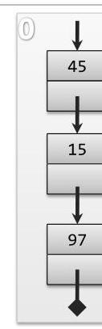

In this example, we start with a list that contains three nodes, containing values 45, 15, and 97. We will remove the first item, 45. This function will take the pointer to the head node ( pHead ) and, because our goal is to change pHead, we will pass the pointer byreference:

```cpp
void removeFromHead(Node * & pHead)
{
    // 0. do nothing if there is nothing to do
    if (pHead == NULL)
        return;
}
```

In this process, the first step is to save the location of the next item in the list. This is done by creating a new pointer, pSave, and initialize it as the value of pHead->pNext:

```cpp
// 1. remember the second item
Node * pSave = pHead->pNext;
```

This step is important because we will need to know where the new pHead is going to point to once we've deleted the pHead node.

Now we need to delete the first item in the list (pHead), using the delete operator:

```cpp
// 2. delete the first item
delete pHead;
```

Note that at this point, our linked list is broken. There is nothing connecting pHead (which currently points to a deleted node) to the next item in the list (containing 15). We must fix this pointer to complete the linked list.

The final step is to make sure that the head now points to the next node. We saved the location of this node using the pointer pSave, so all we have to do is assign pHead to pSave and the next node becomes the head of the list. The only way this can work is if we pass pHead to our function by-reference:

```cpp
// 3. make head point to the second item
pHead = pSave;
```

When the function exits, pSave will fall out of scope leaving our properly formed linked list starting with pHead.

# Remove from the middle of the list 

Removing an item from the middle of a list is convenient because no items in the list need to be shifted in any way. This process can also be reduced into three steps; saving the location of the item, updating the head pointer, and deleting the node.
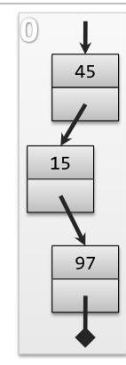

We will start with a list that contains three nodes. We will remove one node from the list, as specified by a passed parameter.

One parameters will be passed to our remove() function: a pointer to the node immediately before the one we wish to remove (pPrevious) with the value 15):

```cpp
void remove(Node * pPrevious)
{
    // if the list is empty or there is just one item, use removeFromHead
    if (pPrevious == NULL || pPrevious->pNext == NULL)
        return;
}
```

We need to save the location of item we plan to delete. We will create a pointer called pSave and assign it to the location of pHead->pNext:

```cpp
// 1. save the location of the item before the one we are deleting
    Node * pDelete = pPrevious->pNext;
```

Note that two pointers will be pointing to the node containing 15: pDelete and pPrevious->pNext.

The next step is to update the pointer of the head (pPrevious->pNext) to the item following the saved node (pSave->pNext):
// 2. update the pointer of pPrevious->pNext
pPrevious->pNext = pDelete->pNext;
At this point, the linked list has forgotten about the node we are deleting. If we start from pHead, we will never encounter pDelete (with the value 15); it is no longer part of the chain. However, we still need to delete the node.

Finally, we will delete the saved node using the delete operator:

```cpp
// 3. delete the pointer at pDelete
delete pDelete;
```

Notice with this and all of the previous examples we didn't have to shift any of the nodes to add or delete items. We simply needed to change the pointers.

# Example 4.4 - Remove from a linked list 

This example will demonstrate how to remove items from a linked list. It will handle both the special case of removing the head of a list as well as the general case of removing from the middle of a list.

Write a program to remove a node from a linked list. The user should be able to specify the index of the number to be removed from the list (user input is underline):

```cpp
Enter five numbers to put in the linked list
#1: 101
#2: 102
#3: 103
#4: 104
#5: 105
    before: 101 102 103 104 105
Which item do you want to remove? 3
    after: 101 102 104 105
```

The special case is to remove from the beginning of the list. To handle this, it is necessary for the pHead pointer to be passed by-reference.

```cpp
void removeFromHead(Node * & pHead)
{
    // 0. do nothing if there is nothing to do
    if (pHead == NULL)
        return;
    // 1. remember the second item
    Node * pSave = pHead->pNext;
    // 2. delete the head
    delete pHead;
    // 3. make the head point to the second item
    pHead = pSave;
}
```

The general case is to remove from the middle of the list. We must first detect if the passed node is NULL or if the next node is NULL. In either of these cases, we must call removeFromHead().
void remove(Node * pPrevious)
\{
// if the list is empty or there is just one item, use removeFromHead
if (pPrevious == NULL || pPrevious->pNext == NULL)
return;
// 1. save the location of the item before the one we are deleting
Node * pDelete = pPrevious->pNext;
// 2. update the pointer of pPrevious->pNext
pPrevious->pNext = pDelete->pNext;
// 3. delete the pointer at pDelete
delete pDelete;
\}
The complete solution is available at 4-4-remove.html or:
/home/cs165/examples/4-4-remove.cpp

# Review 1 

Recall from Unit 3 that only member functions can be polymorphic. Recall from Unit 2 that the insertion operator (<<) cannot be a member function. The combination of these makes it impossible to create a polymorphic insertion operator.
Define a template version of the insertion operator that works with any data type defining a public display() method.

```cpp
class Date
{
    public:
        void display(ostream & out) const;
    ... code removed for brevity ...
    };
```

Note that, if the display() function in the passed object is virtual, we can have the equivalent of a polymorphic insertion operator.

A singly linked list is a data-structure where each node is connected to the next node in the list through a pNext pointer:
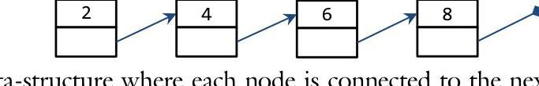

A doubly linked list is a data-structure where each node is connected to the next and the previous node through a pointer:
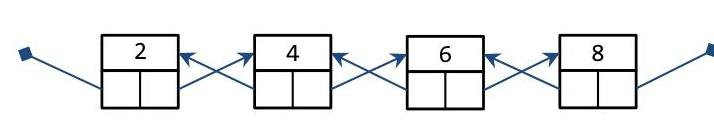
2. Write the UML for a doubly linked list Node structure.
3. Create a structure definition for Node. Make sure the structure is a template.
4. Using the addToHead() function as your guide, write the code to add onto the beginning of a doubly linked list.
5. Using the remove() function as your guide, write the code to remove from the middle of a doubly linked list. Hint: you will pass as a parameter the node to be removed.