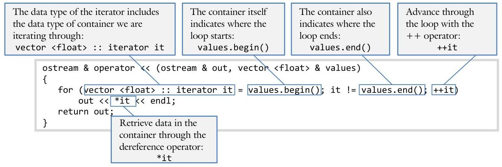
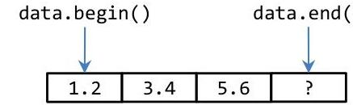
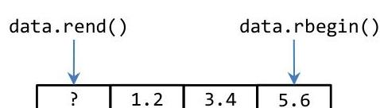

# Unit 4. Abstract Types {.unit-1-background}

> **In this Chapter:**
> [[toc]]

<div style="page-break-after: always;"></div>

# 4.5 Iterators

Sue gets confused by the many different versions of the FOR loop: for arrays, for c-strings, and linked lists. Even though both FOR loops do essentially the same thing, the specifics of the loops are completely different. If only there was just one FOR loop that she could use for all types of containers.

**Objectives**

By the end of this chapter, you will be able to:

- Provide a definition of an iterator and explain why they are useful programming constructs
- Recite the syntax for an iterator through a string object, a vector, and a linked list
- Use an iterator to solve programming problems involving loops


**Prerequisites**

Before reading this chapter, please make sure you are able to:

- Instantiate a vector of floats and loop through all the items in the vector (Review chapter)
- Be able to overload the common operators as both members and non-members (Chapter 2.6 - 2.8)
- Recite the syntax for the three standard FOR loops: the loop through an array, through a c-string, and the loop through a linked list (Chapter 4.4)


## What are iterators and why you should care

An iterator is a tool used to provide a standard way to iterate or traverse through a collection of values. They are designed to work the same regardless of the data type stored in the collection and regardless of how the collection is stored in memory. For example, an iterator used to loop through the items in a vector should work the same as an iterator used to loop through the items in a linked list.

Iterators are a key component to encapsulation. Recall from Unit 2 that one of the purposes of encapsulation is to shield the user of a class from the specific implementation details used to build the class. In other words, a programmer instantiating an object should not need to know how data is stored within the class from which the object was defined. Iterators are designed to help with this. Since linked lists are stored in memory so differently than arrays, it is necessary to use a completely different loop to iterate through the items in a linked list than it is to loop through the items in an array.

| Arrays | C-Strings | Linked Lists |
| :--: | :--: | :--: |
| for (int i = 0; <br> i < num; <br> i++) <br> cout << array[i]; | for (char * $p=$ text; <br> *p; <br> $\mathrm{p}++$ <br> cout << *p; | for (Node * $p=$ pHead; <br> p; <br> $\mathrm{p}=\mathrm{p}->$ pNext) <br> cout << p->data; |

Iterators avoid this necessity by providing a standard way to iterate through all collections of values:

```cpp
for (string :: iterator it = text.begin(); it != text.end(); ++it)
    cout << *it;
```

# Syntax for iterators 

For every container class, there is an associated iterator. In other words, we use a different iterator for a string object, a vector, and a list (the vector and the list will be discussed in Chapter 4.6).

Consider, for example, a vector of floating point numbers containing the values $\{1.2,3.4,5.6\}$. A function displaying the values of the vector using an iterator is the following:



There are several things to observe about the syntax for iterators: the iterator data type, the process of initializing an iterator, the process of verifying the iterator is not beyond the end of the data, the process of advancing the iterator, and finally the process of retrieving data from the container.

## Declaring an iterator

The syntax for an iterator, by convention, is the syntax of the data type through which the iterator is to loop followed by ":: iterator". Consider the following iterator declarations:

| Container | Iterator declaration |
| :-- | :-- |
| string object | string :: iterator it; |
| vector of integer | vector <int> :: iterator it; |
| vector of Date | vector <Date> :: iterator it; |
| list of double | list <double> :: iterator it; |

## Initializing an iterator

The container tells the iterator where to start the loop. The container does this, by convention, with a method called begin(). The iterator then provides the assignment operator to accept the return value from the begin() method.

## End condition

Every FOR loop has a Boolean expression indicating when to leave the loop. The container indicates the end of the data through a method called end(). The iterator then provides the absolute comparison operators ( $==$ and $!=)$ and often the relative comparison operators $(<,<=,>,>=)$ as well. Each of these operators compares the return value from end() with the iterator's notion of the progress through the loop.

# Advancing the iterator 

By convention, the iterator advances through the container with the ++ operator. Both the prefix (++it) and the postfix (it++) versions of the ++ operator are defined in the iterator.

Note that advancing through an array (i++), through a c-string (p++), and through a linked list ( $p=p->p N e x t$ ) are quite different. The iterator needs to know these differences in order to advance properly. Thus the iterator needs to be aware of the internal data representation of the container it is designed to iterate through. This is why there is a special iterator designed for each container.

## Accessing data from the container

By convention, we access data from the container by using the dereference operator (*) on the iterator. Recall from Chapter 2.8 that the dereference operator is among the operators that can be overloaded as a member function.

## Reverse iterators

It turns out that traversing a list backwards requires a different iterator than traversing a list forwards. In order to understand why this is the case, consider a vector with the following values $\{1.2,3.4,5.6\}$ :

```cpp
{
    vector <float> data;
    data.push_back(1.2);
    data.push_back(3.4);
    data.push_back(5.6);
}
```

The iterator to display these values would be:

```cpp
{
    for (vector <float> :: iterator it = data.begin(); it != data.end(); it++)
        cout << *it << endl;
}
```

Notice how data.begin() points to the beginning of the list but data.end() must point to one item off the end of the list:


For a reverse loop to work, a different set of begin() and end() methods will be needed from the container. These are called the rbegin() and rend(), respectively.


The loop to walk through a vector backwards is then:

```cpp
{
    for (vector <float> :: reverse_iterator it = data.rbegin(); it != data.rend(); ++it)
        cout << *it << endl;
}
```

Observe how the name of the iterator is "reverse_iterator" rather than "iterator".

## Example 4.5 - Vector iterator 

This example will demonstrate how to use an iterator to traverse a vector. Both forward and reverse iterators will be demonstrated.

Write a program to prompt the user for an unspecified number of words. Continue prompting until the user selects "Done!" Next display the list both forward and backwards.

```cpp
{
    vector <string> words;
    // fill the vector of words;
    cout << "Please enter some words. Specify \"Done!\" when done\n";
    string text;
    cin >> text;
    while (text != "Done!")
    {
        words.push_back(text);
        cin >> text;
    }
    // loop through the list
    cout << "The list forwards:\n";
    for (vector <string> :: iterator it = words.begin();
                it < words.end();
                it++)
            cout << "\t" << *it << endl;
    // loop through the list backwards
    cout << "The list backwards:\n";
    for (vector <string> :: reverse_iterator it = words.rbegin();
                it != words.rend();
                ++it)
            cout << "\t" << *it << endl;
}
```

Note how the iterator and the reverse iterator loops are too long to fit on a single line. This is commonly the case with iterators because the declaration is so verbose.

As a challenge, can you change the above program so it works with a vector of Date objects from the `Date` class built in Unit 2?

The complete solution is available at 4-5-vectorIt.html or:
/home/cs165/examples/4-5-vectorIt.cpp

## Example 4.5 - List iterator 

This example will demonstrate how to use an iterator to traverse a list. A list is a linked list container that we will learn about more in Chapter 4.6.

Write a program to prompt the user for five numbers and put them in a list. Next, remove the even numbers so only the odd ones remain. Finally, display the resulting list.

Because this is such a simple demonstration program, all the code will be in main():

```cpp
int main()
{
    // declare a list object
    list <int> data;
    // prompt the user for five numbers
    cout << "Please enter five numbers\n";
    for (int i = 0; i < 5; i++)
    {
        int value;
        cout << "> ";
        cin >> value;
        data.push_back(value);
    }
    // delete the even numbers
    for (list <int> :: iterator it = data.begin(); it != data.end(); /* blank */ )
        if (*it % 2 == 0) // determine if the number is even
            it = data.erase(it); // update it when we erase the number
        else
            ++it; // we must increment it only if we don't erase an element
    // display the numbers
    cout << "The list with even numbers removed\n";
    for (list <int> :: iterator it = data.begin(); it != data.end(); ++it)
        cout << *it << ' ';
    cout << endl;
    return 0;
}
```

The trickiest part here is where the even numbers are removed. Notice how we remove an item from the list with the erase() method. The erase() method takes an iterator as a parameter (indicating which node of the linked list to remove) and also returns an iterator. Returning an iterator is an important step because, after the node is erased, the iterator will point to an invalid location in memory. By updating the it iterator, we are compensating for the removed node.

As a challenge, can you change the above program so it works with a list of string objects? Next, rather than removing the even numbers, instead remove the words beginning with a capital letter.

The complete solution is available at 4-5-listIterator.html or:

# Building an Iterator 

It is not difficult to build an iterator for a given container; one only needs to abstract the components of the non-iterator version of the loop. First, consider the loop to iterate through a string object:

```cpp
for (char * p = text.buffer; p != text.buffer + test.size; p++)
    cout << *p << endl;
```

We would like this loop to work with an iterator:

```cpp
for (StringIterator it = text.begin(); it != text.end(); it++)
    cout << *it << endl;
```

The first questions is: what will be the member variable for the StringIterator class? The obvious answer is: a pointer to a character, the same data type used for the non-iterator version of the FOR loop.

## Start the loop

With our storage strategy found, we can define the begin() function in our String class:

```cpp
class String
{
... code removed for brevity...
    char * begin() { return buffer; }
... code removed for brevity...
    private:
        char * buffer;
        int size;
};
```

Now we can define our StringIterator class to accept this data:

```cpp
class StringIterator
{
    public:
        StringIterator(char * p) : p(p) { }
        StringIterator & operator = (char * p) { this->p = p; }
    private:
        char * p;
};
```


## End the loop

How do we know we are at the end of the loop? The answer is when the pointer is referring to the null character. Therefore, our String: :end() method should return a pointer to the null character:

```cpp
class String
{
... code removed for brevity...
    char * end() { return buffer + size; }
... code removed for brevity...
};
```

Now we can define the not-equals operator in our StringIterator class to test this condition:

```cpp
class StringIterator
{
... code removed for brevity...
    bool operator != (const char * p) const { return this->p != p; }
... code removed for brevity...
};
```

# Advance 

With the start of the loop defined and the end of the loop defined, we next need to define how advance our iterator. We do not need to make any modifications to the String class to do this, StringIterator should be able to do it itself.

```cpp
class StringIterator
{
.... code removed for brevity ...
    StringIterator & operator ++ () { p++; return *this; }
... code removed for brevity ...
};
```


## Retrieve data

The final step in the iterator definition process is to fetch the data referred to by the iterator. We use the dereference operator to do that. Since our member variable is a pointer to the data, the function is trivial:

```cpp
class StringIterator
{
... code removed for brevity...
    char & operator * () { return *p; }
... code removed for brevity ...
};
```

Observe how we return the character by-reference. This is important because the client of the iterator class needs to not only retrieve data from the string, but also set data to the string:

```cpp
{
    StringIterator it = text.begin();
    *it = 'z';
    cout << *it << endl;
}
```

Using StringIterator

| Non-Iterator Loop | Iterator Loop |
| :--: | :--: |
| A FOR loop for a string class: | The standard iterator FOR loop: |
| $\{$ <br> char * $p$; <br> for (p = text.buffer; <br> p != text.buffer + text.size; <br> ++p) <br> cout << *p; $} | `<br>    {StringIterator it;<br>    for (it = text.begin();<br>        it != text.end();<br>        ++it)<br>        cout << *it;<br>    }` |

Notice how the loop here is different than the standard FOR loop for c-strings. Here were are taking advantage of the fact that we know the buffer size. Thus with a size member variable, we do not need to check for the null character.

Since text.begin() returns text.buffer, the first part of the loop is identical to the non-iterator version. The same can be said for the text.end() part, the increment part, and the dereference part. In other words, the two loops are the same.

## Example 4.5 - Container class 

This example will demonstrate how to create an iterator for a class designed to hold data. We call this a "container." There are several containers in the Standard Template Library (STL). This particular container is generic: it can handle any data type.

Write a class similar to the vector we created for Chapter 4.3 (/home/cs165/examples/4-3-vector.cpp). Additionally, create an iterator called ContainerIterator.

We will need to add two methods to vector to start and end the iterator:

```cpp
class Container
... code removed for brevity...
    ContainerIterator<T> begin() { return ContainerIterator<T> (data); }
    ContainerIterator<T> end() { return ContainerIterator<T> (data + size); }
... code removed for brevity...
};
```

Additionally, a new class called ContainerIterator $<T>$ will need to be created:

```cpp
template <class T>
class ContainerIterator
{
public:
    ContainerIterator() : p(0x00000000) {}
    ContainerIterator(T * p) : p(p) {}
    ContainerIterator <T> & operator = (const ContainerIterator & rhs)
    {
        this->p = rhs.p;
        return *this;
    }
    bool operator != (const ContainerIterator & rhs) const {return rhs.p!=this->p;}
    bool operator == (const ContainerIterator & rhs) const {return rhs.p==this->p;}
    T & operator * () { return *p; }
    ContainerIterator <T> & operator ++ () { p++; return *this; }
private:
    T * p;
};
```

Note how the iterator works much like that for the String class described earlier in the chapter.
As a challenge, can you also create another class representing a constant iterator? The only differences will be that it will have a "const T * p;" as a member variable and the dereference operator will return a T by-value instead of by-reference.

Another challenge is to create a reverse iterator. In this case, create a rbegin() and rend() method in the Container class, and define the -- operator in ContainerIterator.

The complete solution is available at 4-5-container.html or:
/home/cs165/examples/4-5-container.cpp

> ## Problem 1 
> 
> Write the code to return the sum of values in a vector of integers. The function (`computeSum()`) will take a vector of integers as a by-reference parameter and return an integer. Please use iterators to solve this problem.
> ```
> 
> 
> 
> 
> ```
>
> ## Problem 2
> 
> Write the code to return the sum of values in a list of integers. The function (`computeSum()`) will take a list of integers as a by-reference parameter and return an integer. Please use iterators to solve this problem.
> ```
> 
> 
> 
> 
> ```
> 
> ## Challenge 3 
> 
> Consider the following String class:
> 
> ```cpp
> class String
> {
>     public:
>         String();
>         char operator [] (int index);
>         char *begin() { return text; }
>         char *end() { return text + length;}
>     ... code removed for brevity ...
>     private:
>         char text[256];
>         int length;
> };
> ```
> 
> Define an iterator for the above String class that behaves as one would expect:
> 
> ```cpp
> {
>     String text;
> ... code remove for brevity ...
>     for (StrIter it = text.begin(); it != text.end(); ++it)
>         cout << *it;
> }
> ```
> 
> Note that the StrIter class will need to support the following operators: not equal (!=), prefix increment $(++)$, assignment $(=)$, and dereference $(*)$.
> 
> Please define the StrIter class.
> ```
>
>
>
>
>
> ```
> ## Challenge 4 
> 
> Consider the following Node class:
> 
> ```cpp
> class Node
> {
>     public:
>         Node();
>         ~Node();
>             Node * getNext();
>             int getValue() const { return value; }
>             Node * begin();
>             Node * end();
>         private:
>             int value;
>             Node *pNext;
> };
> ```
> 
> Define an iterator for the above Node class that behaves as one would expect:
> 
> ```cpp
> {
>     Node node;
>     ... code remove for brevity ...
>     for (NodeIter it = node.begin(); it != node.end(); ++it)
>         cout << *it;
> }
> ```
> 
> Note that the NodeIter class will need to support the following operators: not equal (!=),.prefix increment $(++)$, assignment $(=)$, and dereference $(*)$.
> 
> Define the NodeIter class.
> ```
> 
> 
> 
> 
> 
> 
> ```
