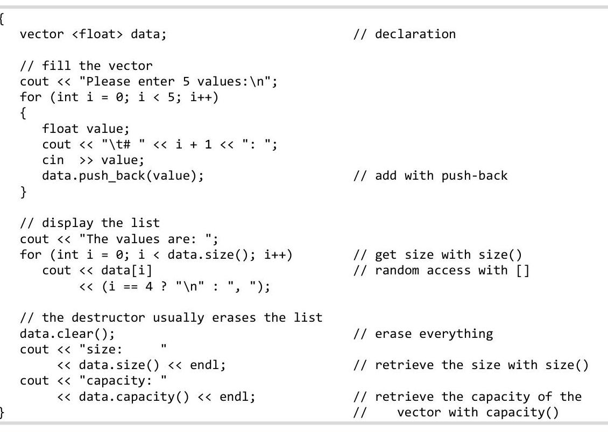
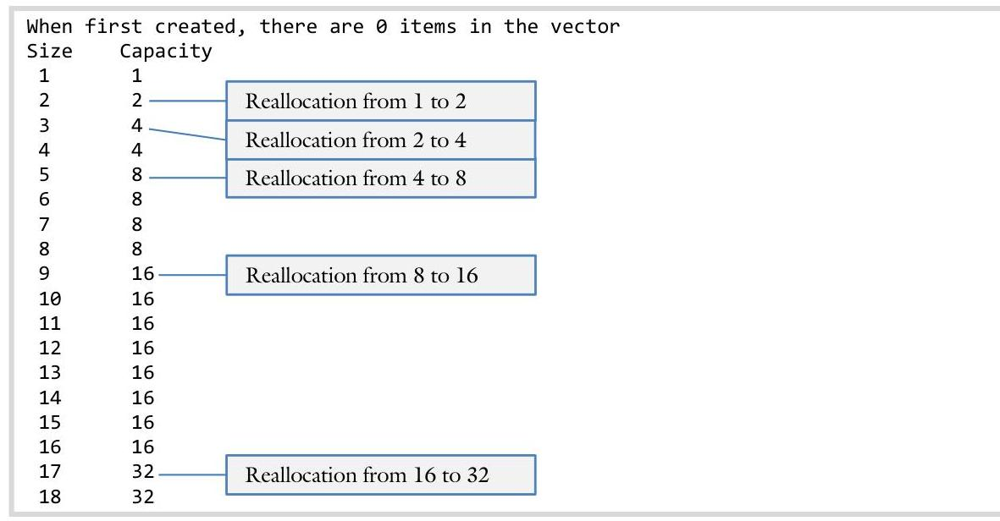
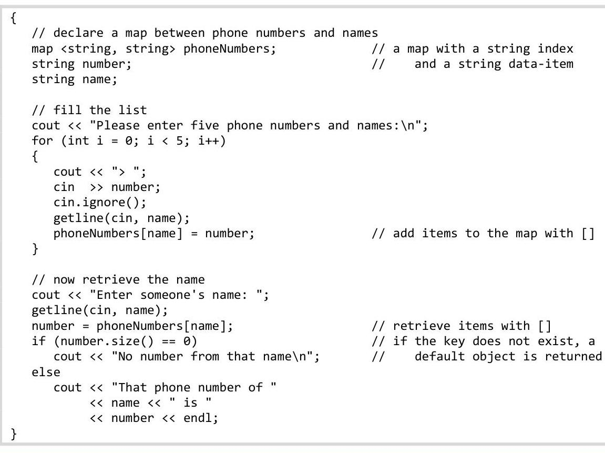

# Unit 4. Abstract Types

> **In this Chapter:**
> [[toc]]

<div style="page-break-after: always;"></div>

### 4.6 Standard Template Library

Sam is working with a program that manipulates a large amount of data. In anticipation of this program, Sam wrote a special array class that can grow to accommodate data-sets of any size. However, as he starts the program, Sam realizes that a linked list would be a more appropriate data-structure. He is about to start writing a linked list class when Sue stops by the lab and introduces him to the standard template library.

**Objectives**

By the end of this chapter, you will be able to:

- Explain the purpose of the standard template library
- Use the vector, list, and map classes in a program
- Describe situations where the vector, list, and map classes would be useful tools to solving a problem


**Prerequisites**

Before reading this chapter, please make sure you are able to:

- Define and use a class template (Chapter 4.3)
- Define and use a linked list (Chapter 4.4)
- Define and use an iterator to the vector class (Chapter 4.5)


## What is the STL and why you should care

The Standard Template Library (STL) is a collection of tools designed to make common programming tasks easier. The STL, in combination with the stream classes (istream and ostream) and the string class, are instrumental in most programming tasks. This is particularly relevant because `C++` has no built-in way to interact with the console (which is why cin and cout are so important) and has only primitive data-structures.
The name "Standard Template Library" does a good job of explaining its purpose. First, it is "standard," meaning it is available on all installations of `C++`. You can always depend on the STL regardless of the platform you are developing on. Second, it is based on "templates." All the data-structures in the STL are implemented using templates so they can work with any data type. Finally, they are a "library." Not being built into the `C++` language, we must explicitly include them in our code through the \#include mechanism.
There are many containers (data-structures designed to hold or contain data) in the STL. The most commonly used are the vector (an array-like data-structure), list (a linked list), and the map (a data-structure ebling a simple database).

> [!Danger] Sue's Tips
> {.sue}
> It is wise for every programmer to become acquainted with the STL and similar libraries which are part of other programming languages. They are like "power-ups" on classic video games; they make you a more powerful programmer. By leveraging the work done by others, it is possible to implement more complex programs, quicker, and with fewer bugs than it would be to implement these data-structures on your own. As Sir Isaac Newton once said "If I have seen further it is by standing on ye sholders <sic> of giants."

# Vector

The vector container is a data-structure similar to an array. However, there are three fundamental differences between a vector and an array. First, a vector object can grow to accommodate any amount of data whereas the size of an array is fixed. Second, whereas arrays can be either a local variable or created with the new statement, vector data is always dynamically allocated. Finally, the vector class supports iterators whereas arrays do not.

## When to use

A vector should be considered for a given problem when:

- Unknown size: When the size of the data-set is unknown at compile time, a vector should be considered. If the size of the data-set is constant and known, use an array
- Random access: When it is necessary to access items in the middle of the array, consider a vector. Items can be accessed quickly because vectors ensure items reside in a continuous block of memory
- Add/Remove from end: When data is commonly added or removed only from the end of the data-set, consider using a vector. Otherwise, consider using a list


## Syntax

In order to declare a vector object, it is first necessary to include the vector library:

```cpp
#include <vector>
```

Note that the vector class is in the standard namespace so either include "using namespace std;" or refer to a vector by its full name "std: :vector".

To declare a vector object, it is necessary to indicate the data type of the data being contained. Since vector is a class template, the syntax should be familiar:

```cpp
{
    vector <double> data; // a vector of doubles
}
```


## Methods

The most commonly used methods supported by the vector class are the following:

| Method | Use |
| :-- | :-- |
| operator [] | Random access is achieved through the square-bracket operator just like an array. This <br> will return the item by-reference so it can be used both as a getter and as a setter |
| push_back() | Items are added onto the end of a vector through the push_back() method. If the size <br> exceeds the capacity of the vector, the capacity will be increased |
| size() | Returns the number of items currently in the vector |
| capacity() | Returns the size of allocated storage capacity currently in the vector |
| clear() | Removes all items currently in the vector |

## Discussion

One interesting thing about vectors (and the string class) is how the capacity grows to accommodate user data. When a vector is first declared, the capacity is zero. After the initial allocation, every time the client attempts to put more data into the vector than is allowed by the current capacity, the capacity is doubled.

# Example 4.6 - Vector of floats

This example will demonstrate how to do the common manipulations with a vector.

Write a program to prompt the user for five numbers, put the numbers in a vector, and then display the results on the screen.

```cpp
Please enter 5 values:
    # 1: 124
    # 2: 165
    # 3: 235
    # 4: 246
    # 5: 364
The values are: 124, 165, 235, 246, 364
size: 0
capacity: 8
```



As a challenge, can you change the FOR loop to use an iterator rather than an index?

The complete solution is available at 4-6-vector.html or:
/home/cs165/examples/4-6-vector.cpp

# Example 4.6 - Vector growth

This example will demonstrate how the vector capacity grows as more data is entered. Observe how the capacity is doubled once the size reaches the current capacity.

Write a program to display how the capacity increases as data is placed on a vector:


This demo will first instantiate a vector object then fill the container with numbers. With each number entered, the size and capacity will be displayed.

```cpp
{
    vector <int> list;
    // The initial size of a vector
    cout << "When first created, there are "
            << list.capacity()
            << " items in the vector\n";
    // Now we will add items to the list, one at a time
    cout << "Size\tCapacity\n";
    for (int i = 0; i < 18; i++)
    {
        list.push_back(i);
        cout << " " << list.size()
            << "\t " << list.capacity() << endl;
    }
}
```

The complete solution is available at 4-6-vectorGrowth.html or:
/home/cs165/examples/4-6-vectorGrowth.cpp

# List

The list container is a linked list data-structure. It is therefore useful in all situations where adding to the middle of the list or removing from the middle of the list is common.

## Use

A list should be considered for a given problem when:

- Unknown size: When the size of the data-set is unknown at compile time, a list should be considered. If the size of the data-set is constant and known, use an array
- Sequential access: When it is only necessary to access members of the data-set sequentially (either forwards or backwards), consider using the list. If random access is required, then consider using the vector class or an array
- Add/Remove from middle: When data is commonly added or removed from the middle of the data-set, consider using a list. Since no shifting is required, this operation is very efficient with the list class. If adding and removing only occurs at the end of the data-set, consider using a vector


## Syntax

The library containg the list class is called list:

```cpp
#include <list>
```

To declare an object of type list, it is first necessary to specify the data type of each item in the data-set:

```cpp
{
    list <double> data; // a linked list of doubles
}
```


## Methods

The most commonly used methods supported by the list class are the following:

| Method | Use |
| :--: | :--: |
| push_back() | Items are added onto the end of a list through the push_back() method. It is also common to put items at the head of the list with push_front() |
| insert() | Insert an item in the middle of a list. The insert() method takes an iterator parameter indicating the location of the inserted node. It returns an interator so the loop can be continued from the current location |
| erase() | Remove an item from the middle of a list. The erase() method takes an iterator parameter indicating the location of the node to be removed. It returns an iterator so the loop can be continued from the current location |
| size() | Returns the number of items currently in the list |
| clear() | Removes all items currently in the list |

## Variations

Another variant of the list container is the slist. The list container is a doubly linked list, meaning it is possible to use both forward and reverse iterators. Thus the nodes in the list container have both a pNext and pPrev pointers. The slist container can only be traversed in the forward direction. Its nodes only have the pNext pointer.

# Example 4.6 - List of words

This example will demonstrate how to create a list object, add items to the list, and display the results both forwards and backwards.

Write a program to add two words to the end of a list, two words to the beginning, and two words to the middle. Then display the list forwards and backwards:

```cpp
The list displayed forwards
    one two three four five six
The list displayed backwards
    six five four three two one
```

```cpp
{
    // declare a list of strings
    list <string> data;
    // add items on to the end of the list with push_back
    data.push_back(string("five"));
    data.push_back(string("six"));
    // add items to the head of the list
    data.push_front(string("two"));
    data.push_front(string("one"));
    // add items to the middle
    list <string> :: iterator it = data.begin();
    it++; // skip the first
    it++; // skip the second
    it = data.insert(it, string("four"));
    it = data.insert(it, string("three"));
    // display the list forwards
    cout << "The list displayed forwards\n";
    for (it = data.begin(); it != data.end(); it++)
        cout << '\t' << *it << ' ';
    cout << endl;
    // display the list backwards
    cout << "The list displayed backwards\n";
    list <string> :: reverse_iterator rit;
    for (rit = data.rbegin(); rit != data.rend(); rit++)
        cout << '\t' << *rit << ' ';
    cout << endl;
}
```

As a challenge, can you add the code necessary to remove items from the list? Specifically, can you remove the word "three" from the list after it is displayed forwards?

The complete solution is available at 4-6-listWords.html or:
/home/cs165/examples/4-6-listWords.cpp

# Map

The map is a data-structure designed to store and retrieve items in a data-set based on a key. Therefore the client provides two pieces of information when adding an item to a map: the data to be stored and the key with which the data will be retrieved. Thus in many ways the map data-structure works like a simple database.

## When to use

A map should be considered for a given problem when:

- Non-integer key: The key of an array or a vector is always an integer: the index. The key of a map can be any data type. If an non-integer key is used, consider using a map
- Non-continuous key: Even if the key is an integer, an array or vector may not be practical. Consider an application where a user's name is associated with the telephone number. Since there are ten million combinations in a seven digit telephone number, one would need an array of ten million to associate phone numbers with user names. With a map, it is possible to associate names with numbers without allocating ten million values


## Syntax

In order to declare a map object, it is first necessary to include the map library:
\#include <map>
To declare a map object, is is necessary to indicate the data type of the data being contained as well as the data type of the key. To associate phone numbers (integers) with names (string objects), we would need:

```cpp
{
    map <int, string> data; // a map with an integer key and string data
}
```


## Methods

The most commonly used methods supported by the map class are the following:

| Method | Use |
| :-- | :-- |
| operator [] | Random access is achieved with a vector through the square-bracket operator. Note that <br> the parameter inside the square brackets [] is the key type, not necessarily an integer. <br> Note that items can either be retrieved or added with the square bracket operator. |
| erase() | Removes an item at a given location. That location can be provided either by an iterator <br> or by a key. |
| clear() | Removes all items currently in the map. |

# Example 4.6 - Phone numbers

This example will demonstrate how to declare, fill, and retrieve items out of a map.

Write a program to prompt the user for several phone numbers and names. The program will then store the phone number in memory using the user name as a key. Finally, the program will retrieve the phone number based on the user name. Use input is underline:

```cpp
Please enter five phone numbers and names:
> 496-7608 Br. Helfrich
> 496-7606 Br. Ercanbrack
> x7601 Sister Price
> 911 Emergency
> (208)496-1111 President Gilbert
Enter someone's name: President Gilbert
That phone number of President Gilbert is (208)496-1111
```



As a challenge, can you modify this program to store the user's birthday? Therefore the data-item (second parameter in the map declaration) will be a Date rather than a string. You will need to use your `Date` class from Unit 2.

The complete solution is available at 4-6-mapPhone.html or:
/home/cs165/examples/4-6-mapPhone.cpp

# Example 4-6 - Phonetic alphabet

This example will demonstrate how to declare, fill, and retrieve items out of a map.

Write a program to convert a letter to the phonetic alphabet equivalent. The first six letters of the phonetic alphabet corresponding to A, B, C, D, E, and F are "Alfa," "Bravo," "Charlie," "Delta," "Echo", and "Foxtrot." Note that we will only convert uppercase letters.

```cpp
What letter? E
The letter 'F' corresponds to Foxtrot
```

The alphabet is stored in the file /home/cs165/examples/4-6-mapAlphabet.txt.
The function to read the phonetic data from the 4-6-mapAlphabet.txt file and place it in the map is:

```cpp
void readAlphabet(const char * fileName, map <char, string> & alphabet)
{
    // open the file
    ifstream fin(fileName);
    if (fin.fail())
    {
        cout << "ERROR: Unable to open the alphabet file " << fileName << endl;
        return;
    }
    // read the file. The first item is the letter
    char letter;
    string word;
    while (fin >> letter >> word)
        alphabet[letter] = word; // add data to the map with
                                    // the [] operator
    // close the file and bail
    fin.close();
    return;
}
```

The code to retrieve the data from the user user is:

```cpp
{
    map <char, string> alphabet;
    // read the alphabet
    readAlphabet("/home/cs165/examples/4-6-mapAlphabet.txt", alphabet);
    // prompt the user for a letter
    char letter;
    cout << "What letter? ";
    cin >> letter;
    // display the results
    cout << "The letter '" << letter
        << "' corresponds to " // retrieve the data with the
        << alphabet[letter] << endl;
    // [ ] operator. Note that
}
```

The complete solution is available at 4-6-mapAlphabet.html or:
/home/cs165/examples/4-6-mapAlphabet.cpp

## Problem 1

Of the following tools: \{string, vector, stream, map, list\}, identify which would be useful in the following scenario:

- A tool useful for most I/O applications
- Like an array except a non-integer key can be used
- Useful only with text
- Like an array except adding and deleting are fast, no random access
- Like an array except it will grow as the size increases

*Please see page 325, 328, 330 for a hint.*

## Problem 2-5

Define a variable for each of the following problems:
2. A collection of student names
3. A data-structure having three components: the assignment name, the points possible, and the student's score
4. A collection of assignments (from \#3)
5. A program translating English words to French

*Please see page 325, 328, 330 for a hint.**

## Problem 6

Consider the following code:

```cpp
{
    vector <string> names;
    fill(names);
}
```

Write the function fill() to fill the parameter with student names until the user enters the text "done"

# Challenge 7 - 8

Consider the following code:

```cpp
{
    map <string, string> dict;
    fill(dict);
    translate(dict);
}
```

7. Write the function fill() to fill the dictionary with English / French word pairs. Stop when user enters "!"
8. Write the function translate() to prompt the user for an English word and display the French response. Stop when the user types "!"

# Assignment 4.6: Reverse file

Write a program to read the data from a file line-by-line. You will need to store the contents of the file in one of the STL containers. Next, display the file backwards.

## Example

Consider the following familiar file (/home/cs165/assign46.txt):

```cpp
#include <iostream>
int main()
{
    std::cout << "Hello world!" << std::endl;
}
```

Execution of the program will be (input in underline):

```cpp
Enter the name of the file: /home/cs165/assign46.txt
}
    std::cout << "Hello world!" << std::endl;
{
int main()
#include <iostream>
```


## Instructions

Please verify your solution against test-bed with:
testBed cs165/assign46 assignment46.cpp